#   &nbsp;Little Woolly Snuggles

Little Woolly Snuggles is a business-to-consumer e-commerce website, selling hand crafted crocheted goods along with a learning environment for individuals to learn how to crochet themselves.

This site is my Portfolio Project 5 submission showcasing full stack frameworks, search engine optimisation and web marketing skills. 

The deployed website can be found at this [link.](https://little-woolly-snuggles-4b258af9630a.herokuapp.com/)

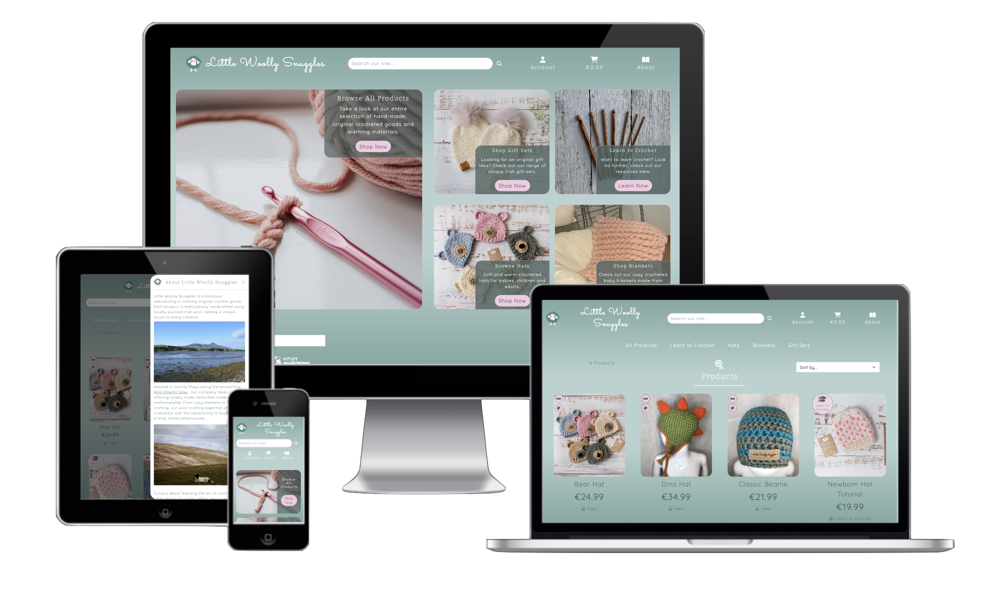

## Contents
<a name="contents"></a>

- [UX](#ux)
  - [Strategy](#strategy)
    - [Project Goals](#project-goals)
    - [Marketing Strategy](#marketing-strategy)
    - [Agile Methodology](#agile-methodology)
    - [User Stories](#user-stories)
  - [Scope](#scope)
    - [Essential Content](#essential-content)
    - [Optional Content](#optional-content)
  - [Structure](#structure)
    - [Data Storage](#data-storage)
    - [Search Engine Optimisation](#search-engine-optimisation)
  - [Skeleton](#structure)
    - [Wireframes](#wireframes)
  - [Surface(Design)](#surface-design)
    - [Colour Scheme](#colour-scheme)
    - [Mockups](#mockups)
    - [Imagery](#imagery)
    - [Icons](#icons)
    - [Logo](#logo)
    - [Typography](#typography)
- [Features](#features)
  - [Security Features](#security-features)
  - [Existing Features](#existing-features)
  - [Features Left to Implement](#features-left-to-implement)
- [Technologies Used](#technologies-used)
  - [Languages Used](#languages-used)
  - [Frameworks, Libraries & Programs Used](#frameworks-libraries--programs-used)
- [Testing](#testing)
- [Deployment](#deployment)
  - [AWS](#aws)
  - [Elephant SQL](#elephant-sql)
  - [Stripe](#stripe)
  - [Mailtrap](#mailtrap)
  - [Integrated Development Environment](#integrated-development-environment)
  - [Deploying to Heroku](#deploying-to-heroku)
  - [Forking the GitHub Repository](#forking-the-github-repository)
  - [Making a Local Clone](#making-a-local-clone)
- [Credits](#credits)
  - [Content](#content)
  - [Media](#media)

## UX
### Strategy
The primary objective of this business-to-consumer e-commerce site is to offer consumers a diverse selection of crocheted goods across various categories while providing a user-friendly platform for browsing, selecting, and purchasing these items. Additionally, we aim to enhance user engagement by offering a learning environment where users can access step-by-step walkthroughs to create their own crocheted products. The site employs intuitive navigation, responsive design, and a streamlined purchasing process to deliver an optimal user experience.

#### Project Goals

The following goals were identified for the project:
- A modern,responsive and stylish website.
- A fully functional, user friendly and dynamic website with the best possible user experience.
- A secure platform for purchasing and user creation.
- An optimised website for search engines to improve visibility and reach.
- A series of web marketing strategies both on the website and external to it.
- Enhanced website accessibility to accommodate all users.
- A selection of crocheted products are available for purchase directly in the website.
- Learn products offering users purchase of crocheting tutorials.

#### Marketing Strategy
The business is a small, home based business with a limited budget for marketing. As such, an organic marketing strategy has been selected by the client. The following marketing means will be used:
- A mail subscription sign up service for users.
- A Facebook business page.

#### Agile Methodology

The project followed an Agile Project Management approach, completing *15* epics consisting of various user stories. These stories were categorized using MoSCoW prioritization, labeled in GitHub as *Must Have*, *Should Have*, *Could Have*, and *Won't Have*. Each user story was assigned a timebox value using the Fibonacci Sequence. Throughout the project, sprints were conducted, selecting user stories with a timebox value of no more than 8 per sprint. Epics, user stories, and bugs were tracked and visualized using GitHub's Project Kanban board feature, accessible [here.](https://github.com/users/johnamdickson/projects/3/views/1)


#### User Stories

As stated, the user stories were collated into *16* epics. Each user story was assigned to either the user, site admin, super user or site owner. In total there are *56* user stories, with *16* Must Have (*29*%), *23* Should Have(*41*%), *14* Could Have (*25*%) and *3* Won't Have (*5*%). 
<br>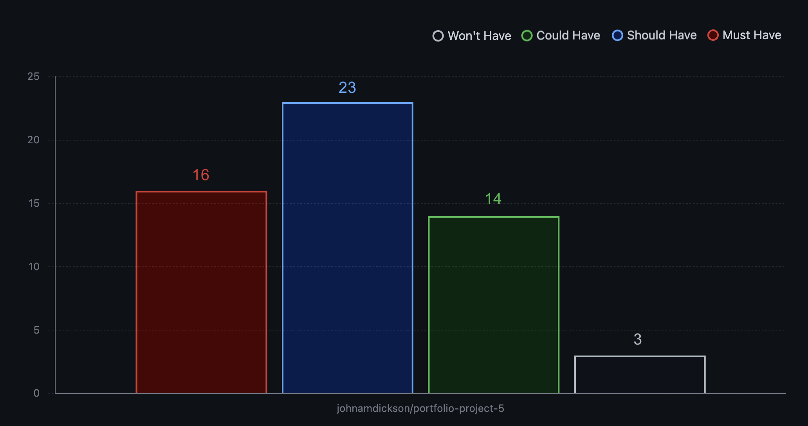<br><br>
The total number of story points assigned to the user stories is *179* of which the majority were in the category of 3 storypoints. 
<br>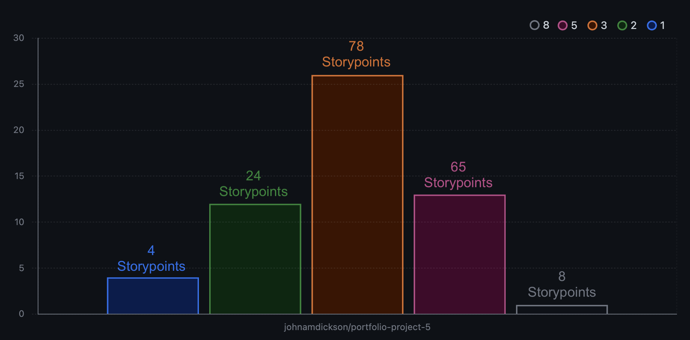<br>

Each of the user stories were broken down into tasks and acceptance criteria which can be reviewed on the project [kanban board](https://github.com/users/johnamdickson/projects/3/views/1).

### Scope
#### Essential Content
  - A selection of crocheted products for sale.
  - A selection of learn to crochet digital tutorials.
  - A secure user authentication system.
  - A secure means of making payments for products.
  - An order tracking system.
  - Superuser only access to add and edit products.
  - An email sending mechanism for verification and order confirmation.
  - Dymanic sidebar functionality.

#### Optional Content
  - User profile creation/management.
  - FAQs section.

### Structure
#### Data Storage
- The structure of the postgresql database was defined and mapped out on a database schema. This helped define the required data interactions to develop a usuable product. The Product model forms the backbone of the schema. The model contains the expected properties of an online business product with additional attributes such as size, primary and secondary colour and alearn component.  There exists two product attribute models - size and colour - which have a Many-to-Many relationship with the Product model. The Category model is a foreign key for the Product model with a One-to-Many relationship. The auth user has relationships with account email model and the user profile model. The Order model for tracking customer orders has a One-to-Many relationship with OrderLineItems model, itself having a One-to-One relationship with the Product model.<br><br>
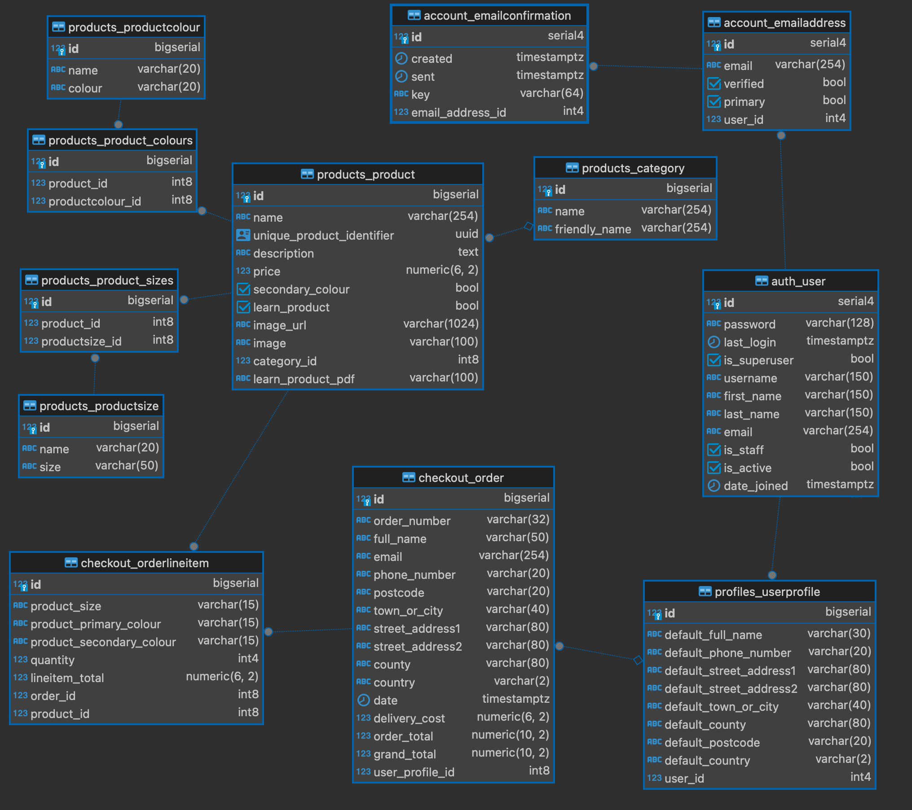
- The front end utilises bootstrap and bespoke styling for a user friendly, designed approach. 
- Static and media files are stored in Amazon S3 cloud based storage bucket and linked to Django via the Boto3 library.
#### Search Engine Optimisation
- A SEO study was completed and can be found [here.](documentation/TESTING-files/user-story-testing/seo-web-marketing-study.pdf)
- A selection of short and long tail keywords were selected for use with the html head and body elements.
- A sitemap.xml file was created using an online tool and added to the project root directory.
- A robots.txt file was created and added to the project root directory.
### Skeleton
#### Wireframes
- The desktop wireframes can be found [here.](documentation/README-files/desktop-wireframes.pdf)
- The mobile and tablet wireframes can be found [here.](documentation/README-files/mobile-tablet-wireframes.pdf)
### Surface (Design)
#### Colour Scheme
- The main theme colours for the site are muted derivatives of the colours found in the company logo. 
- The main colours used were: 
  * a shade of green called Cutty Sark.
  * a shade of pink called We Peep <br><br>

  <table>
<tr>
<td width=75%>
  
</td>
<td>
  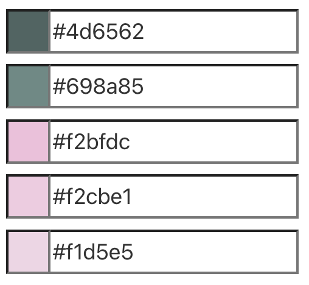
</td>
</tr>
</table>


#### Mockups
- The project mockups can be found [here.](documentation/README-files/mockups.pdf)

#### Imagery
- Aside from individual product images, the following images were used on the site:<br><br>
<table>
<tr>
<td width=66%>
  
</td>
<td>
A simple crochet hook and yarn. This image serve as the main image on the home page providing a simple and striking depiction of the basics of crochet - the hook and yarn. On the home page, the link to all products is situated on the corner of the image.
</td>
</tr>
<tr>
<td width=66%>
  
</td>
<td>
A professional image of two matching hats in adult and child sizes showcasing a Mummy and Me giftset. On the home page, the link to all Gift Sets is situated on the corner of the image.
</td>
</tr>
<tr>
<td width=66%>
  
</td>
<td>
An image of crochet hooks of different sizes arranged in a fan shape to encompass the learn offering on the site by showcasing the tool used. On the home page, the link to all Learn Products is situated on the corner of the image.
</td>
</tr>
<tr>
<td width=66%>
  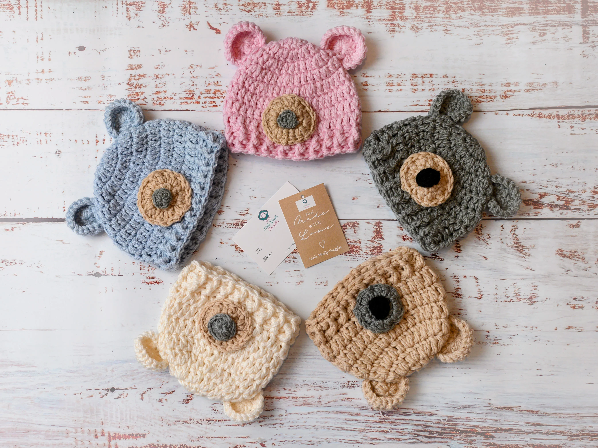
</td>
<td>
A professional image of bear hats that are for sale in the shop. On the home page, the link to all Hats is situated on the corner of the image.
</td>
</tr>
<tr>
<td width=66%>
  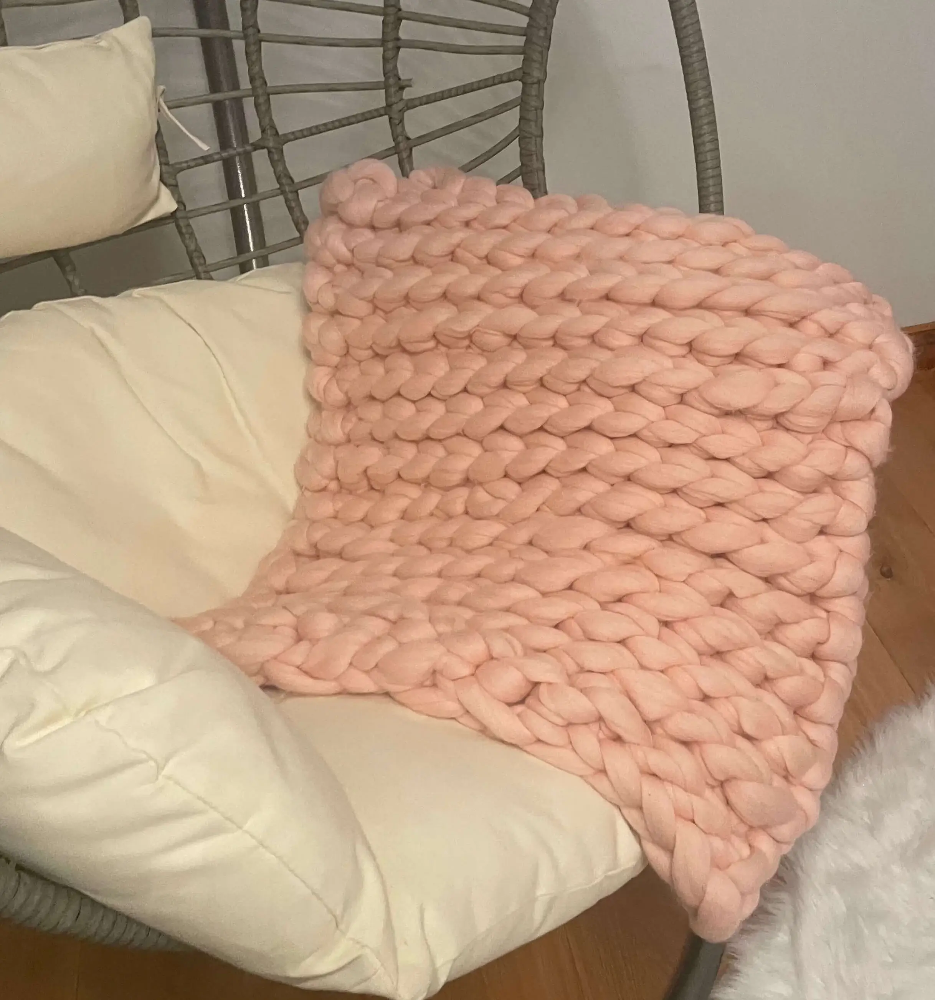
</td>
<td>
A blanket draped over a stylish chair, this image links together. the final category of the shop. On the home page, the link to Blankets is situated on the corner of the image.
</td>
</tr>
<tr>
<td width=66%>
  
</td>
<td>
An image of Croagh Patrick used in the About offcanvas. This image depicts the area where the company is based using the most prominent landmark on the Wild Atlantic Way.
</td>
</tr>
<td width=66%>
  
</td>
<td>
An image of a lamb lying down in a rugged landscape used in the About offcanvas. The image ties in the use of wool in the products and is representative of the area the company is based in.
</td>
</tr>
</table>

#### Icons
- Many of the icons used on site were sourced from Fontawesome. The icons used to depict the product and product categories are SVGs, the sources of which are in the credit section:<br><br>
<table>
<tr>
<td width=10%>
  
</td>
<td>
Products Icon. Used when all products are on display.
</td>
<td width=10%>
  
</td>
<td>
Learn Icon. Used when the Learn to Crochet products are displayed.
</td>
</tr>
<tr>
<td width=10%>
  
</td>
<td>
Blankets Icon. Used when Blankets products are on display.
</td>
<td width=10%>
  
</td>
<td>
Learn Icon. Used when the Learn to Crochet products are displayed.
</td>
</tr>
<tr>
<td width=10%>
  
</td>
<td>
Hats Icon. Used when Hats products are displayed.
</td>
<td width=10%>
</td>
<td>
</td>
</tr>
</table>

#### Logo
The site logo consists of a cartoon sheep, representing the wool used in crafting the company's products. It is prominent in the header along with the company name and can also be found in various places through the site such as toast headers, offcanvas title and favicon.<br><br>

#### Typography
The fonts used in the project were sourced from Google Fonts open source offering and are described below:
- Sacramento. A cursive font used for the logo text.
- Bitter. A serif font used for most titles and headings.
- Quicksand. A sans-serif font <br><br>
<a href="#contents">BACK TO CONTENTS 🔼</a>

## Features 

### Security Features
- There are a number of features utilsed in the app to ensure the security of private information. The following information is contained in the env.py file and Heroku config vars:
  - The database URL. NOTE: this was changed at commit number 507 by rotating the password in Elephant SQL for the database as the url was deployed to Github in error previously.
  - Sripe secret key to authenticate the payment API request.
  - Stripe WH secret key to authenticate the webhook API request.
  - Mailtrap token for accessing the Mailtrap account via SMTP.
  - Django secret key. User defined specifically for this project.
- There are 3 user types avialable in the app: Anonymous User, Standard User and Superuser. The different user types confer different permissiions as described below:
  - All users can view products, add them to cart, change quantity or remove from cart and checkout.
  - Standard Users and Superusers can update profile information and review order history.
  - Superusers can add, edit and delete products from the store.

### Existing Features
- __Header__
  - The header consists of the site logo which when pressed returns the user to the home page. Adjacent to the this is the search bar which searches the site categories, products and product descriptions. Next to the search bar are the header icons for Account, Cart and About. The Account and About links open an offcanvas described later in this section. The Cart link will open the Cart page. There is also a dynamic order total which changes depending on what is in the users cart. The header changes dependant on screen size with the logo occupying the full screen width in medium screens and each section occupying a full width in small screens. On small screens, the aforementioned header icons are joined by a menu icon which opens an offcanvas menu of navbar items, described later in this section.
    ##### Header Large
    
    ##### Header Medium
    
    ##### Header Small
    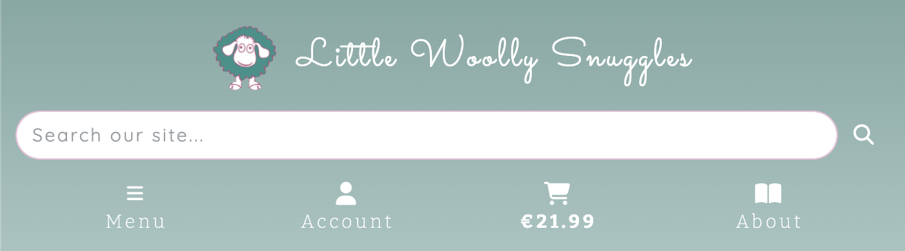
- __Navbar__
  - The navbar contains a series of dropdown menus opened by clicking on nav items. These items allow the user to navigate to all products or navigate to products by category. When clicked, a drop down menu appears and for all products the user can make a choice between products by price, producst by category or all products. For the category dropdowns the user is presented with a list of products in the category or an option to view all products by that category. As stated in the Header description, on small screens the nav items are contained in a menu off canvas which is toggles using the Menu header buton.
    ##### Navbar All Products Selected
    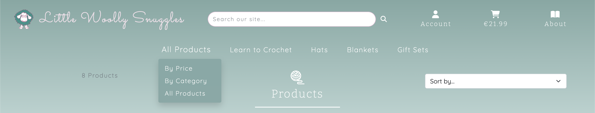
    ##### Navbar Category Selected
    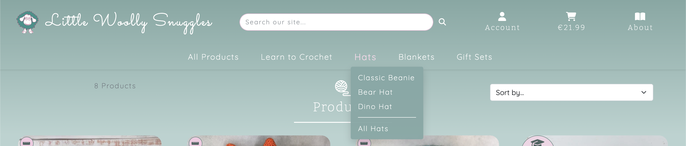
    ##### Menu Offcanvas
    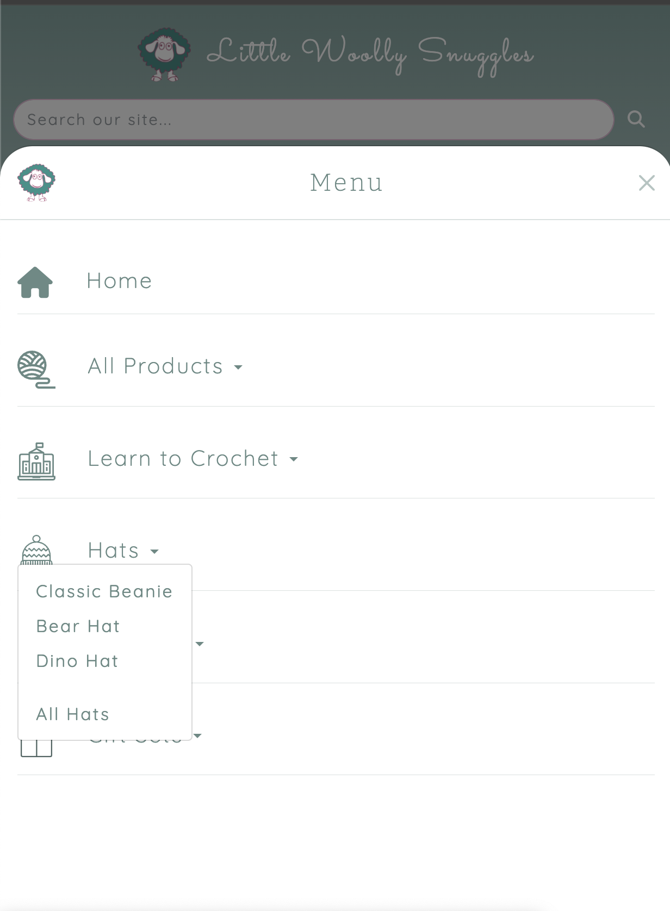
- __Home Page__
  - The home page consists of a grid of crochet based images depicting the products and categories. The main image and associated button will take the user to the products page where all products will be visible. The other buttons take the user to the products page where they will be filtered by the category selected.
    <br><br>
- __Products Page__
  - The products page consists of a series of containers with the following product details included: image, price and category. The products can be sorted with the sort selector by: Product Price high to low or low to high, Product Category a-z or z-a and Product Name a-z or z-a.<br><br>
  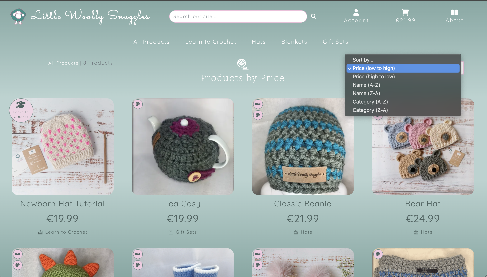<br><br>
  - When products are hovered over the container background colour changes and the scale increases marginally.<br><br>
  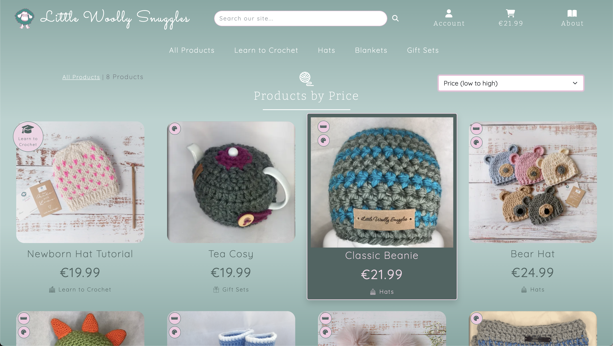<br><br>
  - When the product sizes button is clicked, a popover appears with all of the available sizes and a link to a size guide chart. When the size chart button is clicked the chart appears in a new tab.<br><br>
  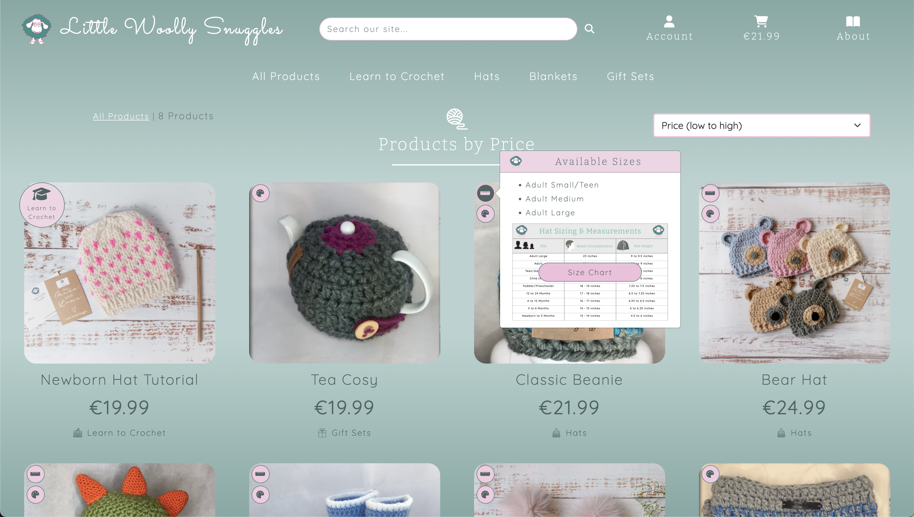<br>
  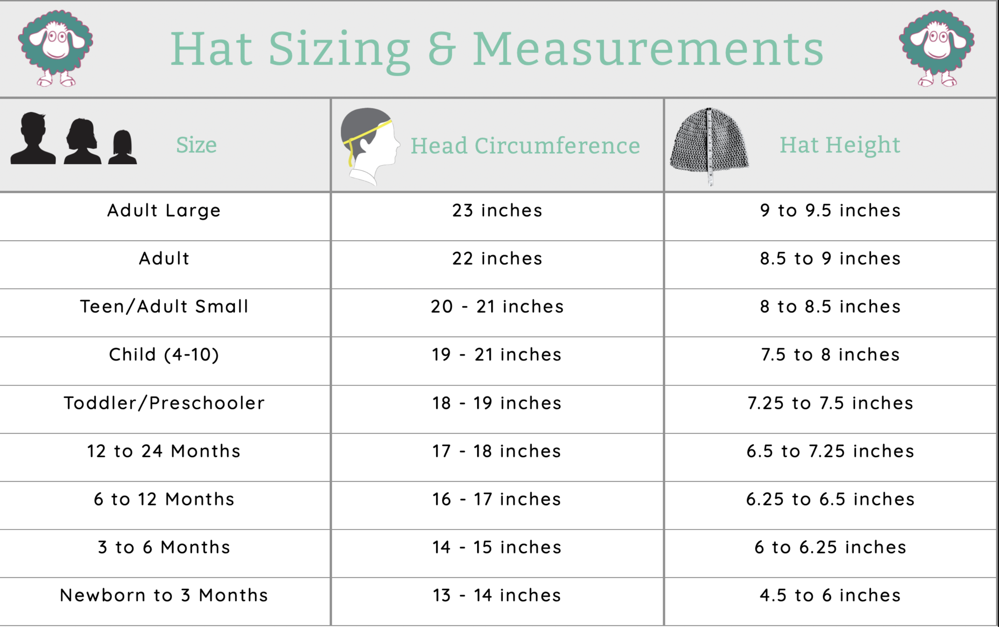<br><br>
  - When the product colours button is clicked, a popover appears with all of the products available sizes.<br><br>
  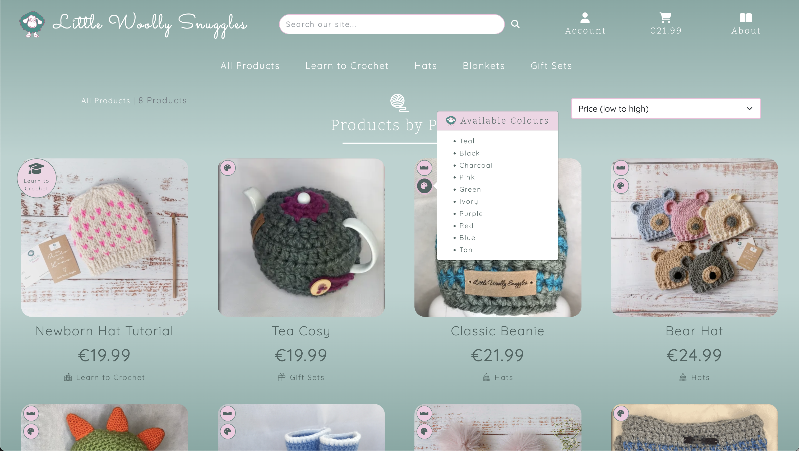<br><br>
  - When the product is a learn product it is identifiable through a Learn to Crochet badge.<br><br>
  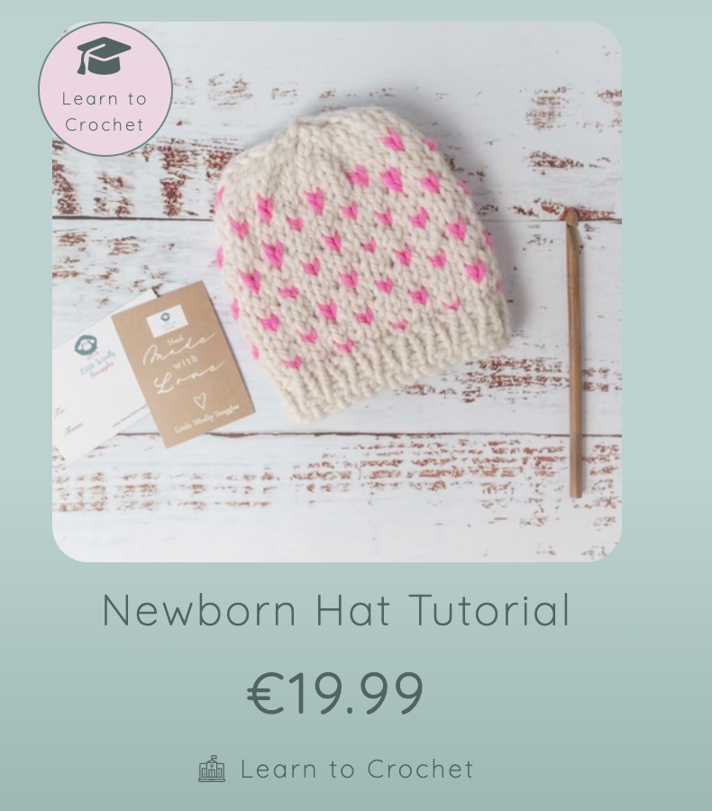<br><br>
- __Add Product__
  - The add product functionality is available in the Product Management offcanvas or via the button in the Products page. This feature is only available to superusers and consists of a form with all of the product fields that are available for adding.<br><br>
    <br><br>
- __Product Detail Page__
  - The products detail page consists of an image, description, quantity selector buttons, attribute selectors (size or colour)and buttons to either add the selected product to the cart or go back to Products page.<br><br>
  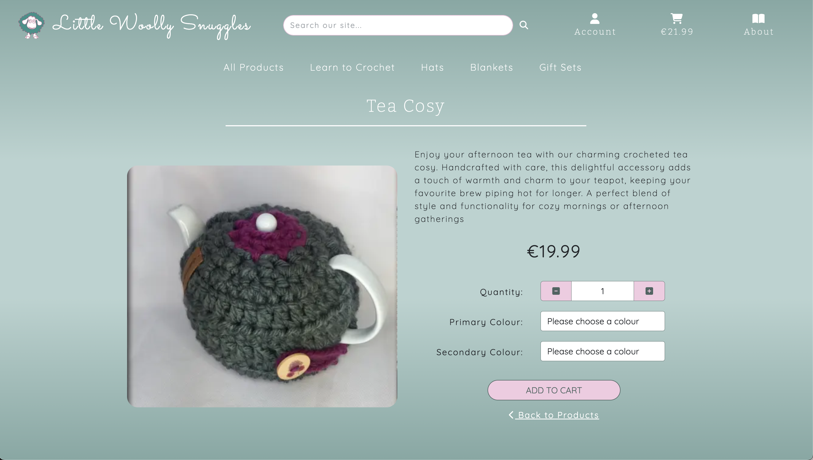<br><br>
  - When the size or colour inputs are selected a drop down menu appears.<br><br>
  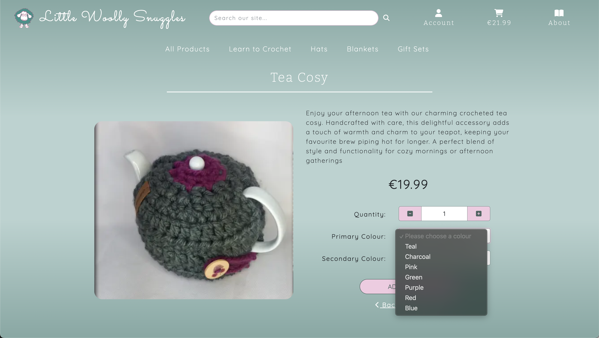<br><br>
  - If the user does not select any attributes for the product, warning popovers appear requesting the user to make a selection.<br><br>
  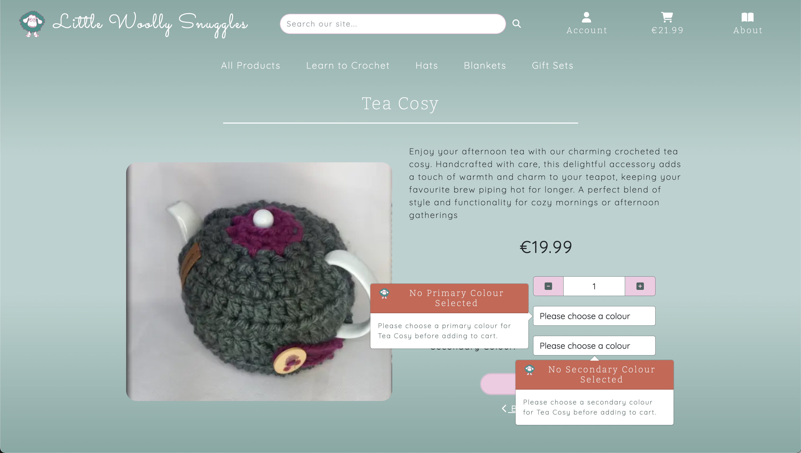<br><br>
  - When the user adds the product to their cart, a success toast appears with a summary of their cart items.<br><br>
  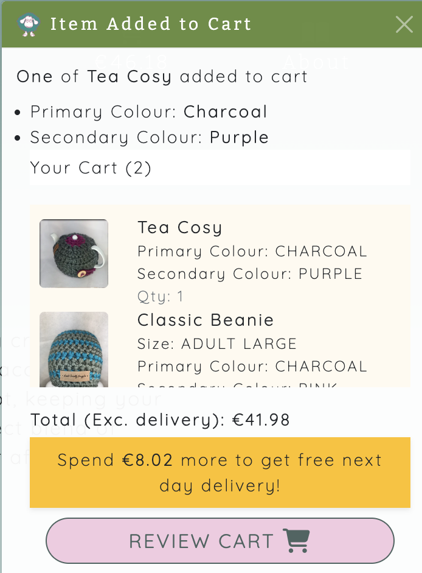<br><br>
- __Edit Product__
  - The edit product functionality is available via the button in the Product Detail page. This feature is only available to superusers and consists of a form with all of the product fields that are available for editing. The edit product page also has a button to delete the product if required.<br><br>
    <br><br>
- __Cart Page__
  - The cart page consists of a table detailing all of the items that are in the users cart. A quantity adjustment is available for the items as well as an option to remove the item from the cart altogether. Any changes made in the cart are notifiied to the user via an info toast. A cart summary is positioned to the right of the table and is fixed on the screen should the user have multiple items to scroll through. Within this summary is a button to access the Checkout page or return to products.<br><br>
  <br><br>
- __Checkout and Checkout Success Pages__
  - The checkout page consists of two sections - an order summary and a payment form. The order details summarises the users order with a list of products in the cart along with a the total pricee. The payment form consists of a contact details section, an address section and a Stripe. On entering the required details the user can pay for their products by clicking the Pay Now button. Whilst the request is in process, an animation commences on the button itself. Once the payment is confirmed, the user is directed to a checkout success where a summary of the order is given along with a success toast confirming the order.<br><br>
  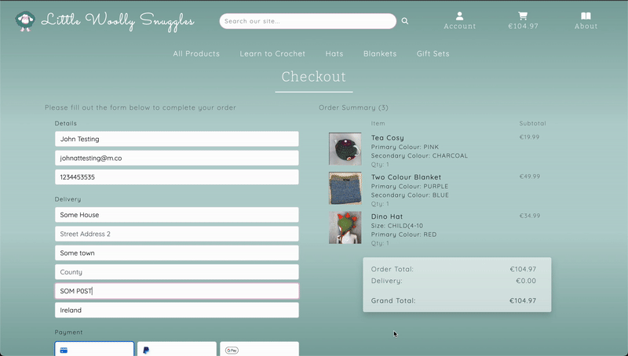<br><br>
- __Register__
  - If a user wants to register for an account they can do so in the Register offcanvas. This replicates the main registration page but in an easy to access mannner that does not require a page reload. The main registration page is still available and can be accessed by typing in the correct url or is automatically opened if there is an error with the offcanvas form.<br><br>
  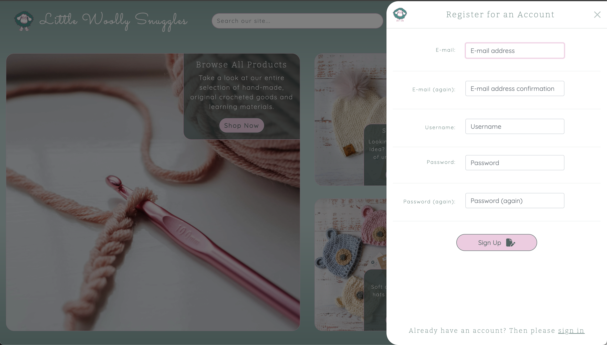<br><br>
- __Login__
  - If a user wants to login to their account they can do so in the login offcanvas. This replicates the main login page but in an easy to access mannner that does not require a page reload. The main login page is still available and can be accessed by typing in the correct url or is automatically opened if there is an error with the offcanvas form.<br><br>
  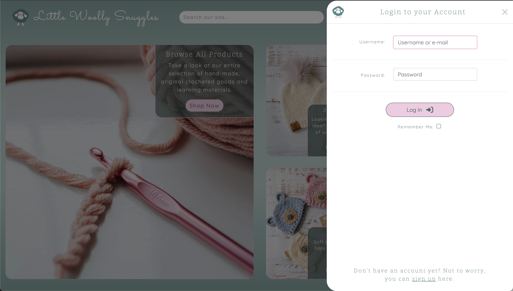<br><br>
- __Logout__
  - If a user wants to logout of their account they can do so in the logout offcanvas. This replicates the main logout page but in an easy to access mannner that does not require a page reload. The main logout page is still available and can be accessed by typing in the correct url.<br><br>
  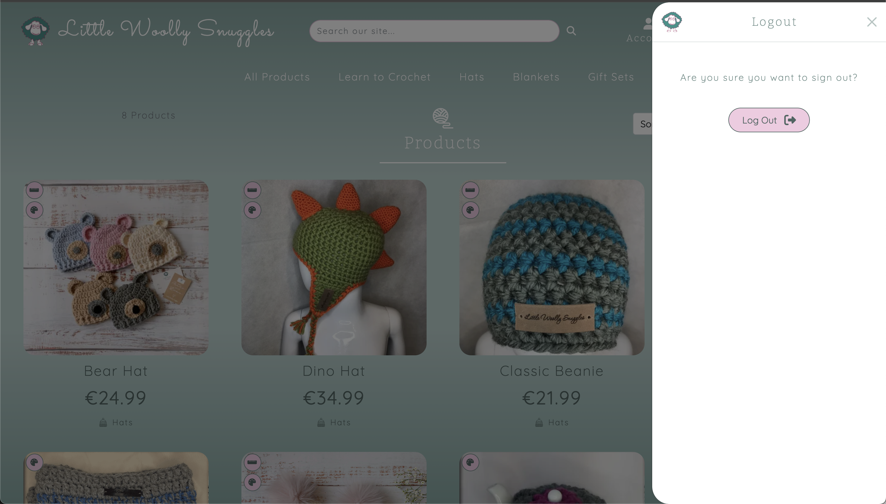<br><br>
- __User Profile__
  - When a new user is created, they are automatically assigned a profile. The profile can be amended in the My Profile offcanvas. Here there are options to edit user details and submit to update. The user can also access an order history by clicking the relevant link in the My Profile offcanvas. This leads the user to the main profile page where the update profile form also exists and a summary of all of the users orders is also present.<br><br>
  <br><br>
- __Footer__
  - The footer contains a mail sign up embedded form provided by Mail Chimp on one side with a contact section on the other. The contact options are email, Facebook or YouTube.<br><br>
  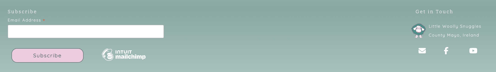<br><br>


- __Toasts and Popovers__
  - Bootstrap toasts were used to convey notifications to the user in a visually engaging manner. The toasts were coloured green for success, blue for info and red for error. <br><br>
  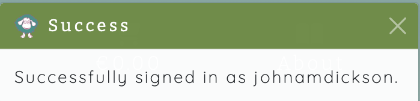
  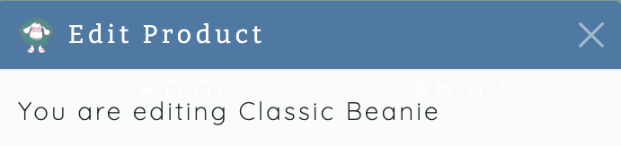
  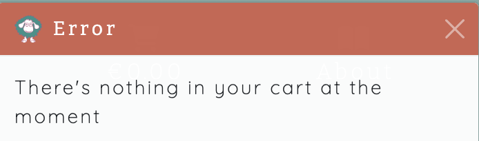
  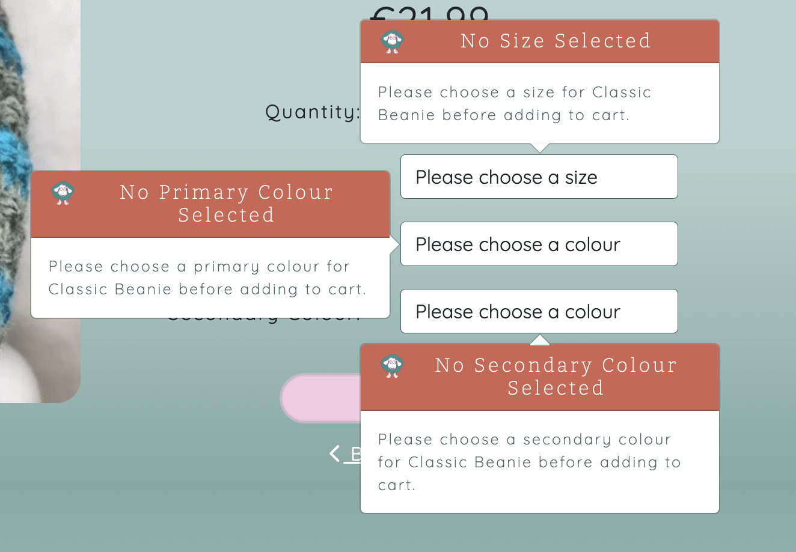
  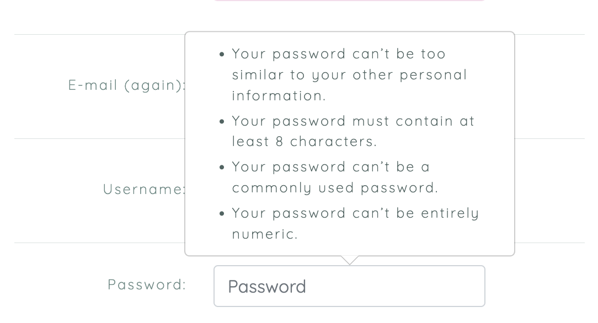<br><br>


### Features Left to Implement
A number of features were considered at the outset of and during the project but were shelved due to time constraints. These are detailed briefly below:
- A subscription service for the learn feature.
- Videos to compliment the learn pdf offering.
- A styled email for order confirmation and learn to crochet.

<a href="#contents">BACK TO CONTENTS 🔼</a>

## Technologies Used

### Languages Used
- **Python**: used extensively during project utilising the MVT (Model View Template) software design pattern.
- **Javascript**: Used for front end functionality notably the Google Maps API, conditional formatting.
- **HTML5**: Used for rendering the DOM.
- **CSS3**: Used to apply custom styling where bootstrap did not extend to the project design requirements.
- **Django Template Language**: Used within the DOM to connect with the backend and render data on the page.
- **Markdown**: Used exclusively for README and TESTING.<br>

### Frameworks, Libraries & Programs Used
- **Django**: web framework to enable full stack development of this project.
- **Heroku**: cloud based platform used for site deployment.
- **elephantSQL**: cloud based database storage.
- **AWS S3**: cloud based storage for static and media files.
- **Bootstrap**: CSS framework for class based styling directly in the DOM.
- **os**: from the standard library used to access system method to clear terminal screen at appropriate points whilst the program is running.
- **gunicorn**: Python HTTP server for WSGI applications.
- **json**: used to create json of instantiated model date for use in Javascript.
- **Gitpod** cloud based IDE used for majority of the project.
- **Git** used for version control.
- **GitHub** as cloud repository for Git version control.
- Any other libraries not explicitly mentioned here can be found in the [requirements.txt](requirements.txt) file.
- **DBeaver** a desktop app which connects with a database and can generate relationship diagrams.
- **country-converter** a Python library for converting country names, ISO codes, and other country-related data between different formats.
- **mailtrap** Python library for interacting with Mailtrap email sending services.
- **num2words** Python library for coverting integers into words.
- **stripe** Python library for interactions with the Stripe payment service.
- **Mail Chimp** embeded form and boilerplate code to enable functionality for email subscription service.

<br><a href="#contents">BACK TO CONTENTS 🔼</a>
## Testing 
Testing information can be found [here.](TESTING.md)

<a href="#contents">BACK TO CONTENTS 🔼</a>

## Deployment

### AWS
1. Open [S3](https://eu-west-1.console.aws.amazon.com/s3/get-started?region=eu-west-1&bucketType=general) and create a new bucket for storing files.
2. Choose a name for the bucket, preferably matching your Heroku app name for clarity.
3. Select the region closest to you for better performance.
4. Uncheck "Block all public access" and acknowledge that the bucket will be public.
5. Set the Object Ownership setting to the ACLs enabled option and check Bucket Owner Preferred.
6. Create the bucket.
7. Set up static website hosting on the properties tab to get a new endpoint for internet access.
8. Fill in default values for index and error documents.
9. Save the settings.
10. On the permissions tab, paste a CORS configuration for required access between the Heroku app and S3 bucket.
11. Go to the bucket policy tab, select "Policy Generator," and create a security policy.
12. Set the policy type to "S3 Bucket Policy," allow all principals using a star, and set the action to "Get Object."
13. Copy the ARN from the other tab and paste it into the ARN box.
14. Add a statement, generate the policy, and copy it into the bucket policy editor.
15. Modify the resource key to allow access to all resources in the bucket.
16. Save the policy.
17. Set the "List objects" permission for everyone under the Public Access section in the access control list tab.
18. Finish configuring the bucket, which is now ready to serve files.
19. With the S3 bucket ready, the next step is to create a user to access it via IAM (Identity and Access Management).
20. Go back to the services menu and open IAM.
21. Start by creating a group for the user to reside in.
22. Click on "User Groups," then "Create New Group," and name it appropriately.
23. Proceed to create the group on the same page.
24. Next, create a policy for accessing the S3 bucket by clicking on "Policies" and then "Create Policy."
25. Import a managed policy for full S3 access, then modify it to restrict access to the specific bucket.
26. Click the button to proceed to the next page to add optional tags, and then review and create the policy.
27. Attach the policy to the group by selecting the group, clicking on "Permissions," and opening the "Add permissions" dropdown.
28. Select "Attach policies," choose the created policy, and click "Add permissions" at the bottom.
29. Create a user to put in the group by clicking "Add User" on the user's page.
30. Provide a username and select "Programmatic Access" for access type.
31. Proceed to the next step, put the user in the group with the attached policy, and create the user.
32. Retrieve the user's access keys by going to IAM, selecting "Users," and choosing the user.
33. Select the "Security Credentials" tab and scroll to "Access Keys."
34. Click "Create access key," choose "Application running outside AWS," and proceed.
35. Leave the "Description tag value" blank and click "Create Access Key."
36. Click the "Download .csv file" button to get the CSV file containing the access keys.
37. Save the CSV file as it contains critical authentication information that cannot be retrieved later.
38. In summary, the process involves creating a group, attaching an access policy allowing S3 access to the bucket, and creating a user with specific access keys.
39. In the next step, configure Django to connect to S3 using these keys and upload static files to S3.

### Elephant SQL
1. Navigate to the [ElephantSQL](https://customer.elephantsql.com/) website and sign up for an account.
2. After signing up, log in to your ElephantSQL account.
3. Once logged in, click on the "Create New Instance" button.
4. Choose a plan for your instance. For this project, the free tier was selected.
5. Select the region for your instance. Choose the region closest to your target audience for better performance.
6. Choose a name for your instance. In this instance little-woolly-snuggles.8. Click on the "Create" or "Deploy" button to create your instance.
7. Wait for the instance to be provisioned. This may take a few moments.
8. Once the instance is ready, click on the instance in the instances page.
9. Copy the url for use as the production environment database.

### Stripe
1. Navigate to the  [Stripe](https://stripe.com) website.
2. Create a Stripe account and log-in.
3. From your Stripe dashboard, click to expand the "Get your test API keys".
4. Copy the STRIPE_PUBLIC_KEY and STRIPE_SECRET_KEY for later use.
5. From your Stripe dashboard, click *Developers*, and select *Webhooks*.
6. lick *Add Endpoint* and add the following url:
	    `https://little-woolly-snuggles-4b258af9630a.herokuapp.com/checkout/wh/`
7. Click *receive all events*.
8. Click *Add Endpoint* to complete the process.
9. Copy the STRIPE_WH_SECRET for use later.

### Mailtrap
1. Create a Mailtrap account.
2. In sending Domains, copy the DNS records.
3. In your own domians DNS records, change them to the copied Mailtrap DNS records.
4. Back on Mailtrap console, click verify DNS records. This could take up to 3 hours to take effect.
5. Once DNS records are verified, Mailtrap can start to send emails from your domain.

### Integrated Development Environment 
#### Prepare the environment and settings.py file:
1. In your GitPod workspace, create an env.py file in the main directory.
2. Add the DATABASE_URL value and your chosen SECRET_KEY value to the env.py file. 
3. Update the settings.py file to import the env.py file and add the SECRETKEY and DATABASE_URL file paths.
4. Comment out the default database configuration and temporarily add ElephantSql database url.
5. Save files and make migrations.
8. Add the STATIC files settings - the url, storage path, directory path, root path, media url and default file storage path.
9. Link the file to the templates directory in Heroku.
10. Change the templates directory to TEMPLATES_DIR
11. Add Heroku to the ALLOWED_HOSTS list.

#### Create files / directories
1. Create requirements.txt file
2. Create three directories in the main directory; media, storage and templates.
3. Create a file named "Procfile" in the main directory and add the following: web: gunicorn project-name.wsgi

### Deploying to Heroku
* This site was deployed by completing the following steps:

1. Log in to [Heroku](https://id.heroku.com) or create an account.
2. On the main page click the button labelled New in the top right corner and from the drop-down menu select Create New App.
3. You must enter a unique app name.
4. Next select your region.
5. Click on the Create App button
6. The next page is the project’s Deploy Tab. Click on the Settings Tab and scroll down to Config Vars.
7. Click Reveal Config Vars and enter the following:
    - Add AWS_ACCESS_KEY_ID into the key box and in the value add the data from csv file obtained from AWS.
    - Add AWS_SECRET_ACCESS_KEY into the next available key box and in the value add the data from csv file obtained from AWS.
    - Add ALLOWED_HOSTS into the key box and in the value add in the hosting sites ie Heroku app URL.
    - Add MAILTRAP_TOKEN into the next available key box and the token obtained from Mailtrap in the value box.
    - Add STRIPE_PUBLISHABLE_KEY into the next available key box and the publishable key obtained from Stripe developer website in the value box.
    - Add STRIPE_WH_SECRET into the next available key box and the Stripe Webhook secret key obtained from Stripe developer website in the value box.
    - Add STRIPE_SECRET_KEY into the next available key box and the secret key obtained from Stripe developer website in the value box.
    - Enter DATABASE_URL into the next available Key box and then in the value box add the unique Database URL.
    - Enter PORT into the next available Key box and 8000 into the Value box and click the Add button.
    - Enter DJANGO_SECRET_KEY into the next available Key box and then whichever secret key was selected into the corresponding Value box.
    - Enter USE_AWS into the next available Key box and then add True into the corresponding value box to tell Django to use AWS for static and media files.
8. Scroll to the top of the page and choose the Deploy tab.
9. Select Github as the deployment method.
10. Confirm you want to connect to GitHub.
11. Search for the repository name and click the connect button.
12. Scroll to the bottom of the deploy page and select the preferred deployment type.
13. Click Enable Automatic Deploys for automatic deployment when you push updates to Github.

### Forking the GitHub Repository

By forking the GitHub Repository we make a copy of the original repository on our GitHub account to view and/or make changes without affecting the original repository by using the following steps:

1. Log in to GitHub and locate the [GitHub Repository.](https://github.com/johnamdickson/portfolio-project-3)
2. At the top of the Repository (not top of page) just above the "Settings" Button on the menu, locate the "Fork" Button.
3. You should now have a copy of the original repository in your GitHub account.

### Making a Local Clone

1. Log in to GitHub and locate the [GitHub Repository.](https://github.com/johnamdickson/portfolio-project-3)
2. Under the repository name, click "Clone or download".
3. To clone the repository using HTTPS, under "Clone with HTTPS", copy the link.
4. Open Git Bash
5. Change the current working directory to the location where you want the cloned directory to be made.
6. Type `git clone`, and then paste the URL you copied in Step 3.

```
$ git clone https://github.com/YOUR-USERNAME/YOUR-REPOSITORY
```

7. Press Enter. Your local clone will be created.

```
$ git clone https://github.com/YOUR-USERNAME/YOUR-REPOSITORY
> Cloning into `CI-Clone`...
> remote: Counting objects: 10, done.
> remote: Compressing objects: 100% (8/8), done.
> remove: Total 10 (delta 1), reused 10 (delta 1)
> Unpacking objects: 100% (10/10), done.
```

Click [here](https://help.github.com/en/github/creating-cloning-and-archiving-repositories/cloning-a-repository#cloning-a-repository-to-github-desktop) to retrieve pictures for some of the buttons and more detailed explanations of the above process.<br><br>


<a href="#contents">BACK TO CONTENTS 🔼</a>

## Credits
### Content 
NOTE: Specific links are included within the Python, Javascript, HTML and CSS  files. The list below summarises content credits in general.
- The Boutique Ado walkthrough provided much of the inspiration for this project.
- Stack Overflow, W3 Docs, Slack, Django docs and other online resources were a massive help for Python, Javascript, HTML or CSS code that enabled some of the functionality I was looking for.
- This [website](https://www.scaler.com/topics/multiline-comment-in-python/) gave guidance for making multi-line comments where using `“””` is recommended for docstrings and using `#` for comments.
- Guidance on JS function comments was taken from this [website.](https://courses.cs.washington.edu/courses/cse154/18au/resources/styleguide/commenting.html#:~:text=Function%20Commenting%20Format,a%20value%20of%20%2D1)
- Temporary email addresses were created at [Temp Mail](https://temp-mail.org/en/)
- [Mobile simulator Chrome extension](https://chromewebstore.google.com/detail/mobile-simulator-responsi/ckejmhbmlajgoklhgbapkiccekfoccmk) used during testing.
- The sitemap was created using [XML Sitemaps](https://www.xml-sitemaps.com/)

### Media
- The site fonts were source from [Google Fonts.](https://fonts.google.com/)
- All gifs were generated on [ezgif.com.](https://ezgif.com/video-to-gif)
- Images not provided by the client were sourced from [Pexels.](https://www.pexels.com/)
- The database schema was created on [drawSQL.](https://drawsql.app/)
- The Django secret key was created using [Djecrety.](https://djecrety.ir)
- Converting jpg files to webp at [Cloud Convert](https://cloudconvert.com/png-to-webp)
- Markdown tables were generated using this online [tool.](https://jakebathman.github.io/Markdown-Table-Generator/)
- The colour name was sourced from [Name That Color.](https://chir.ag/projects/name-that-color/)
- The site colour scheme pallete was generated using the palette creation tool in [Color Hex.](https://www.color-hex.com/) 
- Most of the icons used on the website were from [Font Awesome](https://fontawesome.com/).
- Other icons in svg format were obtained taken from various sites: [reshot](https://www.reshot.com/) [iconscout](https://iconscout.com)


### Acknowledgements
  - I would like to extend my thanks to my wife Sinéad for all of her help during the project. The majority of photos are her work along with all of the product descriptions and text in the about section. Thank you Sinéad, I could not have done this project and every other project in this course without your support.
  - I would like to thank my mentor Graeme for all of his guidance during our mentor sessions, particularly spotting an error that was not replicating for me that surely would have resulted in a fail mark. Thank you for all your assistance.<br><br>
<a href="#contents">BACK TO CONTENTS 🔼</a>
