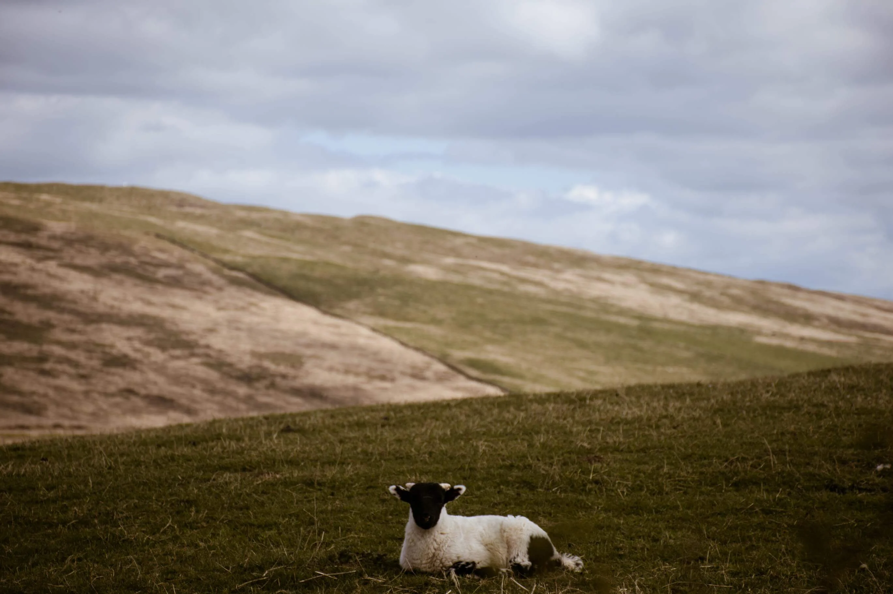
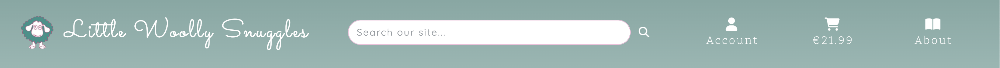
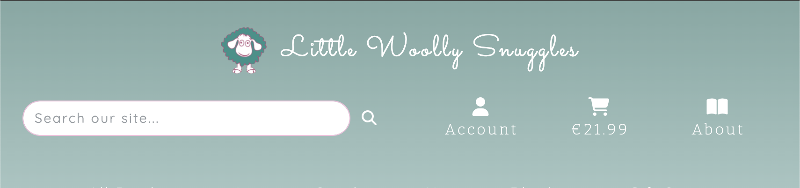

#   &nbsp;Little Woolly Snuggles

Little Woolly Snuggles is a business-to-consumer e-commerce website, selling hand crafted crocheted goods along with a learning environment for individuals to learn how to crochet themselves.

This site is my Portfolio Project 5 submission showcasing full stack frameworks, search engine optimisation and web marketing skills. 

The deployed website can be found at this [link.](https://little-woolly-snuggles-4b258af9630a.herokuapp.com/)


## Contents
<a name="contents"></a>

- [UX](#ux)
  - [Strategy](#strategy)
    - [Project Goals](#project-goals)
    - [Marketing Strategy](#marketing-strategy)
    - [Agile Methodology](#agile-methodology)
    - [User Stories](#user-stories)
  - [Scope](#scope)
    - [Essential Content](#essential-content)
    - [Optional Content](#optional-content)
  - [Structure](#structure)
  - [Skeleton](#structure)
    - [Wireframes](#wireframes)
  - [Surface(Design)](#surface-design)
    - [Colour Scheme](#colour-scheme)
    - [Mockups](#mockups)
    - [Imagery](#imagery)
    - [Icons](#icons)
    - [Logo](#logo)
    - [Typography](#typography)
- [Features](#features)
  - [Security Features](#security-features)
  - [Existing Features](#existing-features)
  - [Features Left to Implement](#features-left-to-implement)
- [Technologies Used](#technologies-used)
  - [Languages Used](#languages-used)
  - [Frameworks, Libraries & Programs Used](#frameworks-libraries--programs-used)
- [Testing](#testing)
- [Deployment](#deployment)
  - [Deploying to Heroku](#deploying-to-heroku)
  - [Forking the GitHub Repository](#forking-the-github-repository)
  - [Making a Local Clone](#making-a-local-clone)
- [Credits](#credits)
  - [Content](#content)
  - [Media](#media)

## UX
### Strategy
The primary objective of this business-to-consumer e-commerce site is to offer consumers a diverse selection of crocheted goods across various categories while providing a user-friendly platform for browsing, selecting, and purchasing these items. Additionally, we aim to enhance user engagement by offering a learning environment where users can access step-by-step walkthroughs to create their own crocheted products. The site employs intuitive navigation, responsive design, and a streamlined purchasing process to deliver an optimal user experience.

#### Project Goals

The following goals were identified for the project:
- A modern,responsive and stylish website.
- A fully functional, user friendly and dynamic website with the best possible user experience.
- A secure platform for purchasing and user creation.
- An optimised website for search engines to improve visibility and reach.
- A series of web marketing strategies both on the website and external to it.
- Enhanced website accessibility to accommodate all users.
- A selection of crocheted products are available for purchase directly in the website.
- Learn products offering users purchase of crocheting tutorials.

#### Marketing Strategy
The business is a small, home based business with a limited budget for marketing. As such, an organic marketing strategy has been selected by the client. The following marketing means will be used:
- A mail subscription sign up service for users.
- A Facebook business page.

#### Agile Methodology

The project followed an Agile Project Management approach, completing *15* epics consisting of various user stories. These stories were categorized using MoSCoW prioritization, labeled in GitHub as *Must Have*, *Should Have*, *Could Have*, and *Won't Have*. Each user story was assigned a timebox value using the Fibonacci Sequence. Throughout the project, sprints were conducted, selecting user stories with a timebox value of no more than 8 per sprint. Epics, user stories, and bugs were tracked and visualized using GitHub's Project Kanban board feature, accessible [here.](https://github.com/users/johnamdickson/projects/3/views/1)


#### User Stories

As stated, the user stories were collated into *16* epics. Each user story was assigned to either the user, site admin, super user or site owner. In total there are *56* user stories, with *16* Must Have (*29*%), *23* Should Have(*41*%), *14* Could Have (*25*%) and *3* Won't Have (*5*%). 
<br><br><br>
The total number of story points assigned to the user stories is *179* of which the majority were in the category of 3 storypoints. 
<br><br>

Each of the user stories were broken down into tasks and acceptance criteria which can be reviewed on the project [kanban board](https://github.com/users/johnamdickson/projects/3/views/1).

### Scope
#### Essential Content
  - A selection of crocheted products for sale.
  - A selection of learn to crochet digital tutorials.
  - A secure user authentication system.
  - A secure means of making payments for products.
  - An order tracking system.
  - Superuser only access to add and edit products.
  - An email sending mechanism for verification and order confirmation.
  - Dymanic sidebar functionality.

#### Optional Content
  - User profile creation/management.
  - FAQs section.

### Structure
- The structure of the postgresql database was defined and mapped out on a database schema. This helped define the required data interactions to develop a usuable product. The Product model forms the backbone of the schema. The model contains the expected properties of an online business product with additional attributes such as size, primary and secondary colour and alearn component.  There exists two product attribute models - size and colour - which have a Many-to-Many relationship with the Product model. The Category model is a foreign key for the Product model with a One-to-Many relationship. The auth user has relationships with account email model and the user profile model. The Order model for tracking customer orders has a One-to-Many relationship with OrderLineItems model, itself having a One-to-One relationship with the Product model.<br><br>

- The front end utilises bootstrap and bespoke styling for a user friendly, designed approach. 
- Static and media files are stored in Amazon S3 cloud based storage bucket and linked to Django via the Boto3 library.
### Skeleton
#### Wireframes
- The desktop wireframes can be found [here.](documentation/README-files/desktop-wireframes.pdf)
- The mobile and tablet wireframes can be found [here.]documentation/README-files/mobile-tablet-wireframes.pdf()
### Surface (Design)
#### Colour Scheme
- The main theme colours for the site are muted derivatives of the colours found in the company logo. The main colours used werea shade of green called Cutty Sark and a shage of pink called following are the colour names:
  * a shade of green called Cutty Sark.
  * a shade of pink called We Peep <br><br>
      <p align="center">

      </p>

#### Mockups
- The project mockups can be found [here.](documentation/README-files/mockups.pdf)

#### Imagery
- Aside from individual product images, the following images were used on the site:<br><br>
<table>
<tr>
<td width=66%>
  
</td>
<td>
A simple crochet hook and yarn. This image serve as the main image on the home page providing a simple and striking depiction of the basics of crochet - the hook and yarn. On the home page, the link to all products is situated on the corner of the image.
</td>
</tr>
<tr>
<td width=66%>
  
</td>
<td>
A professional image of two matching hats in adult and child sizes showcasing a Mummy and Me giftset. On the home page, the link to all Gift Sets is situated on the corner of the image.
</td>
</tr>
<tr>
<td width=66%>
  
</td>
<td>
An image of crochet hooks of different sizes arranged in a fan shape to encompass the learn offering on the site by showcasing the tool used. On the home page, the link to all Learn Products is situated on the corner of the image.
</td>
</tr>
<tr>
<td width=66%>
  
</td>
<td>
A professional image of bear hats that are for sale in the shop. On the home page, the link to all Hats is situated on the corner of the image.
</td>
</tr>
<tr>
<td width=66%>
  
</td>
<td>
A blanket draped over a stylish chair, this image links together. the final category of the shop. On the home page, the link to Blankets is situated on the corner of the image.
</td>
</tr>
<tr>
<td width=66%>
  
</td>
<td>
An image of Croagh Patrick used in the About offcanvas. This image depicts the area where the company is based using the most prominent landmark on the Wild Atlantic Way.
</td>
</tr>
<td width=66%>
  
</td>
<td>
An image of a lamb lying down in a rugged landscape used in the About offcanvas. The image ties in the use of wool in the products and is representative of the area the company is based in.
</td>
</tr>
</table>

#### Icons
- Many of the icons used on site were sourced from Fontawesome. The icons used to depict the product and product categories are SVGs, the sources of which are in the credit section:<br><br>
<table>
<tr>
<td width=10%>
  
</td>
<td>
Products Icon. Used when all products are on display.
</td>
<td width=10%>
  
</td>
<td>
Learn Icon. Used when the Learn to Crochet products are displayed.
</td>
<td width=10%>
  
</td>
<td>
Hats Icon. Used when Hats products are displayed.
</td>
</tr>
<tr>
<td width=10%>
  
</td>
<td>
Blankets Icon. Used when Blankets products are on display.
</td>
<td width=10%>
  
</td>
<td>
Learn Icon. Used when the Learn to Crochet products are displayed.
</td>
</tr>
</table>

#### Logo
The site logo consists of a cartoon sheep, representing the wool used in crafting the company's products. It is prominent in the header along with the company name and can also be found in various places through the site such as toast headers, offcanvas title and favicon.<br><br>

#### Typography
The fonts used in the project were sourced from Google Fonts open source offering and are described below:
- Sacramento. A cursive font used for the logo text.
- Bitter. A serif font used for most titles and headings.
- Quicksand. A sans-serif font <br><br>
<a href="#contents">BACK TO CONTENTS 🔼</a>

## Features 

### Security Features
- There are a number of features utilsed in the app to ensure the security of private information. The following information is contained in the env.py file and Heroku config vars:
  - The database URL. NOTE: this was changed at commit number 507 by rotating the password in Elephant SQL for the database as the url was deployed to Github in error previously.
  - Sripe secret key to authenticate the payment API request.
  - Stripe WH secret key to authenticate the webhook API request.
  - Mailtrap token for accessing the Mailtrap account via SMTP.
  - Django secret key. User defined specifically for this project.
- There are 3 user types avialable in the app: Anonymous User, Standard User and Superuser. The different user types confer different permissiions as described below:
  - All users can view products, add them to cart, change quantity or remove from cart and checkout.
  - Standard Users and Superusers can update profile information and review order history.
  - Superusers can add, edit and delete products from the store.

### Existing Features
- __Header__
  - The header consists of the site logo which when pressed returns the user to the home page. Adjacent to the this is the search bar which searches the site categories, products and product descriptions. Next to the search bar are the header icons for Account, Cart and About. The Account and About links open an offcanvas described later in this section. The Cart link will open the Cart page. There is also a dynamic order total which changes depending on what is in the users cart. The header changes dependant on screen size with the logo occupying the full screen width in medium screens and each section occupying a full width in small screens. On small screens, the aforementioned header icons are joined by a menu icon which opens an offcanvas menu of navbar items, described later in this section.<br><br>
  - Header Large
  
  - Header Medium
  
  - Header Small
  
- __Navbar__
  - The navbar contains a series of dropdown menus opened by clicking on nav items. These items allow the user to navigate to all products or navigate to products by category. When clicked, a drop down menu appears and for all products the user can make a choice between products by price, producst by category or all products. For the category dropdowns the user is presented with a list of products in the category or an option to view all products by that category. As stated in the Header description, on small screens the nav items are contained in a menu off canvas which is toggles using the Menu header buton.<br><br>
  - Navbar All Products Selected
  
  - Navbar Category Selected
  
  - Menu Offcanvas
  
- __Footer__
  - *ADD*.<br><br>
  <br><br>
- __Login Page__ 
  - *ADD*<br><br>
        <p align="center">
  
      </p>

- __Register Page__ 
  - *ADD*.<br><br>
  
- __Home Page__ 
  - *ADD*.<br><br>
   <br><br>

- __Logout Page__ 
  - *ADD*
          <p align="center">
      
      </p> 
- __Alerts__
  - *ADD*


### Features Left to Implement
A number of features were considered at the outset of and during the project but were shelved due to time constraints. These are detailed briefly below:
- *ADD*.

<a href="#contents">BACK TO CONTENTS 🔼</a>

## Technologies Used

### Languages Used *UPDATE*
- **Python**: used extensively during project utilising the MVT (Model View Template) software design pattern.
- **Javascript**: Used for front end functionality notably the Google Maps API, conditional formatting.
- **HTML5**: Used for rendering the DOM.
- **CSS3**: Used to apply custom styling where bootstrap did not extend to the project design requirements.
- **Django Template Language**: Used within the DOM to connect with the backend and render data on the page.
- **Markdown**: Used exclusively for README and TESTING.<br>

### Frameworks, Libraries & Programs Used *UPDATE*
- **Django**: web framework to enable full stack development of this project.
- **Heroku**: cloud based platform used for site deployment.
- **elephantSQL**: cloud based database storage.
- **Cloudinary**: cloud based storage for images.
- **Bootstrap**: CSS framework for class based styling directly in the DOM.
- **dateutil**: used to calculate relative dates.
- **datetime**: from the standard library, used to perform operations on date and time objects and strings.
- **os**: from the standard library used to access system method to clear terminal screen at appropriate points whilst the program is running.
- **gunicorn**: Python HTTP server for WSGI applications.
- **json**: used to create json of instantiated model date for use in Javascript.
- **freezegun**: used to set a known date for testing.
- **jest**: used for testing Javascript.
- **Google Maps**: Javascript API required for map.
- **Gitpod** cloud based IDE used for majority of the project.
- **Git** used for version control.
- **GitHub** as cloud repository for Git version control.
- Any other libraries not explicitly mentioned here can be found in the [requirements.txt](requirements.txt) file.
- **DBeaver** a desktop app which connects with a database and can generate relationship diagrams.

<br><a href="#contents">BACK TO CONTENTS 🔼</a>
## Testing 
Testing information can be found [here.](TESTING.md)

<a href="#contents">BACK TO CONTENTS 🔼</a>

## Deployment *UPDATE*

### Prepare the environment and settings.py file:
1. In your GitPod workspace, create an env.py file in the main directory.
2. Add the DATABASE_URL value and your chosen SECRET_KEY value to the env.py file. 
3. Update the settings.py file to import the env.py file and add the SECRETKEY and DATABASE_URL file paths.
4. Comment out the default database configuration.
5. Save files and make migrations.
6. Add Cloudinary URL to env.py
7. Add the cloudinary libraries to the list of installed apps.
8. Add the STATIC files settings - the url, storage path, directory path, root path, media url and default file storage path.
9. Link the file to the templates directory in Heroku.
10. Change the templates directory to TEMPLATES_DIR
11. Add Heroku to the ALLOWED_HOSTS list.

### Create files / directories
1. Create requirements.txt file
2. Create three directories in the main directory; media, storage and templates.
3. Create a file named "Procfile" in the main directory and add the following: web: gunicorn project-name.wsgi

### Deploying to Heroku
* This site was deployed by completing the following steps:

1. Log in to [Heroku](https://id.heroku.com) or create an account.
2. On the main page click the button labelled New in the top right corner and from the drop-down menu select Create New App.
3. You must enter a unique app name.
4. Next select your region.
5. Click on the Create App button
6. The next page is the project’s Deploy Tab. Click on the Settings Tab and scroll down to Config Vars.
7. Click Reveal Config Vars and enter the following:
    - Add ALLOWED_HOSTS into the key box and in the value add in the hosting sites ie Heroku app URL.
    - Enter CLOUDINARY_URL into the next available Key box and then in the value box add the unique Cloduinary URL.
    - Enter DATABASE_URL into the next available Key box and then in the value box add the unique Database URL.
    - Enter DISABLE_COLLECTSTATIC into the next available Key box and then in the value box add 1 if this is to be disabled to prevent errors or 0 if the app is in a state where errors will not be generated.
    - Enter port into the next available Key box and 8000 into the Value box and click the Add button.
    - Enter SECRET_KEY into the next available Key box and then whichever secret key was selected into the corresponding Value box.
8. Next, scroll down to the Buildpack section click Add Buildpack and confirm that Heorku/Python buildpack is present.
9. Scroll to the top of the page and choose the Deploy tab.
10. Select Github as the deployment method.
11. Confirm you want to connect to GitHub.
12. Search for the repository name and click the connect button.
13. Scroll to the bottom of the deploy page and select the preferred deployment type.
14. Click either Enable Automatic Deploys for automatic deployment when you push updates to Github.

### Forking the GitHub Repository

By forking the GitHub Repository we make a copy of the original repository on our GitHub account to view and/or make changes without affecting the original repository by using the following steps:

1. Log in to GitHub and locate the [GitHub Repository.](https://github.com/johnamdickson/portfolio-project-3)
2. At the top of the Repository (not top of page) just above the "Settings" Button on the menu, locate the "Fork" Button.
3. You should now have a copy of the original repository in your GitHub account.

### Making a Local Clone

1. Log in to GitHub and locate the [GitHub Repository.](https://github.com/johnamdickson/portfolio-project-3)
2. Under the repository name, click "Clone or download".
3. To clone the repository using HTTPS, under "Clone with HTTPS", copy the link.
4. Open Git Bash
5. Change the current working directory to the location where you want the cloned directory to be made.
6. Type `git clone`, and then paste the URL you copied in Step 3.

```
$ git clone https://github.com/YOUR-USERNAME/YOUR-REPOSITORY
```

7. Press Enter. Your local clone will be created.

```
$ git clone https://github.com/YOUR-USERNAME/YOUR-REPOSITORY
> Cloning into `CI-Clone`...
> remote: Counting objects: 10, done.
> remote: Compressing objects: 100% (8/8), done.
> remove: Total 10 (delta 1), reused 10 (delta 1)
> Unpacking objects: 100% (10/10), done.
```

Click [here](https://help.github.com/en/github/creating-cloning-and-archiving-repositories/cloning-a-repository#cloning-a-repository-to-github-desktop) to retrieve pictures for some of the buttons and more detailed explanations of the above process.<br><br>


<a href="#contents">BACK TO CONTENTS 🔼</a>
## Credits *UPDATE*
### Content 
NOTE: Specific links are included within the Python, Javascript, HTML and CSS  files. The list below summarises content credits in general.
- Stack Overflow, W3 Docs, Slack, Django docs and other online resources were a massive help for Python, Javascript, HTML or CSS code that enabled some of the functionality I was looking for.
- This [website](https://www.scaler.com/topics/multiline-comment-in-python/) gave guidance for making multi-line comments where using `“””` is recommended for docstrings and using `#` for comments.
- Guidance on JS function comments was taken from this [website.](https://courses.cs.washington.edu/courses/cse154/18au/resources/styleguide/commenting.html#:~:text=Function%20Commenting%20Format,a%20value%20of%20%2D1)

### Media
- The site fonts were source from [Google Fonts.](https://fonts.google.com/)
- All gifs were generated on [ezgif.com.](https://ezgif.com/video-to-gif)
- All emission images were sourced from [Pexels.](https://www.pexels.com/)
- The database schema was created on [drawSQL.](https://drawsql.app/)
- The Django secret key was created using [Djecrety.](https://djecrety.ir)
- Markdown tables were generated using this online [tool.](https://jakebathman.github.io/Markdown-Table-Generator/)
- The colour name was sourced from [Name That Color.](https://chir.ag/projects/name-that-color/)
- The site colour scheme pallete was generated using the palette creation tool in [Color Hex.](https://www.color-hex.com/) 
- All icons used on the website were from [Font Awesome](https://fontawesome.com/)
<br>

<a href="#contents">BACK TO CONTENTS 🔼</a>
