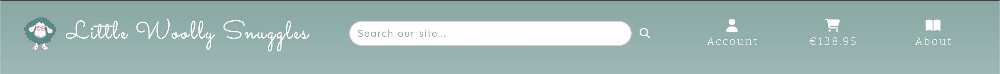
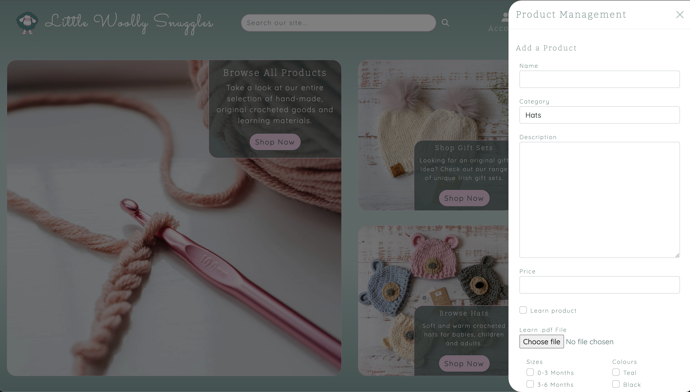
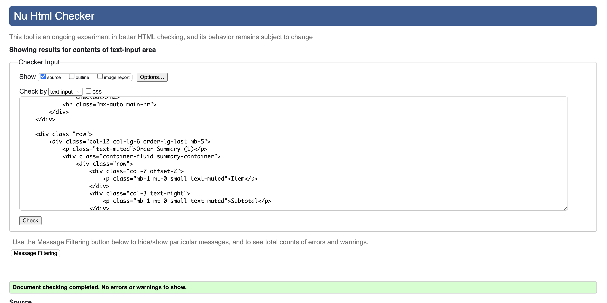
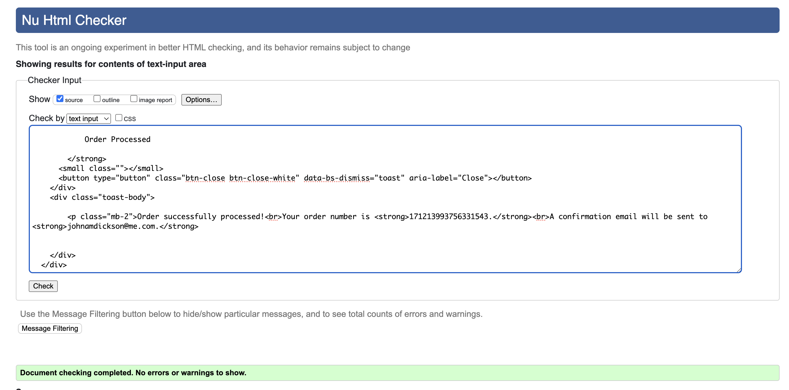

# Testing 

## Contents

- [User Story Testing](#user-story-testing)
  * [Project Setup and Authorisation Epic](#project-setup-and-authorisation-epic)
  * [Home Page and Header Epic](#home-page-and-header-epic)
  * [Products Set Up and Interactions Epic](#products-set-up-and-interactions-epic)
  * [Products & Categories: Filtering, Sorting and Searching Epic](#products--categories-filtering-sorting-and-searching-epic)
  * [Shopping Cart Epic](#shopping-cart-epic)
  * [Notification System Epic](#notification-system-epic)
  * [Checkout Epic](#checkout-epic)
  * [Payment Functionality Epic](#payment-functionality-epic)
  * [User Profiles Epic](#user-profiles-epic)
  * [Product Management Epic](#product-management-epic)
  * [Error Pages Epic](#error-pages-epic)
  * [Deploy Project to Production Environment Epic](#deploy-project-to-production-environment-epic)
  * [Search Engine Optimisation Epic](#search-engine-optimisation-epic)
- [Validator Testing](#validator-testing)
  * [HTML](#html)
  * [CSS](#css)
  * [Javascript](#javascript)
  * [Python](#python)
  * [Lighthouse](#lighthouse)
  * [DBeaver](#dbeaver)
- [Responsiveness Testing](#responsiveness-testing)
  * [Browser Testing](#browser-testing)
  * [Device Testing](#device-testing)
- [Automated Testing](#automated-testing)
  * [Python Automated Testing](#python-automated-testing)
  * [Javascript Automated Testing](#javascript-automated-testing)
- [Manual Testing](#manual-testing)
  * [Home Page](#home-page)
  * [Emissions Page](#emissions-page)
  * [Checks Page](#checks-page)
  * [Emission Details Page](#emission-details-page) 
  * [Add Emission Page](#add-emission-page)
  * [Close Emission Page](#close-emission-page)
  * [Add Check Page](#add-check-page)
  * [Login Page](#login-page) 
  * [Signup Page](#signup-page) 
  * [Logout Page](#logout-page) 
  * [400 Error Page](#400-error-page) 
  * [403 Error Page](#403-error-page) 
  * [404 Error Page](#400-error-page) 
  * [500 Error Page](#403-error-page) 
  * [Footer](#footer) 
  * [Alerts](#alerts) 
- [Bugs](#bugs)

## User Story Testing

### [Project Setup and Authorisation Epic](https://github.com/johnamdickson/portfolio-project-5/issues/1)
**User Story**|**Test**|**Result**|**Evidence**|**Project Goals**
:------|:------|:----:|:-----:|:------|
As a **Site Admin** I can **commence the project build** so that **the project can commence in a timely manner.**  [🔗](https://github.com/johnamdickson/portfolio-project-5/issues/3)|All tasks completed to comply with acceptance criteria. Project build completed and installation confirmed along with superuser creation| ✅|  | A fully functional, user friendly and dynamic website with the best possible user experience.|
As a **Site Admin** I can **install a robust authorisation system** so that **user information and the site access is secure**  [🔗](https://github.com/johnamdickson/portfolio-project-5/issues/4)|All auth added to project and confirmed email verification operational. | ✅|| A secure platform for purchasing and user creation.
 As a **Site Owner** I can **review site wireframes and database schemas** so that **the initial proposal for the project is understood and agreed upon**  [🔗](https://github.com/johnamdickson/portfolio-project-5/issues/6)| Wireframes agreed with client. Database schema  | ✅|[Database Schema](documentation/README-files/database-schema.png)  [Desktop Wireframes](documentation/README-files/desktop-wireframes.pdf)  [Mobile/Tablet Wireframes](documentation/README-files/mobile-tablet-wireframes.pdf)| A fully functional, user friendly and dynamic website with the best possible user experience.

### [Home Page and Header Epic](https://github.com/johnamdickson/portfolio-project-5/issues/2)
**User Story**|**Test**|**Result**|**Evidence**|**Project Goals**
:------|:------|:----:|:-----:|:------|
As a **site admin** I can **connect the home page** so that **the initial page can be confirmed operational**  [🔗](https://github.com/johnamdickson/portfolio-project-5/issues/5)|Home app created and confirmed operational using temporary test message| ✅|  | A fully functional, user friendly and dynamic website with the best possible user experience.|
As a **site user** I can **access a functional and styled home page** so that **initial experience of the website is a positive one**  [🔗](https://github.com/johnamdickson/portfolio-project-5/issues/7)|Styled home page and header added to home app. Mockups agreed with site owner. | ✅|[Mock Ups](documentation/README-files/mockups.pdf)    | A fully functional, user friendly and dynamic website with the best possible user experience.
As a **site user** I can **access secondary information on the site using a sidebar** so that **there is not information overload on the home page and I can access all information in an engaging manner**  [🔗](https://github.com/johnamdickson/portfolio-project-5/issues/8)| Bootstrap offcanvas added to project working off header links  | ✅|| A modern,responsive and stylish website.
As a **user** I can **log in and out of my account** so that **I am able to access all the sites features.**  [🔗](https://github.com/johnamdickson/portfolio-project-5/issues/16)| Signup, login and logout added and confirmed operational. Links in account offcanvas conditional on user status (logged in or out).  | ✅|| A secure platform for purchasing and user creation.    A fully functional, user friendly and dynamic website with the best possible user experience.|

### [Products Set Up and Interactions Epic](https://github.com/johnamdickson/portfolio-project-5/issues/9)
**User Story**|**Test**|**Result**|**Evidence**|**Project Goals**
:------|:------|:----:|:-----:|:------|
As a **Site Admin** I can **add/remove products** so that **the shop inventory can be updated**  [🔗](https://github.com/johnamdickson/portfolio-project-5/issues/10)|Products app with associated models created and confirmed operational by uploading a list of products to the DB| ✅|  | A fully functional, user friendly and dynamic website with the best possible user experience.  A selection of crocheted products are available for purchase directly in the website.|
As a **Site Admin** I can **view products in the admin page** so that **the business inventory can be checked and amended.** [🔗](https://github.com/johnamdickson/portfolio-project-5/issues/11)|Product and Category admin classes added to app and confirmed in admin panel. | ✅|  | A fully functional, user friendly and dynamic website with the best possible user experience.  A selection of crocheted products are available for purchase directly in the website.|
As a **user** I can **browse products on the product page** so that **I can view all of the items the shop has to offer**  [🔗](https://github.com/johnamdickson/portfolio-project-5/issues/12)|Product template created and listed on products page. | ✅|  | A fully functional, user friendly and dynamic website with the best possible user experience.  A selection of crocheted products are available for purchase directly in the website.|
As a **User** I can **review the product details** so that **make and informed decision to buy or not, based on a more detailed description of the product.**  [🔗](https://github.com/johnamdickson/portfolio-project-5/issues/13)|Product detail template created showing image of product and all details. Link from products page set up and operational | ✅|  | A fully functional, user friendly and dynamic website with the best possible user experience.  A selection of crocheted products are available for purchase directly in the website.|
As a **User** I can **view the products in a visually engaging manner** so that **my experience of the site is a positive one**  [🔗](https://github.com/johnamdickson/portfolio-project-5/issues/14)|Products and product detail pages styled to site aesthetic. Responsivenes confirmed across all device screen sizes. | ✅|  | A modern,responsive and stylish website.  A selection of crocheted products are available for purchase directly in the website.|
As a **user** I can **access the main pages using navigation links** so that **experience of navigating the site is simple and intuitive**  [🔗](https://github.com/johnamdickson/portfolio-project-5/issues/17)|Navbar and links added to all pages with exception of home page. Added dropdown menu for navigation links on small screens. | ✅|  |  A fully functional, user friendly and dynamic website with the best possible user experience.|
As a **user** I can **browse available item sizes and/or colours** so that **I can make an informed decision on product sizing and preferred colours.**  [🔗](https://github.com/johnamdickson/portfolio-project-5/issues/19)|Size and colour models added to products app. A means of displaying available colours added to products page along with a size chart. | ✅|  |  A fully functional, user friendly and dynamic website with the best possible user experience.  A selection of crocheted products are available for purchase directly in the website.|

### [Products & Categories: Filtering, Sorting and Searching Epic](https://github.com/johnamdickson/portfolio-project-5/issues/15)
**User Story**|**Test**|**Result**|**Evidence**|**Project Goals**
:------|:------|:----:|:-----:|:------|
As a **user** I can **locate products using the search bar** so that **quickly find what I am looking for on the site**  [🔗](https://github.com/johnamdickson/portfolio-project-5/issues/20)|Search logic implemented and tested in the template.| ✅|  | A fully functional, user friendly and dynamic website with the best possible user experience.  A selection of crocheted products are available for purchase directly in the website.|
As a **User** I can **filter by categories using the nav menu** so that **site navigation to the correct products is straight forward.**  [🔗](https://github.com/johnamdickson/portfolio-project-5/issues/21)|Method added to filter products by category and functionality added to the Products page| ✅|  | A fully functional, user friendly and dynamic website with the best possible user experience.  A selection of crocheted products are available for purchase directly in the website.|
As a **user** I can **select products by price and category from the navbar links** so that **I can sort as required dependent on my personal preference**  [🔗](https://github.com/johnamdickson/portfolio-project-5/issues/22)|Sorting by category and price functionality added to navbar links| ✅|  | A fully functional, user friendly and dynamic website with the best possible user experience.  A selection of crocheted products are available for purchase directly in the website.|
As a **user** I can **sort products within the products page** so that **I do not have to access the nav link if I want to refine the sort criteria** [🔗](https://github.com/johnamdickson/portfolio-project-5/issues/23)|Full sort functionality implemented. Back to top button added| ✅|  | A fully functional, user friendly and dynamic website with the best possible user experience.  A selection of crocheted products are available for purchase directly in the website.|

### [Shopping Cart Epic](https://github.com/johnamdickson/portfolio-project-5/issues/24)
**User Story**|**Test**|**Result**|**Evidence**|**Project Goals**
:---|:---|:----:|:----------:|:------|
As a **Site Admin** I can **view the shopping cart app structure** so that **I can verify the project structure and functionality is consistent with other apps**  [🔗](https://github.com/johnamdickson/portfolio-project-5/issues/25)|Shopping cart app created. Context data confirmed operational by referencing total update persistence on all screens| ✅|  | A fully functional, user friendly and dynamic website with the best possible user experience.  A selection of crocheted products are available for purchase directly in the website.|
As a **user** I can **add products to the shopping bag** so that **I can select the products that I want to purchase.**  [🔗](https://github.com/johnamdickson/portfolio-project-5/issues/26)|Products can be added to the shopping cart. Product sizes and colours can be added as applicable. Toast added with cart summary. Cart template added and styled| ✅| | A fully functional, user friendly and dynamic website with the best possible user experience.  A selection of crocheted products are available for purchase directly in the website.|
As a **user** I can **amend or delete products from the shopping cart** so that **my purchase is correct if I change my mind**  [🔗](https://github.com/johnamdickson/portfolio-project-5/issues/27)|Products can be amended in or deleted from the shopping cart. | ✅|  | A fully functional, user friendly and dynamic website with the best possible user experience.  A selection of crocheted products are available for purchase directly in the website.|

### [Notification System Epic](https://github.com/johnamdickson/portfolio-project-5/issues/28)
**User Story**|**Test**|**Result**|**Evidence**|**Project Goals**
:---|:---|:----:|:----------:|:------|
As a **user** I can **see when key events are successful or not via notifications** so that **I am informed of my status as I attempt to use the site**  [🔗](https://github.com/johnamdickson/portfolio-project-5/issues/29)|Bootstrap toasts added to project and confirmed operational for sign in and sign out.| ✅|   | A fully functional, user friendly and dynamic website with the best possible user experience.  A modern,responsive and stylish website.|
As a **user** I can **see a preview of the item bought and price in success notifications** so that **my purchase choices are reinforced in a visually stimulating way.** [🔗](https://github.com/johnamdickson/portfolio-project-5/issues/30)|Cart preview added to success toast, shown when a user adds a product to the cart.| ✅|  | A fully functional, user friendly and dynamic website with the best possible user experience.  A modern,responsive and stylish website.|
As a **product developer** I can **change product detail empty select notification from toasts to popovers** so that **the clients preference based on interim feedback can be delivered.** [🔗](https://github.com/johnamdickson/portfolio-project-5/issues/39)|Product detail attribute selectors error notifications changed from toasts to popovers.| ✅|  | A fully functional, user friendly and dynamic website with the best possible user experience.  A modern,responsive and stylish website.|

### [Checkout Epic](https://github.com/johnamdickson/portfolio-project-5/issues/34)
**User Story**|**Test**|**Result**|**Evidence**|**Project Goals**
:---|:---|:----:|:----------:|:------|
As a **site owner** I can **ensure items are captured in an order** so that **customers can complete purchases with all the correct information included.**  [🔗](https://github.com/johnamdickson/portfolio-project-5/issues/40)|Checkout app created with order and order line item objects. Unique number for order created in checkout.js.| ✅|   | A fully functional, user friendly and dynamic website with the best possible user experience.  A modern,responsive and stylish website.|
As a **site owner** I can **ensure the checkout order is updated automatically** so that **the customers cart is fully represented in the order** [🔗](https://github.com/johnamdickson/portfolio-project-5/issues/41)|Signals file added to checkout app for save and delete of order line items which automatically updates totals.| ✅| [signals.py](https://github.com/johnamdickson/portfolio-project-5/blob/main/checkout/signals.py)| A fully functional, user friendly and dynamic website with the best possible user experience.  A modern,responsive and stylish website.|
As a **user** I can **view the cart with items and options to enter details** so that **I can proceed with completing my order**  [🔗](https://github.com/johnamdickson/portfolio-project-5/issues/42)|Checkout template created, styled and accessible from the cart template.| ✅|  | A fully functional, user friendly and dynamic website with the best possible user experience.   A selection of crocheted products are available for purchase directly in the website.
|

### [Payment Functionality Epic](https://github.com/johnamdickson/portfolio-project-5/issues/35)
**User Story**|**Test**|**Result**|**Evidence**|**Project Goals**
:---|:---|:----:|:----------:|:------|
As a **user** I can **make a card payment for selected products** so that **I can pay for the goods that I want to buy**  [🔗](https://github.com/johnamdickson/portfolio-project-5/issues/49)|Stripe payment element added to checkout page and required functionality implemented through JS and view code.| ✅|  | A selection of crocheted products are available for purchase directly in the website.   A secure platform for purchasing and user creation.
As a **Site Admin** I can **ensure that products are added to the order with confirmation to user** so that **the products the user wants to buy are recorded correctly in the database and they are notified in due course.**  [🔗](https://github.com/johnamdickson/portfolio-project-5/issues/50)|Order processing to back end implemented post successful Stripe payment. Checkout success page created confirming order and displaying details to the user.| ✅|  | A selection of crocheted products are available for purchase directly in the website.   A secure platform for purchasing and user creation.
As a **Site Admin** I can **set up webhooks in the payment system** so that **user orders are updated on confirmation of payment regardless of status of browser or inadvertent page redirection.**  [🔗](https://github.com/johnamdickson/portfolio-project-5/issues/51)|Stripe webhook added for project and view classes created to handle different outcomes.| ✅|  | A selection of crocheted products are available for purchase directly in the website.   A secure platform for purchasing and user creation.
As a **Site Admin** I can **set up webhooks in the payment system** so that **user orders are updated on confirmation of payment regardless of status of browser or inadvertent page redirection.**  [🔗](https://github.com/johnamdickson/portfolio-project-5/issues/51)|Stripe webhook added for project and view classes created to handle different outcomes.| ✅|  | A selection of crocheted products are available for purchase directly in the website.   A secure platform for purchasing and user creation.

### [User Profiles Epic](https://github.com/johnamdickson/portfolio-project-5/issues/36)
**User Story**|**Test**|**Result**|**Evidence**|**Project Goals**
:---|:---|:----:|:----------:|:------|
 As a **Site Admin** I can **ensure the functionality to add a profile exists** so that **users have the option to save their details for future purchases making the process of using the site more streamlined and encourage return visits**  [🔗](https://github.com/johnamdickson/portfolio-project-5/issues/52)|User profile app created with associated views, urls and template.| ✅|  | A fully functional, user friendly and dynamic website with the best possible user experience.   A secure platform for purchasing and user creation.
As a **user** I can **view and update my profile details** so that **I can keep my details up to date.** [🔗](https://github.com/johnamdickson/portfolio-project-5/issues/56)|User profile edit functionality added along with offcanvas option.| ✅|  | A fully functional, user friendly and dynamic website with the best possible user experience.   A secure platform for purchasing and user creation.
As a **user** I can **see my order history** so that **I can review purchases that I have already made.** [🔗](https://github.com/johnamdickson/portfolio-project-5/issues/57)|Order history added to main user profile view.| ✅| | A fully functional, user friendly and dynamic website with the best possible user experience.
As a **site admin** I can **ensure orders are assigned to user history** so that **the site operates as intended and does not require manual intervention.** [🔗](https://github.com/johnamdickson/portfolio-project-5/issues/58)|Order history added to main user profile view.| ✅| | A fully functional, user friendly and dynamic website with the best possible user experience.
As a **site admin** I can **enable automated emails** so that **users receive confirmation of a successful order.** [🔗](https://github.com/johnamdickson/portfolio-project-5/issues/60)|Automated emails using SMTP via Mailtrap implemented| ✅|  | A fully functional, user friendly and dynamic website with the best possible user experience.

### [Product Management Epic](https://github.com/johnamdickson/portfolio-project-5/issues/61)
**User Story**|**Test**|**Result**|**Evidence**|**Project Goals**
:---|:---|:----:|:----------:|:------|
 As a **site admin** I can **add products to the store via a site page** so that **new products can be added with ease**  [🔗](https://github.com/johnamdickson/portfolio-project-5/issues/62)|Facility to add products available from button on products page or via product management offcanvas. Functionality only available to superusers| ✅|   | A fully functional, user friendly and dynamic website with the best possible user experience.   A selection of crocheted products are available for purchase directly in the website.  Learn products offering users purchase of crocheting tutorials.
As a **site admin** I can **edit and delete products within the main site** so that **the product invetory can remain current.**  [🔗](https://github.com/johnamdickson/portfolio-project-5/issues/63)|Facility to edit or delete a product added, accessible from the product detail page of individual products| ✅|  | A fully functional, user friendly and dynamic website with the best possible user experience.   A selection of crocheted products are available for purchase directly in the website.  Learn products offering users purchase of crocheting tutorials.
|

### [Error Pages Epic](https://github.com/johnamdickson/portfolio-project-5/issues/61)
**User Story**|**Test**|**Result**|**Evidence**|**Project Goals**
:---|:---|:----:|:----------:|:------|
As a **Site Admin** I can **ensure users are informed of client error responses (400,403 and 404) in an informative and design friendly manner** so that **they can be made aware of the issue whilst maintaining the site aesthetic**  [🔗](https://github.com/johnamdickson/portfolio-project-5/issues/69)|400 error pages created with test page urls for 400 and 403 for use by superuser. Each page has a back button and timer which automatically returns user to home page once completed.| ✅|    | A fully functional, user friendly and dynamic website with the best possible user experience.
As a **Site Admin** I can **ensure users are informed of the server error response (500) in an informative and design friendly manner** so that **they can be made aware of the issue whilst maintaining the site aesthetic**  [🔗](https://github.com/johnamdickson/portfolio-project-5/issues/70)|500 error page created with test page url for use by superuser. The page has a back button and timer which automatically returns user to home page once completed.| ✅|   | A fully functional, user friendly and dynamic website with the best possible user experience.

### [Deploy Project to Production Environment Epic](https://github.com/johnamdickson/portfolio-project-5/issues/47)
**User Story**|**Test**|**Result**|**Evidence**|**Project Goals**
:---|:---|:----:|:----------:|:------|
As a **site owner** I can **access the site in a production environment** so that **I can verify that customers can access the live site.** [🔗](https://github.com/johnamdickson/portfolio-project-5/issues/65)|App deployed to Heroku hosting platform.| ✅|  | A fully functional, user friendly and dynamic website with the best possible user experience.
As a **site owner** I can **store media and static files in the cloud** so that **the site operates as intended with correct images and styling in the production environment.** [🔗](https://github.com/johnamdickson/portfolio-project-5/issues/66)|AWS S3 storage bucket set up with folders for static and media files| ✅|   | A fully functional, user friendly and dynamic website with the best possible user experience.
As a **user** I can **receive pertinent emails** so that **I know when major operations have been completed such as creating a profile or completing an order**  [🔗](https://github.com/johnamdickson/portfolio-project-5/issues/74)|Mailtrap SMTP service linked to custom domain adopted for project to send mails from the app.| ✅|  | A secure platform for purchasing and user creation.

### [Search Engine Optimisation Epic](https://github.com/johnamdickson/portfolio-project-5/issues/71)
**User Story**|**Test**|**Result**|**Evidence**|**Project Goals**
:---|:---|:----:|:----------:|:------|
As a **site owner** I can **optimise the website using established tools and techniques** so that **it ranks highly in the search engines.** [🔗](https://github.com/johnamdickson/portfolio-project-5/issues/71)|Short and long tail keywords added to key areas in DOM. Meta description updated in html head. Sitemap and robots files added to root directory.| ✅| [SEO and Web Marketing Study](documentation/TESTING-files/user-story-testing/seo-web-marketing-study.pdf)   | An optimised website for search engines to improve visibility and reach.    A series of web marketing strategies both on the website and external to it.
As a **site owner** I can **use marketing tools and strategies** so that **I retain customers and attract new ones.** [🔗](https://github.com/johnamdickson/portfolio-project-5/issues/73)|Facebook business page created. Email marketing service added to footer. Links to socials also added to footer| ✅|  | An optimised website for search engines to improve visibility and reach.    A series of web marketing strategies both on the website and external to it.

 <a href="#contents">BACK TO CONTENTS 🔼</a>

## Validator Testing

### HTML

All HTML pages were checked using the [W3C HTML Validator](https://validator.w3.org/) with each page checked using address with the exception of those requring user login. These pages were checked using the source text input. The text input was obtained by navigating to the page to test and then right clicking on the window. From the menu, the view page source option was selected which opened a new tab containing the DOM for the page. The test was then performed by copying and pasting the code into the text input field in the validator. The pages checked using the source text are: profile, add-product, edit-product.

Results for all HTML pages can be found in the table below:

**Page**|**First Pass**|**Warnings/Errors**|**Second Pass (Post Fix)**|**Screenshot**
:-----:|:-----:|:-----|:-----:|:-----:
 |home| ❌ |Errors/warnings returned, click [here](documentation/TESTING-files/html-validation/pre-edit-results/index.md)| ✅ | 
|products| ❌ |Errors/warnings returned, click [here](documentation/TESTING-files/html-validation/pre-edit-results/products.md)| ✅ | 
|product-detail| ❌ |Errors/warnings returned, click [here](documentation/TESTING-files/html-validation/pre-edit-results/product-detail.md)| ✅ | 
|cart| ✅ |No errors/warnings returned| N/A | 
|checkout| ✅ |No errors/warnings returned| N/A | 
|checkout-success| ✅ |No errors/warnings returned| N/A | 
|profile| ❌ |Errors/warnings returned, click [here](documentation/TESTING-files/html-validation/pre-edit-results/profile.md)| ✅ | 
|400 test page|✅|No errors/warnings returned| N/A |
|403 test page|✅|No errors/warnings returned| N/A | 
|404 test page|✅|No errors/warnings returned| N/A | 
|500 test page|✅|No errors/warnings returned| N/A |  

 
### CSS

The site CSS was checked using the [W3C CSS Validator](https://jigsaw.w3.org/css-validator/). There remains 228 warnings in total post edit associated with Bootstrap CSS and webkit vendor extensions. These warnings are unavoidable in the validator because they are vendor extensions. In the interests of project delivery timeline, no action was taken to rectify them.

**First Pass**|**Warnings/Errors**|**Second Pass (Post Fix)**|**Screenshot**
:-----:|:-----|:-----:|:-----:
| ❌ |Errors/warnings returned, click [here](documentation/TESTING-files/css-validation/pre-edit-results/css.md)|✅| 

### Javascript

The site Javascsript functionality was checked using [JS Hint](https://jshint.com/).

**File**|**Warnings**|**Warnings Remaining (Post Fix)**|**Screenshot**
|:-----:|:-----|:-----|:-----:|
cart.js |Warnings returned, click [here](documentation/TESTING-files/javascript-validation/pre-edit-results/js-pre-edit.md) to view|Seven warnings remained post edits all relating to functions declared in loops referencing an outer scoped variable. Decided no to spend time at this stage in the project resolving as they are minor issues. Bootstrap undefined variable. No action taken as necessary for operation of popovers.| 
cart.js |Warnings returned, click [here](documentation/TESTING-files/javascript-validation/pre-edit-results/js-pre-edit.md#checkoutjs) to view|No warnings remained after refactoring. Stripe undefined variable remains but as before, no action taken as necessary for operation of payment element.| 
products.js |Warnings returned, click [here](documentation/TESTING-files/javascript-validation/pre-edit-results/js-pre-edit.md#productsjs) to view|Eight warnings remained post edits all relating to functions declared in loops referencing an outer scoped variable. Decided no to spend time at this stage in the project resolving as they are minor issues. Bootstrap undefined variable. No action taken as necessary for operation of popovers.| 
base.js |Warnings returned, click [here](documentation/TESTING-files/javascript-validation/pre-edit-results/js-pre-edit.md#basejs) to view|Six warnings remained post edits all relating to functions declared in loops referencing an outer scoped variable. As before, decided no to spend time at this stage in the project resolving as they are minor issues. Bootstrap undefined variable. No action taken as necessary for operation of popovers and toasts. Four unused variables remained, all of which are used in the Bootstrap boilerplate - no action taken to resolve.| 

### Python

Each of the site Python files containing code over and above a basic import and boilerplate comments were passed through the [Code Institute Python Linter](https://pep8ci.herokuapp.com/). The table below lists each of the main files with screenshot of the results after resolving errors and warnings.
#### Cart App
**File**|**Initial Errors/Warnings**|**Screenshot**
|:-----:|:------|:-----:|
|apps.py|No errors/warnings returned|
|cart_tools.py|Errors/warnings returned, click [here](documentation/TESTING-files/python-validation/cart/cart-pre-edit.md#cart_toolspy)|
|contexts.py|Errors/warnings returned, click [here](documentation/TESTING-files/python-validation/cart/cart-pre-edit.md#contextspy)|
|tests.py|Errors/warnings returned, click [here](documentation/TESTING-files/python-validation/cart/cart-pre-edit.md#testspy)|
|urls.py|No errors/warnings returned|
|views.py|Errors/warnings returned, click [here](documentation/TESTING-files/python-validation/cart/cart-pre-edit.md#viewspy)|
#### Checkout App
**File**|**Initial Errors/Warnings**|**Screenshot**
|:-----:|:------|:-----:|
|apps.py|No errors/warnings returned|
|checkout_tools.py|Errors/warnings returned, click [here](documentation/TESTING-files/python-validation/checkout/checkout-pre-edit.md#checkout_toolspy)|
|admin.py|Errors/warnings returned, click [here](documentation/TESTING-files/python-validation/checkout/checkout-pre-edit.md#adminpy)|
|forms.py|Errors/warnings returned, click [here](documentation/TESTING-files/python-validation/checkout/checkout-pre-edit.md#formspy)|
|models.py|Errors/warnings returned, click [here](documentation/TESTING-files/python-validation/checkout/checkout-pre-edit.md#modelspy)|
|signals.py|Errors/warnings returned, click [here](documentation/TESTING-files/python-validation/checkout/checkout-pre-edit.md#signalspy)|
|urls.py|Errors/warnings returned, click [here](documentation/TESTING-files/python-validation/checkout/checkout-pre-edit.md#urlspy)|
|views.py|Errors/warnings returned, click [here](documentation/TESTING-files/python-validation/checkout/checkout-pre-edit.md#viewspy)|
|webhook_handler.py|Errors/warnings returned, click [here](documentation/TESTING-files/python-validation/checkout/checkout-pre-edit.md#webhook_handlerpy)|
|webhooks.py|Errors/warnings returned, click [here](documentation/TESTING-files/python-validation/checkout/checkout-pre-edit.md#webhookspy)|
#### Home App
**File**|**Initial Errors/Warnings**|**Screenshot**
|:-----:|:------|:-----:|
|apps.py|No errors/warnings returned|
|urls.py|Errors/warnings returned, click [here](documentation/TESTING-files/python-validation/home/home-pre-edit.md#urlspy)|
|views.py|Errors/warnings returned, click [here](documentation/TESTING-files/python-validation/home/home-pre-edit.md#viewspy)|
#### Little Woolly Snuggles Project
**File**|**Initial Errors/Warnings**|**Screenshot**
|:-----:|:------|:-----:|
|asgi.py|Errors/warnings returned, click [here](documentation/TESTING-files/python-validation/little-woolly-snuggles/lws-pre-edit.md#asgipy)|
|settings.py|Errors/warnings returned, click [here](documentation/TESTING-files/python-validation/little-woolly-snuggles/lws-pre-edit.md#settingspy)|
|urls.py|Errors/warnings returned, click [here](documentation/TESTING-files/python-validation/little-woolly-snuggles/lws-pre-edit.md#urlspy)|
|wsgi.py|Errors/warnings returned, click [here](documentation/TESTING-files/python-validation/little-woolly-snuggles/lws-pre-edit.md#wsgipy)|
#### Products App
**File**|**Initial Errors/Warnings**|**Screenshot**
|:-----:|:------|:-----:|
|admin.py|Errors/warnings returned, click [here](documentation/TESTING-files/python-validation/products/products-pre-edit.md#adminpy)|
|apps.py|No errors/warnings returned|
|contexts.py|Errors/warnings returned, click [here](documentation/TESTING-files/python-validation/products/products-pre-edit.md#contextspy)|
|forms.py|Errors/warnings returned, click [here](documentation/TESTING-files/python-validation/products/products-pre-edit.md#formspy)|
|models.py|Errors/warnings returned, click [here](documentation/TESTING-files/python-validation/products/products-pre-edit.md#modelspy)|
|tests.py|Errors/warnings returned, click [here](documentation/TESTING-files/python-validation/products/products-pre-edit.md#testspy)|
|urls.py|No errors/warnings returned|
|views.py|Errors/warnings returned, click [here](documentation/TESTING-files/python-validation/products/products-pre-edit.md#viewspy)|
#### Profiles App
**File**|**Initial Errors/Warnings**|**Screenshot**
|:-----:|:------|:-----:|
|admin.py|Errors/warnings returned, click [here](documentation/TESTING-files/python-validation/profiles/profiles-pre-edit.md#adminpy)|
|apps.py|No errors/warnings returned|
|contexts.py|Errors/warnings returned, click [here](documentation/TESTING-files/python-validation/profiles/profiles-pre-edit.md#contextspy)|
|forms.py|No errors/warnings returned|
|models.py|Errors/warnings returned, click [here](documentation/TESTING-files/python-validation/profiles/profiles-pre-edit.md#modelspy)|
|urls.py|Errors/warnings returned, click [here](documentation/TESTING-files/python-validation/profiles/profiles-pre-edit.md#urlspy)|
|views.py|Errors/warnings returned, click [here](documentation/TESTING-files/python-validation/profiles/profiles-pre-edit.md#viewspy)|
#### Miscellaneous Python Files
**File**|**Initial Errors/Warnings**|**Screenshot**
|:-----:|:------|:-----:|
|custom_storages.py|No errors/warnings returned|
|constants.py|No errors/warnings returned|

### Lighthouse

All HTML pages were checked using [Chrome DevTools Lighthouse](https://developer.chrome.com/docs/lighthouse/overview/). At first the performance results were sub-optimal, returning a score of 50-55. This very much reflected my experience of the app, taking a long time to render in the browser. Upon investigation, the main issue was due to the server response time of circa 4500ms. Upon researching issue and found two possible means of improving performance - [lazy image loading](https://www.sitepoint.com/five-techniques-lazy-load-images-website-performance/) and [caching](https://adamj.eu/tech/2023/03/23/django-context-processors-database-queries/), the former of which I reverted based on feedback from Lighthouse report. I also compressed images and converted to webp. This increased the score to around 60. In order to troubleshoot and improve the score further, I installed Django debug toolbar and analysed the SQL queries noticing a large number of redundant queries which I was able to resolve by refactoring the code and moving any conditional logic in the view files, bringing the score to mid-60s.  The user profile off canvases order history accounted for a large number of the queries so to improve the score further I opted to remove this from the off canvases and replace with a link to the profile page. 

When testing the production database in developer environment the scores for each page were over 90. However I could not achieve these scores for all pages. In the interest of project delivery, any further works to improve them was suspended with a view to returning at a later date.

The best practices score was also less than optimal at 78. The main reason appears to be related to use of third party cookies, which is a feature that Google will be phasing out. However, for this project they are necessary so the score could not be improved upon

In all instances the Accessibility and SEO scores were excellent. The latter was welcome given the focus on SEO in this project. 

For mobile devices, the performance score was in the 60-80 region, much like in the previous project to this. Researching this performance dip then revealed that any countermeasures and any further alterations towards improving the mobile performance score could be time consuming and in the interests of project progress have not been implemented here.

**File**|**Desktop Results**|**Mobile Results**|
|:-----:|:-----:|:-----:|
|index.html||
|products.html||
|product-detail.html||
|add-product.html||
|edit-product.html||
|cart.html||
|checkout.html||
|checkout-success.html||
|profile.html||
|400.html||
|403.html||
|404.html||
|500.html||

### DBeaver

The DBeaver database administration tool was used to verify the database schema and confirm the entity relationships exist as expected within the database and are correct for the project. As can be seen in the images below, there are differences between the proposed schema and actual schema but broadly speaking are very similar. Product sizes and colour models were added as the project progressed and the FAQ model was omitted due to the approaching project deadline. 

The images below serve as a comparision between the database schema produced online and the actual database structure as reported by DBeaver.

<table width=90% align="center">
  <tr>
    <td>
      

        <strong>Manually Generated Schema</strong>
      

    </td>
  </tr>
  <tr>
    <td>
    
  
    </td>
  </tr>
    <tr>
    <td>
      

        <strong>DBeaver Entity Relationship Diagram</strong>
      

    </td>
  </tr>
  <tr>
    <td>
    

    </td>
  </tr>
</table>

 <a href="#contents">BACK TO CONTENTS 🔼</a>

## Responsiveness Testing

### Browser Testing

The app was tested on Chrome, Firefox, Safari and Microsoft Edge. The appearance and responsiveness on each platform was satisfactory. The only minor anomaly was observed on Safari where a blue surround appears on the navbar elements when selected. This does not occur on the other browsers. As it is a minor styling issue, no further action was taken at this point, with a view to revisiting in later versions.  
      

        
      

### Device Testing
The responsiveness for simulated devices was tested using Chrome extension Mobile Simulator and confirmed to be satisfactory in all cases. There were minor styling modifications such as font size, margin or position adjustments completed during the testing but were of such an insignificant nature they are not mentioned here. The table below demonstrates the site's responsiveness across physical and simulated devices.

**Device**|**Screenshot**|**Device**|**Screenshot**
|:-----:|:-----:|:-----:|:-----:|
|iPhone 12 Pro Max (Physical Device)||MacBook Pro 13" (Physical Device)|
|iPhone SE (Simulated Device)||Google Pixel 6 Pro (Simulated Device)|
|Samsung Galaxy S20 (Simulated Device)||iPhone 13Pro Max (Simulated Device)|
iPad Pro 11 (Simulated Device)||Samsung Galaxy Tab S7 (Simulated Device)|

 <a href="#contents">BACK TO CONTENTS 🔼</a>

## Automated Testing

### Python Automated Testing
Automated testing was completed on the Products and Cart app methods using the built in Django TestCase class. The remainder of the Python based functionality was tested manually. The coverage report for automated testing can be found [here.]
The individual test cases are described in the table below with gif of running tests included:
#### Cart App Tests ####
**Test**|**Test Description**                                            
|:------|:------|
|test_view_cart|Test to confirm correct status code when view_cart url is accessed.
|test_add_to_cart|Add product to cart and test correct item added with appropriate redirection using passed in url and instantiated message.
|test_adjust_cart|Adjust cart by mutating quantity and test correct item quantity with appropriate redirection using passed in url and instantiated message.
|test_remove_from_cart|Remove item from cart by calling remove_from_cart and test item removed with appropriate redirection using passed in url and instantiated message.
|test_empty_cart_contents|Test that initial cart session is empty.|
|test_cart_contents|Test cart session contains items when they are added to cart.|

#### Cart App Tests Outcome ####
<table width=90% align="center">
  <tr>
    <td></td>
  </tr>
</table>

#### Products App Tests ####
**Test**|**Test Description**                                            
|:-----|:------|
|test_category_name|Test category name assigned in setup is correct.
|test_category_friendly_name|Test category friendly name assigned in setup is correct.
|test_product_name_and_category|Test product name and category assigned in setup is correct.
|test_product_description|Test product description assigned in setup is correct.
|test_product_attributes|Test product attributes of sizes and colours assigned in test are correct.
|test_product_size|Test product size assigned in setup is correct.|
|test_product_colour|Test product colour assigned in setup is correct.|
|test_products_view_GET|Test get products view returns correct url, template and response code.|
|test_products_sort_by_name|Test sorting products by name returns correct sort..|
|test_products_sort_by_category|Test sorting products by category returns correct sort.|
|test_products_sort_by_price|Test sorting products by price returns correct sort.|
|test_product_detail_view_GET|Test get product detail view returns correct url, template and response code.|
|test_add_product_superuser|Test adding product by the superuser adds a new product to DB, and redirects to the new products detail page.|
|test_add_product_regular_user|Test adding product by the regular user does not add a new product to DB, and redirects to the home page whilst also instantiating a message to user.|
|test_add_product_no_user|Test adding product by anonymous user does not add a new product to DB, and redirects to the login page.|
|test_edit_product_superuser|Test editing product by the superuser edits product in the DB, and redirects to the new products detail page.|
|test_edit_product_regular_user|Test editing product by the regular user does not edit product in DB and redirects to the home page whilst also instantiating a message to user.|
|test_edit_product_no_user|Test editing product by anonymous user does not edit product on DB, and redirects to the login page.|
|test_delete_product_superuser|Test deleting product by the superuser deletes the product from the DB, and redirects to the products page.|
|test_delete_product_regular_user|Test deleting product by the regular user does not delete product from DB, and redirects to the home page whilst also instantiating a message to user.|
|test_delete_product_no_user|Test deleting product by anonymous user does not delete the product from DB, and redirects to the login page.|

#### Products App Tests Outcome ####
<table width=90% align="center">
  <tr>
    <td></td>
  </tr>
</table>

#### Coverage ####
A coverage report was generated to analyse the coverage rate for Cart and Products app tests. The testing coverage on Cart and Products apps was 52% and 73% respectively with an overall score of 71%. The preference would have been to write more tests to bring these figures up, however in the interests of project deadlines this was not feasible.
<table width=90% align="center">
  <tr>
    <td></td>
  </tr>
</table>
### Javascript Automated Testing ###
Javascript testing was completed using Jest. The only function tested is the errorCountdown (used to create a countdown prior to automatic redirect on HTTP Status Code error pages) as all of the other functions would require a more complex set up to test their functionality fully. Given the time constraints of the project, the remaining functionality would be manually tested. Each test essentially checks for the same seven elements: 
1. Timer set to correct time on page load (60 seconds for 400 and 500 pages, 10 seconds 403 and 404).
2. A check to ensure that the timer is halfway through the countdown (30 or 5 seconds).
3. A check to ensure that the timer is completed and at 0.
4. A check to ensure an h2 exists.
5. A check to ensure the h2 has the correct error code string.
6. A check to ensure an h3 exists.
7. A check to ensure the h3 has the correct error description. 

The test running can be viewed [here.](documentation/TESTING-files/automated-testing-results/jest-testing.gif) 
The test results can be seen in the image below:
      

  
      

 <a href="#contents">BACK TO CONTENTS 🔼</a>
## Manual Testing
Each feature and action on every page of the app was tested manually to verify the correct function of the site. The results are detailed per page or major feature.

### Home Page

 **Feature** | **Expected Outcome** | **Testing Performed** | **Testing Outcome** | **Result** |
|:-----|:------|:------|:-----|:------:|
|Site Logo|Clicking on logo will return user to the home page|Clicked on logo|Home page reloaded|✅|
|Account Header Button|Clicking on Account header button opens an offcanvas with account options|Clicked on Account header button|Account offcanvas opened.|✅|
|Cart Header Button|Clicking on Cart header button opens the Cart page|Clicked on Cart header button|Site redirected to Cart page.|✅|
|About Header Button|Clicking on About header button opens an offcanvas with company information|Clicked on About header button|About offcanvas opened with company information included.|✅|
|Products Shop Now Button|Clicking on the Products Shop Now button opens the Products page with all Products listed|Clicked Products Shop Now button|Site redirected to Products page with all products displayed.|✅|
|Gift Set Shop Now Button|Clicking on the Gift Set Shop Now button opens the Products page filtered to Gift Set products only|Clicked Gift Set Shop Now button|Site redirected to Products page filtered to display Gift Set products.|✅|
|Learn to Crochet Learn Now Button|Clicking on the Learn to Crochet Learn Now button opens the Products page filtered to Learn to Crochet products only|Clicked Learn to Crochet Learn Now button|Site redirected to Products page filtered to display Learn to Crochet products.|✅|
|Hats Shop Now Button|Clicking on the Hats Shop Now button opens the Products page filtered to Hats products only|Clicked Hats Shop Now button|Site redirected to Products page filtered to display Hats products.|✅|
|Blankets Shop Now Button|Clicking on the Blankets Shop Now button opens the Products page filtered to Blankets products only|Clicked Blankets Shop Now button|Site redirected to Products page filtered to display Blankets products.|✅|
|Items Hover|Hover over logo text or header buttons will change their colour to light pink and then return to white once cursor moves off again.|Hovered over each of the aforementioned items| All items changed colour to light pink and then returned to white once cursor moved off|✅|

### Off Canvases

 **Feature** | **Expected Outcome** | **Testing Performed** | **Testing Outcome** | **Result** |
|:-----|:------|:------|:-----|:------:|
|Account Off Canvas - No User|When no user logged in, only the Register and Login options should be available.|Ensure user was logged out and then clicked on Account header button to open off canvas|Account offcanvas opened and revealed only Register and Login options.|✅|
|Account Off Canvas - Standard User|When standard user logged in, only the Profile and Logout options should be available.|Logged in as standard user and then clicked on Account header button to open off canvas|Account offcanvas opened and revealed Profile and Logout options.|✅|
|Account Off Canvas - Superuser|When superuser logged in, a Product Management option should be available along with the Profile and Logout options.|Logged in as superuser and then clicked on Account header button to open off canvas|Account offcanvas opened and revealed Product Management,Profile and Logout options.|✅|
|Login Offcanvas - user authenticated|When the user enters the correct login information, the offcanvas should return to hiddent status and the user informed via a confirmation message toast that they have successfully logged in.|Opened account off canvas and selected login. Entered authenticated user information and clicked login button|Offcanvas animated out of view and the user was notified of successful login via toast with message *Successfully signed in as 'username'*.|✅|
|Login Offcanvas - user not authenticated|When the user enters incorrect or spurious login information, the offcanvas should return to hidden status and the user redirected to the main login page where they should be presented with an error alert and the option to try entering login details again.|Opened account off canvas and selected login. Entered authenticated user information adding extra characters to password before clicking the login button|Offcanvas animated out of view and the user was redirected to the main login page with an error alert in view with the message *The username and/or password you specified are not correct.*.|✅|
|Login Offcanvas - signup link|When the user clicks on the signup link, the Login offcanvas should hide and the Register offcanvas appear.|Opened login offcanvas and then clicked the signup link.|Login offcanvas animated out of view and the register offcanvas appeared.|✅|

### Emissions Page

 **Feature** | **Expected Outcome** | **Testing Performed** | **Testing Outcome** | **Result** |
|:-----|:------|:------|:-----|:------:|
Navbar Menu Items Styling|The emissions navbar link should be a bolder font on page load to indicate where on the site the user is.|Load emissions page|The emissions navbar menu item is a bolder font than the others.|✅|
|Site Logo|Clicking on logo will return user to the home page|Clicked on logo|Home page reloaded|✅|
|Add New Emission Button - with permission to add an emission|Clicking the Add New Emission button should direct the user to the add emission page|Add New Emission button clicked| User is redirected to the add emission page|✅|
|Add New Emission Button - without permission to add an emission|Clicking the Add New Emission button should generate an alert informing the user that they do not have permissions to add a new emission|Add New Emission button clicked| An alert appears informing the user that they are not able to add an emission|✅|
|Add New Emission Button - User Dependant Styling|The Add Emission button should be styled to appropriately depending on user status. For superusers and emission admin users the button should be a white back ground with red font. For base emission users the button background and font colours opacity should be reduced to indicate it is not available.|Logged in as different users with the three permissions detailed previously| The button is styled as expected for all three different users.|✅|
|Add New Emission Button - User Dependant Hover Styling|For superusers and emission admin users the Add Emission button background font and border colour should all change on hover. For base emission users the button background and font colours should remain the same and a not-allowed cursor should appear.|Logged in as different users with the three permissions detailed previously and hovered over Add Emission button| The button is styled on hover as expected for all three different users. The not-allowed cursor appears when the base emission user hovers over button.|✅|
|Emissions Table Checks Complete Column|There should be coloured icons for different check statuses:  
For checks complete&nbsp;&nbsp;&nbsp;&nbsp;&nbsp;&nbsp;&nbsp;
 
For checks outstanding&nbsp;&nbsp;&nbsp;&nbsp;
 
For no checks completed&nbsp;
  | Opened emissions page and scrolled to emissions table.|The three different icons are present in the table for the correct check statuses|✅|
|Emission Table Status Column - Toggle Switch|On page load, only open emissions should displayed in the table.| Load page and scroll to emissions table|The open emissions are displayed and the closed ones are not displayed.|✅|
|Emission Table Status Column - Toggle Switch| The toggle switch in the `<th>` cell of the status column should filter Closed emissions and the switch subtitle should change accordingly to indicate what the column is displaying| Click the toggle switch to both available positions|The Closed emissions were filtered/not filtered depending on the switch position and the switch subtitle changed from *Showing Open Emissions* to *Showing Open & Closed Emissions*.|✅|
|Emission Table Status Column - Background Colour|There should be a different background colour depending on the status - green for Open and red for Closed|Opened emissions page and scrolled to emissions table.|The status dependant background colour is correct for the two different statuses|✅|
|Emission Table Row - Hover| When an emission table row is hovered over, the row background colour should darken slightly and the cursor should change to a pointer.|Move cursor onto an emission table row.| Row background colour and cursor changed as expected|✅|
|Emission Table Row - Closed Emission Row| When a closed emission row is visible, the *Next Check Due* and *Check Status* cells should not contain any text and opacity should be reduced.| Toggled table to indicate closed emissions| The *Next Check Due* and *Check Status* cells were empty and the opacity was reduced.|✅|
|Emission Table Row - Closed Emission| When an emission table row is clicked, a modal should open with the emission selected indicated in the modal title| Click on an emission table row| A modal appeared which had the emission selected in the modal title|✅|
|Emission Table - Scroll Buttons| There should be an up and down button for scrolling the table inside a set height container to the top and bottom respectively. When the table is scrolled to the top, the up button opacity should be reduced. Similarly when the table is scrolled to the bottom, the down button opacity should be reduced. In between the top and bottom position, both buttons should be fully opaque.|Pressed both up and down buttons and scrolled table manually between top and bottom of table.| The buttons opacity reduced dependant on the table scrollview being at the top or bottom. Both buttons were fully opaque between the top and bottom positions.|✅|
|Emissions Page Modal - Submit Check Button|When clicking on the submit emission check button it should redirect the user to the submit check page for the emission selected|Opened modal and clicked the submit emission check button|User is redirected to the submit check page for the correct emission|✅|
|Emissions Page Modal - Go To Emission Detail Page Button|When clicking on the go to emission detail page button it should redirect the user to the emission detail page for the emission selected|Opened modal and clicked the go to emission detail page button|User is redirected to the emission detail page for the correct emission|✅|
|Emissions Page Modal - All Available Buttons(except modal close button)|When hovering over all available buttons the font should change colour and the background opacity should reduce.|Hovered over both of the emissions page modal buttons|The font changed colour and the background opacity reduced as expected|✅|
|Emissions Page Modal - Modal Close Button|When clicking on the close button, the modal should be dismissed.|Opened emissions page modal and clicked on the close button| Emissions page modal was dismissed|✅|
|Screen width <= 982px|Location, Created On and Next Check Due columns should be hidden from the user when screen width is 982px or below and reappear when screen width is above 982px. |Using Chrome Devtools, reduced the screen width to 982px then below before returning width to above 982px.| The Location, Created On and Next Check Due columns were hidden from the user at 982px and below. The columns reappeared when the screen width was brought above 982px.|✅|
|Screen width <= 768px|Main image and all text in callout with the exception of *Easily add a new emission to the system* should be hidden from the user when screen width is 768px or below and reappear when screen width is above 768px. |Using Chrome Devtools, reduced the screen width to 768px then below before returning width to above 768px.| The image and text were hidden from the user, with *Easily add a new emission to the system* remaining at 768px and below. They reappeared when the screen width was brought above 768px.|✅|

### Checks Page

 **Feature** | **Expected Outcome** | **Testing Performed** | **Testing Outcome** | **Result** |
|:-----|:------|:------|:-----|:------:|
Navbar Menu Items Styling|The checks navbar link should be a bolder font on page load to indicate where on the site the user is.|Load checks page|The checks navbar menu item is a bolder font than the others.|✅|
|Site Logo|Clicking on logo will return user to the home page|Clicked on logo|Home page reloaded|✅|
|Search Bar|Typing a string into the search bar should filter the checks table based on the emission title or checked by.|Typed *P-9150* and *john_doe* into the Search Bar|The checks table filtered per the tag number and username entered.|✅|
|Checks Table Status Column - Toggle Switch|On page load, only open emission checks should be displayed in the table.| Load page and scroll to checks table|The open emission checks are displayed and the closed ones are not displayed.|✅|
|Checks Table Status Column - Toggle Switch| The toggle switch in the `<th>` cell of the status column should filter Closed emission checks and the switch subtitle should change accordingly to indicate what the column is displaying| Click the toggle switch to both available positions|The Closed emission checks were filtered/not filtered depending on the switch position and the switch subtitle changed from *Showing Open Emissions* to *Showing Open & Closed Emissions*.|✅|
|Checks Table Row - Hover| When a checks table row is hovered over, the row background colour should darken slightly and the cursor should change to a pointer.|Move cursor onto an checks table row.| Row background colour and cursor changed as expected|✅|
|Checks Table Row - Click| When checks table row is clicked, a modal should open with the emission selected indicated in the modal title.| Click on a check table row| A modal appeared which had the emission selected in the modal title|✅|
|Checks Table - Scroll Buttons| There should be an up and down button for scrolling the table inside a set height container to the top and bottom respectively. When the table is scrolled to the top, the up button opacity should be reduced. Similarly when the table is scrolled to the bottom, the down button opacity should be reduced. In between the top and bottom position, both buttons should be fully opaque.|Pressed both up and down buttons and scrolled table manually between top and bottom of table.| The buttons opacity reduced dependant on the table scrollview being at the top or bottom. Both buttons were fully opaque between the top and bottom positions.|✅|
Checks Page Modal - Content|The modal should display the following check information: *Check Completed On*, *Check Completed By* and *Comments*.| Opened check on *VN-1789* modal by clicking on the relevant checks table row. | Modal opened with all of the information expected.| ✅|
|Checks Page Modal - Submit Check Button|When clicking on the submit emission check button it should redirect the user to the submit check page for the emission selected|Opened modal and clicked the submit emission check button|User is redirected to the submit check page for the correct emission|✅|
|Checks Page Modal - Edit Check Button|When clicking on the edit emission check button it should redirect the user to the edit check page for the check selected|Opened modal and clicked the edit check button|User is redirected to the edit check page for the correct check|✅|
|Checks Page Modal - All Available Buttons(except modal close button)|When hovering over available buttons the font should change colour and the background opacity should reduce.|Hovered over all available checks page modal buttons|The font changed colour and the background opacity reduced as expected|✅|
|Checks Page Modal - Modal Close Button|When clicking on the close button, the modal should be dismissed.|Opened checks page modal and clicked on the close button| Checks page modal was dismissed|✅|
|Checks Page Modal - Delete Button (logged in as non-superuser)|Delete Button only be visible to a superuser.|Signed in as non-superuser and opened modal to check for delete button.|Delete button not visible|✅|
|Checks Page Modal - Delete Button(logged in as superuser)|Should be available to superuser and when clicked should display a confirmation dialogue box which when confirmed will delete the check from the database. On deletion the user should be notified and redirected to the checks page.|Signed in as superuser and clicked delete button and then clicked OK on confirmation dialogue.|Delete button visible to superuser and when clicked generated a confirmation dialogue. Clicking OK on dialogue deleted the check from DB and redirected user to the checks page where an alert notified the user that the check was successfully deleted|✅|
|Checks Page Modal - Edit Button(check submitted <24 hours ago)|Button should only be available to the person that submitted the check or a superuser. For any other user, the button should be styled as unavailable with the background and font opacity reduced. On clicking the button the user should be redirected to the edit check page for the check selected.|Logged in as user that did not submit check, then as superuser and then as user who did submit the check. Edit button then clicked.| Edit button styled unavailable for user that did not submit the check. Button is available for the superuser and user who did submit the check. The edit check page for the selected check was loaded when the button was clicked.|✅|
|Checks Page Modal - Edit Button(check submitted >24 hours ago)|Button should be unavailable for all users except the superuser. If user is not a superuser and clicks the button then they should be notified that they cannot edit the check after 24h hours| Logged in as user that did not submit the check, superuser and user who did submit the check. |Button was unavailable for all users with exception of the superuser. When the button was clicked by a non-superuser an alert was generated to inform the user that a check can only be edited for up to 24 hours after submission|✅|
|Checks Page Modal - Edit Button User Dependant Hover Styling|For superusers and the emission user who entered the check (within 24 hours) the Edit Emission Check button background font and border colour should all change on hover. For all other users and after 24 hours the button background and font colours should remain the same and a not-allowed cursor should appear.|Logged in as different users per criteria in expected outcome and hovered over Edit Emission Check button| The button is styled on hover as expected for all three different users. The not-allowed cursor appears when user that cannot edit the check hovers over the button.|✅|
|Screen width <= 982px|Comments column should be hidden from the user when screen width is 982px or below and reappear when screen width is above 982px. |Using Chrome Devtools, reduced the screen width to 982px then below before returning width to above 982px.| The comments column was hidden from the user at 982px and below. The column reappeared when the screen width was brought above 982px.|✅|

### Emission Details Page

 **Feature** | **Expected Outcome** | **Testing Performed** | **Testing Outcome** | **Result** |
|:-----|:------|:------|:-----|:------:|
|Site Logo|Clicking on logo will return user to the home page|Clicked on logo|Home page reloaded|✅|
|Facility Map|Google map should load zoomed into facility and a marker should animate into position at emission location|Navigated to emission detail page for *FT-4100*.| Map zoomed into facility and following a short delay a marker animated in at position of the emission location|✅|
|Facility Map - responsive zoom|Google map should load zoom should change to accomodate smaller screen widths. Zoom should adjust below 1200px and again at or below 768px. Map should return to zoom above 768px and at 1200px or above|Reduced screen width through 1200px to below 768px and then widened screen to original setting| Map zoom adjusted at the prescribed widths whilst reducing in increasing screen width|✅|
|Facility Map - heading|The Google map should load at a heading to frame the site faciility perpendicular with the map div frame, in this case 22°.|Checked site map with the [Google Maps page](https://www.google.com/maps/place/53%C2%B048'06.7%22N+9%C2%B033'26.4%22W/@53.80185,-9.5599149,17z/data=!3m1!4b1!4m4!3m3!8m2!3d53.80185!4d-9.55734?entry=ttu) on another tab centered the site facility| Confirmed that the heading has been applied to the site map on load.|✅|
|Map Marker|Clicking on the map marker should open an information window with the emissions title and image.|Click on marker within map.|An information window opens displaying the emission title and image.|✅|
|Go Back Button|Clicking on the button should return the user to the previous page.|Click go back button.|Previous page loads.|✅|
|Emission Detail Table - Status Dependant Data Display|The table should display different data depending on if the emission is open or closed|Navigated to closed emission *VN-5050* detail page and then open emission *FT-4100* detail page.| Both pages emission detail tables contain an image along with *Location*, *Type*, *Date Created*, *Description* and *Status* information. *VN-5050* emission detail table contains *Close Out Comments*, *Closed By* and *Close Out Date* data. *FT-4100* contains *Check Status*, *Last Checked*, *Current Check Due* and *Next Check Due* data.|✅|
|Emission Detail Table Status Cell|There should be a different background colour depending on the status - green for Open and red for Closed|Navigated to closed emission *VN-5050* detail page and then open emission *FT-4100* detail page.|The status dependant background colours were: VN-5050 status cell background red, FT-4100 status cell background green.|✅|
|Emission Detsil Table Row - Hover| When the emission detail table rows are hovered over, the row background colour should darken slightly and the cursor should change to a pointer.|Move cursor onto an emission detail table row.| Row background colour and cursor changed as expected|✅|
|Emission Detail Table Row - Click| When an emission detail table row is clicked, a modal should open with the emission selected indicated in the modal title| Click on an emission detail table row| A modal appeared which had the emission selected in the modal title|✅|
|Emissions Detail Page Modal - All Available Buttons(except modal close button)|When hovering over all available buttons the font should change colour and the background opacity should reduce.|Hovered over both of the emissions page modal buttons|The font changed colour and the background opacity reduced as expected|✅|
|Emission Detail Page Modal - Modal Close Button|When clicking on the close button, the modal should be dismissed.|Opened an emission detail page modal and clicked on the close button| Emission detail page modal was dismissed|✅|
|Emission Detail Page Modal - Submit Check Button|When clicking on the submit emission check button it should redirect the user to the submit check page for the emission|Opened modal and clicked the submit emission check button|User is redirected to the submit check page for the correct emission|✅|
|Emission Detail Page Modal - Close Emission Button(authorised users)|Button should only be availale to emission admin users and superusers. When clicking on the close emission button it should redirect the user to the close emission page for the emission|Opened modal as base emission user, emission admin user and superuser. Clicked the close emission button|Close button is not available to the base emission user but is available to the emission admin user and superuser. On click the user is redirected to the close emission page for the correct emission|✅|
|Emission Detail Page Modal - Close Emission Button(non-authorised users)|Button should be unavailable for all users. If unautorised user clicks the button then they should be notified that they do not have the necessary permissions to close an emission| Logged in as base emission user and clicked the close emission button.| An alert appeared informing the user that they do not have the necessary permissions to close an emission.|✅|
|Emission Detail Page Modal - Close Button(emission open)|When clicking on the close button, the modal should be dismissed.|Opened emission detail page modal and clicked on the close button| Emission detail page modal was dismissed|✅|
|Emission Detail Page Modal - Close Button|When clicking on the close button, the modal should be dismissed.|Opened emission detail page modal and clicked on the close button| Emission detail page modal was dismissed|✅|
Emission Detail Page Modal - Close Button User Dependant Hover Styling|For superusers and emission admin users the Close Emission button background font and border colour should all change on hover. For base users the button background and font colour should remain the same and a not-allowed cursor should appear.|Logged in as different users per criteria in expected outcome and hovered over Close Emission button| The button is styled on hover as expected for all three different users. The not-allowed cursor appears when user that cannot edit the check hovers over the button.|✅|
|Emission Detail Page Modal - Delete Emission Button (logged in as non-superuser)|Delete Button only be visible to a superuser.|Signed in as non-superuser and opened modal to check for delete button.|Delete button not visible|✅|
|Emission Detail Page Modal - Delete Emission Button(logged in as superuser)|Should be available to superuser and when clicked should display a confirmation dialogue box which when confirmed will delete the emission from the database. On deletion the user should be notified and then redirected to the emissions page.|Signed in as superuser and clicked delete button and then clicked OK on confirmation dialogue.|Delete button visible to superuser and when clicked generated a confirmation dialogue. Clicking OK on dialogue deleted the check from DB and redirected user to the emissions page where an alert notified the user that the emission was successfully xdeleted|✅|
|Screen width <= 982px - Open Emission|*Date Created* and *Next Check Due* data should be hidden from the user and go back button change to icon only when screen width is 982px or below and revert back when screen width is above 982px. |Using Chrome Devtools, reduced the screen width to 982px then below before returning width to above 982px.|*Date Created* and *Next Check Due* data was hidden from the user and the go back button changed to icon only at 982px and below. The column reappeared when the screen width was brought above 982px.|✅|
|Screen width <= 982px - Closed Emission|*Date Created* data should be hidden from the user when screen width is 982px or below and revert back when screen width is above 982px. |Using Chrome Devtools, reduced the screen width to 982px then below before returning width to above 982px.|*Date Created* data was hidden from the user at 982px and below. The column reappeared when the screen width was brought above 982px.|✅|
|Screen width <= 992px - Go Back Button|The go back button should change to an icon only when screen width is 992px or below and revert back when screen width is above 992px. |Using Chrome Devtools, reduced the screen width to 992px then below before returning width to above 992px.|The go back button changed to icon only at 992px and below. The go back button text reappeared when the screen width was brought above 992px.|✅|

### Add Emission Page
 **Feature** | **Expected Outcome** | **Testing Performed** | **Testing Outcome** | **Result** |
|:-----|:------|:------|:-----|:------:|
|Site Logo|Clicking on logo will return user to the home page|Clicked on logo|Home page reloaded|✅|
|Add Emission - users with no permissions|If a base emission user types the url for adding an emission into the address bar a HTTP Status 403 code will be generated and the user should be presented with the site specific 403 error code page.|Logged in as base user *john_doe* and added */add-emission* to end of home page address and hit return|The 403 error code page was presented.|✅|
|Add Emission - users with permissions| If the user is an emission admin or superuser then they should be able to access the add emission page and add an emission to the database. The user should be able to enter the pertinent data and providing all is in order, add the emission to the database. Once confirmed, the user should be redirected to the emissions page and presented with an alert confirming that the emission has been added successfully.|Logged in as superuser and navigated to the add emission page. Completed the form and clicked submit.| The site returned to the emissions page and an alert was presented confirming that the emission had been succesfully created. Logged out of app and then logged back in as emission_admin user *jane_smith* performing the same operations as above and got the same results.|✅|
Add Emission - input fields|The user should not be able submit the form unless there is content in all of the input fields|Clicked the Add Emission button without entering any text into each input field in turn.|A warning popover appears each time over the empty the field.|✅|
Add Emission - image upload|The user should not be able submit the form unless an image file has been uploaded|Clicked the Add Emission button without uploading an image.|A warning popover appeared requesting user please select a file.|✅|
Add Emission - image upload|The user should not be able upload an image that is not of a specific range of formats|Tried to submit form with a gif uploaded as the image file.|Received an error alert with the text *Incorrect image format. Please upload jpg, jpeg, png, tiff, webp or bmp*.|✅|
Add Emission - latitude and longitude fields|The user should not be able submit the form if a non-numeric character is added to either the latitude or longitude input fields|Clicked the Add Emission button with the letter *e* in the latitude and then longitude fields.|In both instances a warning popover appeared requesting user enter a number.|✅|
Add Emission - latitude field| The number entered must be between -90 and 90. |Added the number 2000 into the input field and clicked the add emission button and then tried the same with the number -2000.|Received two warnings: *Value must be less than or equal to 90* and *Value must be greater than or equal to -90*|✅|
Add Emission - latitude field| The number entered must be between -180 and 180.| Added the number 2000 into the input field and clicked the add emission button and then tried the same with the number -2000.|Received two warnings: *Value must be less than or equal to 180* and *Value must be greater than or equal to -180*|✅|
|Go Back Button|Clicking on the button should return the user to the previous page.|Click go back button.|Previous page loads.|✅|
|Add Emission Callout - Go Back and Add Emission Buttons|When hovering over both buttons the font should change colour and the background opacity should reduce.|Hovered over the go back and add emission buttons|The font changed colour and the background opacity reduced as expected on both buttons.|✅|
|Screen width <= 992px - Go Back Button|The go back button should change to icon only when screen width is 992px or below and revert back when screen width is above 992px. |Using Chrome Devtools, reduced the screen width to 992px then below before returning width to above 992px.|The go back button changed to an icon only at 992px and below. The go back button text reappeared when the screen width was brought above 992px.|✅|

### Close Emission Page

 **Feature** | **Expected Outcome** | **Testing Performed** | **Testing Outcome** | **Result** |
|:-----|:------|:------|:-----|:------:|
|Site Logo|Clicking on logo will return user to the home page|Clicked on logo|Home page reloaded|✅|
|Close Emission Page - Callout Title|The callout title should include the relevant emission title interpolated into the string|Clicked Close Emission button on emission detail page for *FT-4100* and then repeated the process for *P-9150*.|The close emission page loaded the first time and the callout title contained the text *FT-4100*. On the second time the title contained the text *P-9150*|✅|
|Close Emission - users with no permissions|If a base emission user types the url for closing an emission into the address bar a HTTP Status 403 code will be generated and the user should be presented with the site specific 403 error code page.|Logged in as base user *john_doe* and added */close-emission/p-9150* to end of home page address and hit return|The 403 error code page was presented.|✅|
|Close Emission - users with permissions| If the user is an emission admin or superuser then they should be able to access the close emission page and close out the emission. The user should be presented with a dialogue box to confirm that the emission is to be closed out. Once confirmed, the user should be redirected to the emissions page and presented with an alert confirming that the emission has been closed.|Logged in as superuser and clicked Close Emission button for *P-9150*. Confirmation dialogue appeared clicked OK| The site returned to the emissions page and an alert was presented confirming that the emission had been closed. Navigated to admin site and reopened *P-9150* and then logged out of app. Logged back in as emission_admin user *jane_smith* and performed the same operations as above (with the exception of accessing the admin site) and got the same results.|✅|
|Close Out Comments|The user should not be able submit the form unless there is content in the textfield box|Clicked the Close Emission button without entering any text into the close out comments textfield and then clicked OK in the resulting confirmation dialogue.|A warning popover appears requesting user fills in the field.|✅|
|Go Back Button|Clicking on the button should return the user to the previous page.|Click go back button.|Previous page loads.|✅|
|Close Emission Callout - Go Back and Close Emission Buttons|When hovering over both buttons the font should change colour and the background opacity should reduce.|Hovered over the go back and close emission buttons|The font changed colour and the background opacity reduced as expected on both buttons.|✅|
|Screen width <= 992px - Go Back Button|The go back button should change to icon only when screen width is 992px or below and revert back when screen width is above 992px. |Using Chrome Devtools, reduced the screen width to 992px then below before returning width to above 992px.|The go back button changed to an icon only at 992px and below. The go back button text reappeared when the screen width was brought above 992px.|✅|

### Add Check Page
 **Feature** | **Expected Outcome** | **Testing Performed** | **Testing Outcome** | **Result** |
|:-----|:------|:------|:-----|:------:|
|Site Logo|Clicking on logo will return user to the home page|Clicked on logo|Home page reloaded|✅|
|Add Check - users with no permissions|If a base emission user types the url for adding an emission into the address bar a HTTP Status 403 code will be generated and the user should be presented with the site specific 403 error code page.|Logged in as base user *john_doe* and added */add-emission* to end of home page address and hit return|The 403 error code page was presented.|✅|
|Add Check| All authorised users should be able to access the add check page and add a check to the database. The user should be able to enter the pertinent data and providing all is in order, add the check to the database. Once confirmed, the user should be redirected to the checks page and presented with an alert confirming that the emission has been added successfully.|Logged in as base emission user john_doe and navigated to the add check page for *FT-4100*. Completed the form and clicked submit.| The site returned to the checks page and an alert was presented confirming that the check had been succesfully created.|✅|
Add Check - comments field|The user should not be able submit the form unless there is content in the textfield box|Clicked the add check button without entering any text into the comments textfield.|A warning popover appears requesting user to fill in the field.|✅|
|Go Back Button|Clicking on the button should return the user to the previous page.|Click go back button.|Previous page loads.|✅|
|Add Check Callout - Go Back and Add Check Buttons|When hovering over both buttons the font should change colour and the background opacity should reduce.|Hovered over the go back and add check buttons|The font changed colour and the background opacity reduced as expected on both buttons.|✅|
|Screen width <= 992px - Go Back Button|The go back button should change to icon only when screen width is 992px or below and revert back when screen width is above 992px. |Using Chrome Devtools, reduced the screen width to 992px then below before returning width to above 992px.|The go back button changed to an icon only at 992px and below. The go back button text reappeared when the screen width was brought above 992px.|✅|

### Edit Check Page

 **Feature** | **Expected Outcome** | **Testing Performed** | **Testing Outcome** | **Result** |
|:-----|:------|:------|:-----|:------:|
|Site Logo|Clicking on logo will return user to the home page|Clicked on logo|Home page reloaded|✅|
|Edit Check Page - Callout Title|The callout title should include the relevant emission title interpolated into the string|Clicked Edit Check button on checks page for *VN-1789* check.|The edit check page loaded and the callout title contained the text *VN-1789*.|✅|
|Edit Check - users with no permissions|If a user without permissions (did not submit the check originally or check submitted more than 24 hours ago) types the url for editing acheck into the address bar a HTTP Status 403 code will be generated and the user should be presented with the site specific 403 error code page.|Selected a check that was submitted more than 24 hours ago and added */edit-check/vn-1789/109* to end of home page address and hit return|The 403 error code page was presented.|✅|
|Edit Check - users with permissions| If the user added the check less than 24 hours ago or is a superuser then they should be able to access the edit check page and edit the check on the database. The user should be presented with a dialogue box to confirm that the check is to be edited and the dialogue box should contain the Edit Comments. Once confirmed, the user should be redirected to the checks page and presented with an alert confirming that the emission has been edited.|Logged in as superuser filled in form and clicked Edit Check button for check on *VN-1789*. Confirmation dialogue appeared and clicked OK| The confirmation dialogue contained the edit comments and the site returned to the checks page. An alert was presented confirming that the check had been edited.|✅|
Edit Check - comments and status fields| The comments and status fields should match what is stored in the database.|Opened edit check page for a check on *VN-1789* and noted comments and status. Navigated to admin panel and checked status and comments for the check in question|Comments and status in the edit check form matched the admin panel.|✅|
|Edit Comments|The user should not be able submit the form unless there is content in the textfield box|Clicked the edit check button without entering any text into the edit comments textfield and then clicked OK in the resulting confirmation dialogue.|A warning popover appears requesting user fills in the field.|✅|
|Go Back Button|Clicking on the button should return the user to the previous page.|Click go back button.|Previous page loads.|✅|
|Edit Check Callout - Go Back and Edit Check Buttons|When hovering over both buttons the font should change colour and the background opacity should reduce.|Hovered over the go back and edit check buttons|The font changed colour and the background opacity reduced as expected on both buttons.|✅|
|Screen width <= 992px - Go Back Button|The go back button should change to icon only when screen width is 992px or below and revert back when screen width is above 992px. |Using Chrome Devtools, reduced the screen width to 992px then below before returning width to above 992px.|The go back button changed to an icon only at 992px and below. The go back button text reappeared when the screen width was brought above 992px.|✅|

### Login Page

 **Feature** | **Expected Outcome** | **Testing Performed** | **Testing Outcome** | **Result** |
|:-----|:------|:------|:-----|:------:|
Navbar Menu - User Dependant Items|When there is no user logged in, there should only be two items in the navbar menu: *login* and *register*. When an emission user or emission admin user is logged in there should 4 menu items: *home*, *emissions*, *checks* and *logout*. When a superuser is logged in there should be the 4 menu items for other users plus an *admin* menu item.| Logged out user, then logged in as a base emission user, an emission admin user and a superuser.|For no user logged in two items are available in the navbar as expected. For superusers there are 5 items and for all other users 4 items.|✅|
Navbar Menu Items Styling|The login navbar link should be a bolder font on page load to indicate where on the site the user is.|Load login page|The login navbar menu item is a bolder font than the register item.|✅|
|Site Logo|Clicking on logo will return user to the home page|Clicked on logo|Home page reloaded|✅|
|Sign in - authorised user|When the authorised user signs into the app they should be redirected to the home page and an alert generated welcoming them to the app.|Entered details for user *john_doe* and clicked Log In button|User was logged into the app, redirected to the home page and then an alert generated welcoming the user.|✅|
|Sign in - unauthorised user|When an unauthorised user tries to sign into the app they should received an error alert stating that the username and/or password are not correct.|Entered details for non-authorised user *ziggy_stardust* and clicked the log in button.|An error alert appeared stating that the username and/or password are not correct.|✅|
|Go Back Button|Clicking on the button should return the user to the previous page.|Click go back button.|Previous page loads.|✅|
|Log In Callout - Go Back and Log In Buttons|When hovering over both buttons the font should change colour and the background opacity should reduce.|Hovered over the go back and log in buttons|The font changed colour and the background opacity reduced as expected on both buttons.|✅|
|Screen width <= 992px - Go Back Button|The go back button should change to icon only when screen width is 992px or below and revert back when screen width is above 992px. |Using Chrome Devtools, reduced the screen width to 992px then below before returning width to above 992px.|The go back button changed to an icon only at 992px and below. The go back button text reappeared when the screen width was brought above 992px.|✅|
|Sign Up Link| Sign up text link in login callout should direct user to the sign up/register page.| Clicked on the sign up text link.|User is redirected to the sign up page.|✅|

### Signup Page

 **Feature** | **Expected Outcome** | **Testing Performed** | **Testing Outcome** | **Result** |
|:-----|:------|:------|:-----|:------:|
Navbar Menu Items Styling|The register navbar link should be a bolder font on page load to indicate where on the site the user is.|Load signup page|The register navbar menu item is a bolder font than the login item.|✅|
|Site Logo|Clicking on logo will return user to the home page|Clicked on logo|Home page reloaded|✅|
|Registration - user already registered| If a user tries to register a new user with a username that is already in use and error alert is generated informing the user.|Entered existing username *john_doe* into form and selected password before clicking the register button.| An error alert was generated telling the user that the username already exists.|✅|
|Registration - password too short|If user tries to register with a password less than 8 characters then an error alert should be generated informing the user.|Entered a new username *james_stewart_ and typed in a password less than 8 characters long.| An error alert was generated telling the user that the password is too short and it must contain at least 8 characters.|✅|
|Registration - passwords do not match|If user tries to register with the two different passwords then an error alert should be generated informing the user.|Entered a new username *james_stewart_ and typed in different passwords into the password and password(again) inputs.| An error alert was generated telling the user that they must type the same password each time.|✅|
|Registration - password entirely numeric|If user tries to register with a password that is entirely numeric then an error alert should be generated informing the user.|Entered a new username *james_stewart_ and typed in matching numerical passwords into the two password inputs.| An error alert was generated telling the user that the password is entirely numeric. There was also a error that the password is too common.|✅|
|Registration - password entirely numeric|If user tries to register with a password that is entirely numeric then an error alert should be generated informing the user.|Entered a new username *james_stewart_ and typed in matching numerical passwords into the two password inputs.| An error alert was generated telling the user that the password is entirely numeric. There was also a error that the password is too common.|✅|
|Registration - passwords to common|If user tries to register with a password that is deemed too common then an error alert should be generated informing the user.|Entered a new username *james_stewart* and typed in a series of common passwords: *qwertyuiop*, *password1* and *admin123*.| An error alert was generated telling the user that the password is too common.|✅|
Registration - password similar to username|If user tries to register with a password that is deemed too similar to the username then an error alert should be generated informing the user.|Entered a new username *james_stewart* and typed *jamesstewart* into the password inputs.| An error alert was generated telling the user that the password is too similar to the username.|✅|
Registration - successful registration|When a user successfully registers they shoud be automatically be assigned the emission user group permissions and they will be redirected to the homepage with an alert confirming they are registered.|Entered a new username *james_stewart* and typed in a password which conforms to the password requirements before clicking the Register button.| The user was redirected to the home page where an alert was generated informing them of succesful registration. Logged in as superuser and navigated to the admin panel and confirmed that user *james_stewart* had been successfully registered and was automatically added to the emission_user group.|✅|
|Sign Up Callout - Go Back and Register Buttons|When hovering over both buttons the font should change colour and the background opacity should reduce.|Hovered over the go back and register buttons|The font changed colour and the background opacity reduced as expected on both buttons.|✅|
|Go Back Button|Clicking on the button should return the user to the previous page.|Click go back button.|Previous page loads.|✅|
|Screen width <= 992px - Go Back Button|The go back button should change to icon only when screen width is 992px or below and revert back when screen width is above 992px. |Using Chrome Devtools, reduced the screen width to 992px then below before returning width to above 992px.|The go back button changed to an icon only at 992px and below. The go back button text reappeared when the screen width was brought above 992px.|✅|
|Sign In Link| Sign in text link in sign up callout should direct user to the login page.| Clicked on the sign in text link.|User is redirected to the login page.|✅|

### Logout Page

 **Feature** | **Expected Outcome** | **Testing Performed** | **Testing Outcome** | **Result** |
|:-----|:------|:------|:-----|:------:|
Navbar Menu Items Styling|The logout navbar link should be a bolder font on page load to indicate where on the site the user is.|Load logoout page|The logout navbar menu item is a bolder font than the others.|✅|
|Site Logo|Clicking on logo will return user to the home page|Clicked on logo|Home page reloaded|✅|
|Sign out|When the currently logged in user signs out of the the app they should be redirected to the home page and an alert generated informing the user they have logged out and thanking them for using the app.|Accessed logout page and clicked *Log Out* button|User was logged out of the app, redirected to the home page and then an alert generated confirming log out and thanking user for using the app.|✅|
|Go Back Button|Clicking on the button should return the user to the previous page.|Click go back button.|Previous page loads.|✅|
|Log Out Callout - Go Back and Log Out Buttons|When hovering over both buttons the font should change colour and the background opacity should reduce.|Hovered over the go back and log out buttons|The font changed colour and the background opacity reduced as expected on both buttons.|✅|
|Screen width <= 992px - Go Back Button|The go back button should change to icon only when screen width is 992px or below and revert back when screen width is above 992px. |Using Chrome Devtools, reduced the screen width to 992px then below before returning width to above 992px.|The go back button changed to an icon only at 992px and below. The go back button text reappeared when the screen width was brought above 992px.|✅|

### 400 Error Page
 **Feature** | **Expected Outcome** | **Testing Performed** | **Testing Outcome** | **Result** |
|:-----|:------|:------|:-----|:------:|
400 Bad Request Page Set Up|The 400 error page should be presented when a bad request is returned|Simulate a 400 error by removing the hosting platform from the allowed hosts.|The 400 error page was returned when trying to access the site.|✅|
Automatic Redirect| There should be a message informing user they will be redirected automatically in 60 seconds. The time text should count down to 0 before attempting redirection to the homepage.|Initiated 400 error as described in page set up above and then reinstated hosting platform to allowed hosts before 60 second timeout and then waited 60 seconds.| The user was automatically redirected to the home page.|✅|
Go Back Button| The go back button should return the user to the home page.|Initiated 400 error as described in page set up above and then reinstated hosting platform to allowed hosts before pressing the Go Back button.|The user was returned to the homepage.|✅|

### 403 Error Page
 **Feature** | **Expected Outcome** | **Testing Performed** | **Testing Outcome** | **Result** |
|:-----|:------|:------|:-----|:------:|
403 Forbidden Page Set Up|The 403 error page should be presented when a user without permissions tries to access an area of the site that requires those permissions|Simulate a 403 error by logging in as base emission user *john_doe* and then typing */add-emission* at the end of the home page url.|The 403 error page was returned.|✅|
Automatic Redirect| There should be a message informing user they will be redirected automatically in 10 seconds. The time text should count down to 0 before attempting redirection to the homepage.|Initiated 403 error as described in page set up above and wait 10 seconds.| The user was automatically redirected to the home page.|✅|
Go Back Button| The go back button should return the user to the home page.|Initiated 403 error as described in page set up above and then pressed the go back button.|The user was returned to the homepage.|✅|

### 404 Error Page
 **Feature** | **Expected Outcome** | **Testing Performed** | **Testing Outcome** | **Result** |
|:-----|:------|:------|:-----|:------:|
404 Page Does Not Exist Page Set Up|The 404 error page should be presented when a user tries to access a page that does not exists|Simulate a 404 error by typing a typo */emisions* at the end of the home page url.|The 404 error page was returned.|✅|
Automatic Redirect| There should be a message informing user they will be redirected automatically in 10 seconds. The time text should count down to 0 before attempting redirection to the homepage.|Initiated 404 error as described in page set up above and wait 10 seconds.| The user was automatically redirected to the home page.|✅|
Go Back Button| The go back button should return the user to the home page.|Initiated 404 error as described in page set up above and then pressed the go back button.|The user was returned to the homepage.|✅|

### 500 Error Page
 **Feature** | **Expected Outcome** | **Testing Performed** | **Testing Outcome** | **Result** |
|:-----|:------|:------|:-----|:------:|
500 Server Error Page Set Up|The 500 error page should be presented when a server is returned|Simulate a 500 error by adding a property to emission model that has not been migrated to database.|The 500 error page was returned when trying to access the site.|✅|
Automatic Redirect| There should be a message informing user they will be redirected automatically in 60 seconds. The time text should count down to 0 before attempting redirection to the homepage.|Initiated 500 error as described in page set up above and then removed the unmigrated property from the emission model before 60 second timeout and then waited 60 seconds.| The user was automatically redirected to the home page.|✅|
Go Back Button| The go back button should return the user to the home page.|Initiated 500 error as described in page set up above and then removed the unmigrated property from the emission model before pressing the Go Back button.|The user was returned to the homepage.|✅|

### Footer
 **Feature** | **Expected Outcome** | **Testing Performed** | **Testing Outcome** | **Result** |
|:-----|:------|:------|:-----|:------:|
Logged In User Feedback| The active user should be displayed in the footer when looged in.|Logged in as *john_doe*, *jane_smith* and then logged out completely.|For *john_doe* the footer displayed: *User: john_doe*. For *jane_smith* the footer displayed: *User: jane_smith*. When logged out completely the footer displayed: *no user logged in*.|✅|
Social Media Link|Clicking on the LinkedIn icon in the footer should open the app home page in a new tab|Clicked on the LinkedIn icon|A new tab opened directing the user to the LinkedIn home page|✅|
Social Media Link|On hover the LinkedIn icon should change colour|Moved cursor over the social media link|The LinkedIn icon changed colour to blue|✅|

### Alerts
 **Feature** | **Expected Outcome** | **Testing Performed** | **Testing Outcome** | **Result** |
|:-----|:------|:------|:-----|:------:|
Success Alert|When the user performs a positive action a success alert and message should be generated.|Logged in to the app|A success alert was generated with a message to the user confirming action.|✅|
Info Alert|When the user performs a non-positive action (such as deleting an emission check) an info alert and message should be generated.|Deleted an emission check from database using delete option on checks page table row|An info alert was generated with a message to the user confirming action.|✅|
Warning Alert|When the user tries to perfom an action which they do not have required permissions, a warning alert should be generated with information for the user.|Logged in as base user *john_doe* and tried to add an emission|A warning alert was generated with a message to the user informing them the reason why the action cannot be performed.|✅|
Error Alert|When the user inputs incorrect data (such as wrong password in the login page) an error alert should be generated detailing the error for the user.|Attempted to log in as a user not yet registered on the system.|An error alert was generated with a message to the user explaining the error.|✅|

 <a href="#contents">BACK TO CONTENTS 🔼</a>

## Bugs
The were 32 recorded bugs encountered during the project. 30 were resolved and 2 remain unresolved. All of the bugs are summarised in the table below.

 **Bug** | **Description** | **Actions to Resolve** | **Outcome** |
|:-----|:------|:------|:-----|
|[Migration History Error](https://github.com/johnamdickson/portfolio-project-4/issues/43)|InconsistentMigrationHistory: Migration socialaccount.0001_initial is applied before its dependency sites.0001_initial on database ‘default'|Solution: Commented out ‘allauth.socialaccount’ in settings.py made migration successfully then uncommented before final migrate at which stage the migration was a success.|Resolved|
|[DB Relations Issue](https://github.com/johnamdickson/portfolio-project-4/issues/44)|Received numerous programming errors related to relations on DB not existing, despite performing migrations after changes.|Migrated to DB by specifying the app (monitoring_tool) before *make migrations* and *migrate* in CLI which resolved the issue.|Resolved|
|[Maps API Error on Deployment](https://github.com/johnamdickson/portfolio-project-4/issues/42)|After deploying to Heroku, an error appeared on the emission detail page map view. Issue with API not recognising the API Key.|Attempted numerous possible solutions as given in Stack Overflow with no success. Checked Slack but could not find anyone experiencing the same issue. What solved the issue was to simply regenerate the API Key and apply in the app.|Resolved|
|[Confirm action function stopped working](https://github.com/johnamdickson/portfolio-project-4/issues/47)|After setting edit check button click to confirmAction function it stopped working for previous inputs - close emission and delete check/emission. Issue occurred due to variable declaration for edit button in the function body before conditional logic. For other conditions the element does not exist and throws an error causing the function to break.|Moved declaration inside conditional logic associated with that particular element.|Resolved|
|[Update status function error](https://github.com/johnamdickson/portfolio-project-4/issues/48)|Console displaying error *Uncaught TypeError: Cannot read properties of null (reading 'innerText')*. Function being called before the element exists.|Added conditional logic to determine if the element exists.|Resolved|
|[Alert timeout error in console](https://github.com/johnamdickson/portfolio-project-4/issues/49)|Console displaying error *Uncaught TypeError: Cannot read properties of null (reading 'getAttribute')* which was related to the timeout function used to close bootstrap alert after 4 seconds|Added conditional logic to verify the element exists on the DOM before proceeding with function. This resolved the error.|Resolved|
|[Emission last checked update](https://github.com/johnamdickson/portfolio-project-4/issues/50)|When an individual check is completed all of the emissions last checked dates are updated.|Remove save comment from model (which was updating all emission objects) and instead update individual emission in the view form submit code.|Resolved|
|[Deployment error - module not found](https://github.com/johnamdickson/portfolio-project-4/issues/52)|Received error *ModuleNotFoundError: No module named 'dateutil' in Python* on Heroku build log.|Tried *pip freeze > requirements.txt* command but this did not pull across dateutil. Manually added to requirements.txt and issue resolved.|Resolved|
|[Map console errors](https://github.com/johnamdickson/portfolio-project-4/issues/59)|Two console errors *InvalidValueError: Map: Expected mapDiv of type HTMLElement but was passed null* and *Cannot read properties of undefined (reading 'setZoom')* related to Map API.|Created conditional logic to check if map div exists prior to continuing code.|Resolved|
|[Map marker info window error](https://github.com/johnamdickson/portfolio-project-4/issues/62)|When clicking the map marker in the emission detail page the expected behaviour of opening an info window did not happen.|Changed gmp-click event listener to click and the info window appeared.|Resolved|
|[Type error in console](https://github.com/johnamdickson/portfolio-project-4/issues/65)|Experienced console error *Uncaught TypeError: Assignment to constant variable.*|Changed errorSpan declaration from const to let in errorCountdown arrow function.|Resolved|
|[Server error non -null](https://github.com/johnamdickson/portfolio-project-4/issues/67)|Server returned an error stating last_checked property cannot be non-null.|Updated model for last_checked blank or null property to be true and added conditional logic to ensure last check exists before completing dependent logic on it.|Resolved|
|[Current check date not updating](https://github.com/johnamdickson/portfolio-project-4/issues/68)|Observed check due dates not updating when creating new emissions.|The queryset call for current check due did not have any arguments in it. Added calculated check due date as argument which resolved the error.|Resolved|
|[Closed emission detail table column issue](https://github.com/johnamdickson/portfolio-project-4/issues/71)|On closed emission in Emission Detail Page, when columns are hidden on small screen sizes there remains a gap in columns.|Added close out comments class and used hideElements function to change close out comment colspan from 2 to 1 on small screen size.|Resolved|
|[Testing DB Issue](https://github.com/johnamdickson/portfolio-project-4/issues/76)|Received the following error when trying to create a test *Got an error creating the test database: permission denied to create database* with a subsequent error once remedial action was taken to resolve *django.db.utils.OperationalError: no such table*.|At first, the solution was to use the Django sqllite database as testing from this solution:  *https://stackoverflow.com/questions/4650509/different-db-for-testing-in-django* Once this was implemented the second error occurred and was resolved by commenting out views and urls before makemigrations and migrate calls and then performing again with code commented back in.|Resolved|
|[Cloudinary configuration for testing](https://github.com/johnamdickson/portfolio-project-4/issues/77)|Encountered error *ValueError: Must supply cloud_name in tag or in configuration testing* when running tests on Django testcase.|Added cloudinary configuration to test file which resolved problem but then created a security issue. To get around this I added a cloudinary config file and referenced this in git ignore. |Resolved|
|[Jest testing reference error.](https://github.com/johnamdickson/portfolio-project-4/issues/78)|During automated testing, encountered the following error: *[UnhandledPromiseRejection: This error originated either by throwing inside of an async function without a catch block, or by rejecting a promise which was not handled with .catch(). The promise rejected with the reason "ReferenceError: google is not defined".] {code: 'ERR_UNHANDLED_REJECTION'}*|Spent a good deal of time trying to either ignore the problem or mock the google api in the test body. Resolved by adding the bootstrap loader code, normally in base html, at the top of the script.test file. |Resolved|
|[Jest testing jQuery issue.](https://github.com/johnamdickson/portfolio-project-4/issues/79)|Jest testing jQuery issue.|The issue affects jQuery function and appeared to be similar to one experienced on maps API however in this instance there is no option to add jQuery to the JS test file. Tried multiple different approaches with no resolution before successfully resolving using jest fake timers functions. |Resolved|
|[Emission Detail image error](https://github.com/johnamdickson/portfolio-project-4/issues/80)|Excessive emission detail image height on mobile device.|Changed table image rowspan to 2 for 982 size screens and below with description cell extending 4 columns. Set height of image td to 250px above 982 and 200px below, all of which resolved the error. |Resolved|
|[Emission Detail table Firefox formatting error](https://github.com/johnamdickson/portfolio-project-4/issues/81)|Emission detail table body rows overlapping table head on Firefox browser.|Moved bootstrap table class to col div above table which resolved the error. |Resolved|
|[Emission check delete alert stopped working](https://github.com/johnamdickson/portfolio-project-4/issues/83)|Alert is not appearing when a check is deleted resulting in no confirmation prior to the check being deleted.|The issue was caused as the emission title was added to button title string. The JS code was looking for string 'Delete Check'. Bug resolved by changing logic to check that the button title includes both delete AND check.|Resolved|
|[Check due calculation error](https://github.com/johnamdickson/portfolio-project-4/issues/84)|Observed bug on 1st December where the current and next check due dates are calculated, rendering the latest check expired. This should not happen until the first Monday date is reached.|Changed first Monday calculations into a class. Return next and current checks by invoking functions which calculate which dates to return based on if the current date is less than first Monday of the current month or not.|Resolved|
|[Uncaught reference error - Jest module export](https://github.com/johnamdickson/portfolio-project-4/issues/85)|The following error was returned in the devtools console: *Uncaught ReferenceError: module is not defined* The error is in reference to the Jest module export code.|Solution found on stack overflow to declare module as a var as described in the following Stack Overflow answer: https://stackoverflow.com/questions/66349868/jest-unit-testing-module-export-error-in-browser-console|Resolved|
|[Check delete button not functioning](https://github.com/johnamdickson/portfolio-project-4/issues/86)|Check delete button presented with no text and the href set to '#'. After repair a further bug appeared where no alert presented to require confirmation from user.|The first issue was caused by the new event listener class confirm-action being added to the div's id. The second issue is again due to the new event listener which is called on load. As the modal divs are not present on load, the delete button was not assigned the listener. The listener was added in the emissionModal JS function which resolved the issue.|Resolved|
|[Safari background colour issue](https://github.com/johnamdickson/portfolio-project-4/issues/87)|During browser testing observed an anomaly on Safari, where the background colour of the status cells on emissions and emissions checks tables is applied after the page loads or the filter toggle switch is moved. The result is a stepped transition which looks out of place with other transitions in the app.|Due to the minor impact of this issue and time constraints it will remain unresolved in this version of the app.|Unresolved|
|[Carousel indicator overflow](https://github.com/johnamdickson/portfolio-project-4/issues/88)|During responsiveness testing, observed carousel indicators overflowing onto a second row.|Changed the indicator margin from `px` to `%` to size dependant on the parent element width which resolved the bug.|Resolved|
|[Home page callout position issue](https://github.com/johnamdickson/portfolio-project-4/issues/89)|During responsiveness testing on ipad observed that the home page callout position was incorrect, sitting underneath the navbar|Found that callout-hidden class was hiding content at 767 and below, one pixel below the iPad screenwidth. By changing this to 768 and below, the error was resolved.|Resolved|
|[Emission checks filter resetting status filter.](https://github.com/johnamdickson/portfolio-project-4/issues/90)|When searching the emission checks table the closed emissions become visible again and toggle switch remains in the *Showing Open Emissions*|Added statusFilter function call to the filterChecks function which resolved the issue.|Resolved|
|[Login redirect issue.](https://github.com/johnamdickson/portfolio-project-4/issues/91)|When no user is logged in and an incorrect url us added, the user is redirected to the sign in page but it is rendered without any inputs.|Issue centered around the Emission view class where a non-authorised user is redirected by the following code: `render(request, 'account/login.html')` . The code was changed to `redirect('/accounts/login')` and the form worked correctly thereafter.|Resolved|
|[Table scroll issue.](https://github.com/johnamdickson/portfolio-project-4/issues/92)|Issue identified during peer code review by @Stephen_5P where the table scroll stops user scrolling to page bottom on mobile device until the user taps outside of the element.|No action taken to resolve given stage of project however will be considered for future app updates.|Unresolved|
|[Checks table search and status switch position error .](https://github.com/johnamdickson/portfolio-project-4/issues/93) |If the checks table is filtered to show checks on open and closed emissions and a search is carried out by typing a valid username or emission title into the search bar the closed emissions are filtered out as expected but the toggle switch remains in the *Showing Open and Closed Emissions* state.|Added code to filterChecks function which sets the toggle switch to true position or *Showing Open Emissions* status.|Resolved|
|[Browser console TypeError.](https://github.com/johnamdickson/portfolio-project-4/issues/94)|Encountered the following error in browser console *Uncaught TypeError: Cannot set properties of null (setting 'checked')* caused by JS code trying to apply a setting to toggle switch element that does not exist on each page.|Added conditional logic to check that toggle switch exists before applying the code.|Resolved|