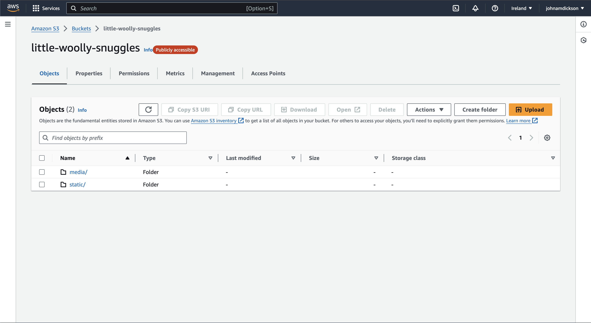
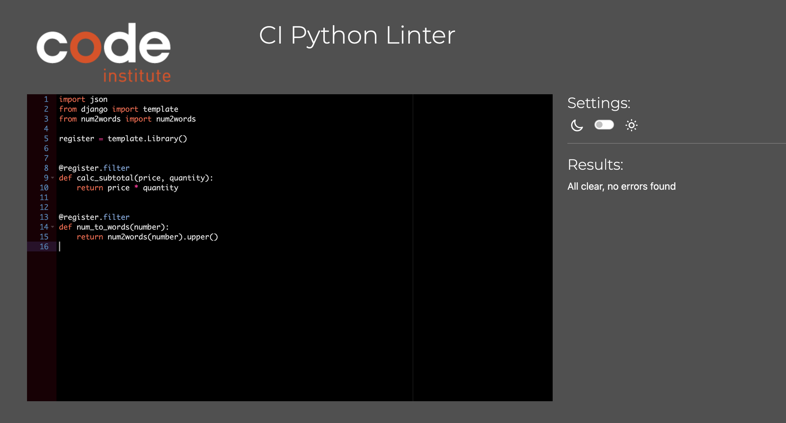
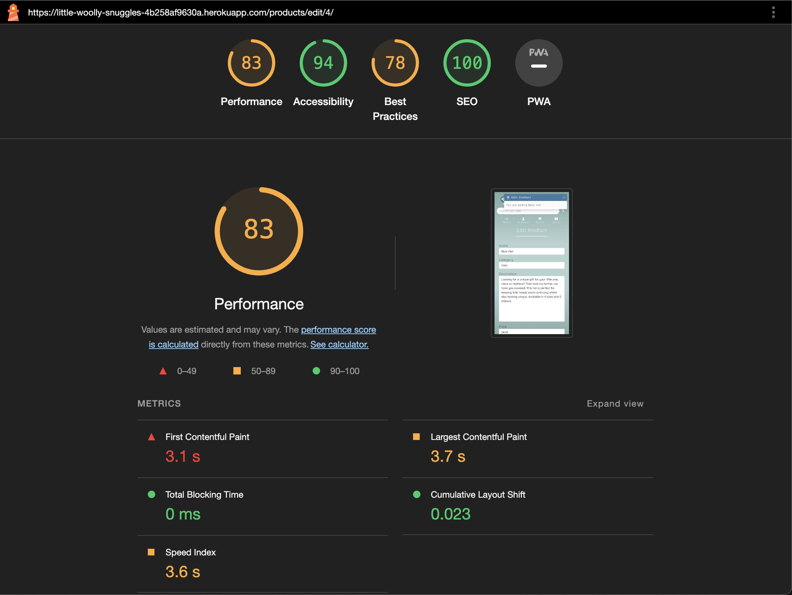

# Testing 

## Contents

- [User Story Testing](#user-story-testing)
  * [Project Setup and Authorisation Epic](#project-setup-and-authorisation-epic)
  * [Home Page and Header Epic](#home-page-and-header-epic)
  * [Products Set Up and Interactions Epic](#products-set-up-and-interactions-epic)
  * [Products & Categories: Filtering, Sorting and Searching Epic](#products--categories-filtering-sorting-and-searching-epic)
  * [Shopping Cart Epic](#shopping-cart-epic)
  * [Notification System Epic](#notification-system-epic)
  * [Checkout Epic](#checkout-epic)
  * [Payment Functionality Epic](#payment-functionality-epic)
  * [User Profiles Epic](#user-profiles-epic)
  * [Product Management Epic](#product-management-epic)
  * [Error Pages Epic](#error-pages-epic)
  * [Deploy Project to Production Environment Epic](#deploy-project-to-production-environment-epic)
  * [Search Engine Optimisation Epic](#search-engine-optimisation-epic)
- [Validator Testing](#validator-testing)
  * [HTML](#html)
  * [CSS](#css)
  * [Javascript](#javascript)
  * [Python](#python)
  * [Lighthouse](#lighthouse)
  * [DBeaver](#dbeaver)
- [Responsiveness Testing](#responsiveness-testing)
  * [Browser Testing](#browser-testing)
  * [Device Testing](#device-testing)
- [Automated Testing](#automated-testing)
  * [Python Automated Testing](#python-automated-testing)
  * [Javascript Automated Testing](#javascript-automated-testing)
- [Manual Testing](#manual-testing)
  * [Home Page](#home-page)
  * [Nav Bar](#navbar)
  * [Products Page](#products-page)
  * [Add Product Page](#add-product-page)
  * [Product Detail Page](#product-detail-page)
  * [Cart Page](#cart-page)
  * [Checkout Page](#checkout-page)
  * [Checkout Success](#checkout-success)
  * [Offcanveses](#offcanvases)
- [Bugs](#bugs)

## User Story Testing

### [Project Setup and Authorisation Epic](https://github.com/johnamdickson/portfolio-project-5/issues/1)
**User Story**|**Test**|**Result**|**Evidence**|**Project Goals**
:------|:------|:----:|:-----:|:------|
As a **Site Admin** I can **commence the project build** so that **the project can commence in a timely manner.**  [🔗](https://github.com/johnamdickson/portfolio-project-5/issues/3)|All tasks completed to comply with acceptance criteria. Project build completed and installation confirmed along with superuser creation| ✅|  | A fully functional, user friendly and dynamic website with the best possible user experience.|
As a **Site Admin** I can **install a robust authorisation system** so that **user information and the site access is secure**  [🔗](https://github.com/johnamdickson/portfolio-project-5/issues/4)|All auth added to project and confirmed email verification operational. | ✅|| A secure platform for purchasing and user creation.
 As a **Site Owner** I can **review site wireframes and database schemas** so that **the initial proposal for the project is understood and agreed upon**  [🔗](https://github.com/johnamdickson/portfolio-project-5/issues/6)| Wireframes agreed with client. Database schema  | ✅|[Database Schema](documentation/README-files/database-schema.png)  [Desktop Wireframes](documentation/README-files/desktop-wireframes.pdf)  [Mobile/Tablet Wireframes](documentation/README-files/mobile-tablet-wireframes.pdf)| A fully functional, user friendly and dynamic website with the best possible user experience.

### [Home Page and Header Epic](https://github.com/johnamdickson/portfolio-project-5/issues/2)
**User Story**|**Test**|**Result**|**Evidence**|**Project Goals**
:------|:------|:----:|:-----:|:------|
As a **site admin** I can **connect the home page** so that **the initial page can be confirmed operational**  [🔗](https://github.com/johnamdickson/portfolio-project-5/issues/5)|Home app created and confirmed operational using temporary test message| ✅|  | A fully functional, user friendly and dynamic website with the best possible user experience.|
As a **site user** I can **access a functional and styled home page** so that **initial experience of the website is a positive one**  [🔗](https://github.com/johnamdickson/portfolio-project-5/issues/7)|Styled home page and header added to home app. Mockups agreed with site owner. | ✅|[Mock Ups](documentation/README-files/mockups.pdf)    | A fully functional, user friendly and dynamic website with the best possible user experience.
As a **site user** I can **access secondary information on the site using a sidebar** so that **there is not information overload on the home page and I can access all information in an engaging manner**  [🔗](https://github.com/johnamdickson/portfolio-project-5/issues/8)| Bootstrap offcanvas added to project working off header links  | ✅|| A modern,responsive and stylish website.
As a **user** I can **log in and out of my account** so that **I am able to access all the sites features.**  [🔗](https://github.com/johnamdickson/portfolio-project-5/issues/16)| Signup, login and logout added and confirmed operational. Links in account offcanvas conditional on user status (logged in or out).  | ✅|| A secure platform for purchasing and user creation.    A fully functional, user friendly and dynamic website with the best possible user experience.|

### [Products Set Up and Interactions Epic](https://github.com/johnamdickson/portfolio-project-5/issues/9)
**User Story**|**Test**|**Result**|**Evidence**|**Project Goals**
:------|:------|:----:|:-----:|:------|
As a **Site Admin** I can **add/remove products** so that **the shop inventory can be updated**  [🔗](https://github.com/johnamdickson/portfolio-project-5/issues/10)|Products app with associated models created and confirmed operational by uploading a list of products to the DB| ✅|  | A fully functional, user friendly and dynamic website with the best possible user experience.  A selection of crocheted products are available for purchase directly in the website.|
As a **Site Admin** I can **view products in the admin page** so that **the business inventory can be checked and amended.** [🔗](https://github.com/johnamdickson/portfolio-project-5/issues/11)|Product and Category admin classes added to app and confirmed in admin panel. | ✅|  | A fully functional, user friendly and dynamic website with the best possible user experience.  A selection of crocheted products are available for purchase directly in the website.|
As a **user** I can **browse products on the product page** so that **I can view all of the items the shop has to offer**  [🔗](https://github.com/johnamdickson/portfolio-project-5/issues/12)|Product template created and listed on products page. | ✅|  | A fully functional, user friendly and dynamic website with the best possible user experience.  A selection of crocheted products are available for purchase directly in the website.|
As a **User** I can **review the product details** so that **make and informed decision to buy or not, based on a more detailed description of the product.**  [🔗](https://github.com/johnamdickson/portfolio-project-5/issues/13)|Product detail template created showing image of product and all details. Link from products page set up and operational | ✅|  | A fully functional, user friendly and dynamic website with the best possible user experience.  A selection of crocheted products are available for purchase directly in the website.|
As a **User** I can **view the products in a visually engaging manner** so that **my experience of the site is a positive one**  [🔗](https://github.com/johnamdickson/portfolio-project-5/issues/14)|Products and product detail pages styled to site aesthetic. Responsivenes confirmed across all device screen sizes. | ✅|  | A modern,responsive and stylish website.  A selection of crocheted products are available for purchase directly in the website.|
As a **user** I can **access the main pages using navigation links** so that **experience of navigating the site is simple and intuitive**  [🔗](https://github.com/johnamdickson/portfolio-project-5/issues/17)|Navbar and links added to all pages with exception of home page. Added dropdown menu for navigation links on small screens. | ✅|  |  A fully functional, user friendly and dynamic website with the best possible user experience.|
As a **user** I can **browse available item sizes and/or colours** so that **I can make an informed decision on product sizing and preferred colours.**  [🔗](https://github.com/johnamdickson/portfolio-project-5/issues/19)|Size and colour models added to products app. A means of displaying available colours added to products page along with a size chart. | ✅|  |  A fully functional, user friendly and dynamic website with the best possible user experience.  A selection of crocheted products are available for purchase directly in the website.|

### [Products & Categories: Filtering, Sorting and Searching Epic](https://github.com/johnamdickson/portfolio-project-5/issues/15)
**User Story**|**Test**|**Result**|**Evidence**|**Project Goals**
:------|:------|:----:|:-----:|:------|
As a **user** I can **locate products using the search bar** so that **quickly find what I am looking for on the site**  [🔗](https://github.com/johnamdickson/portfolio-project-5/issues/20)|Search logic implemented and tested in the template.| ✅|  | A fully functional, user friendly and dynamic website with the best possible user experience.  A selection of crocheted products are available for purchase directly in the website.|
As a **User** I can **filter by categories using the nav menu** so that **site navigation to the correct products is straight forward.**  [🔗](https://github.com/johnamdickson/portfolio-project-5/issues/21)|Method added to filter products by category and functionality added to the Products page| ✅|  | A fully functional, user friendly and dynamic website with the best possible user experience.  A selection of crocheted products are available for purchase directly in the website.|
As a **user** I can **select products by price and category from the navbar links** so that **I can sort as required dependent on my personal preference**  [🔗](https://github.com/johnamdickson/portfolio-project-5/issues/22)|Sorting by category and price functionality added to navbar links| ✅|  | A fully functional, user friendly and dynamic website with the best possible user experience.  A selection of crocheted products are available for purchase directly in the website.|
As a **user** I can **sort products within the products page** so that **I do not have to access the nav link if I want to refine the sort criteria** [🔗](https://github.com/johnamdickson/portfolio-project-5/issues/23)|Full sort functionality implemented. Back to top button added| ✅|  | A fully functional, user friendly and dynamic website with the best possible user experience.  A selection of crocheted products are available for purchase directly in the website.|

### [Shopping Cart Epic](https://github.com/johnamdickson/portfolio-project-5/issues/24)
**User Story**|**Test**|**Result**|**Evidence**|**Project Goals**
:---|:---|:----:|:----------:|:------|
As a **Site Admin** I can **view the shopping cart app structure** so that **I can verify the project structure and functionality is consistent with other apps**  [🔗](https://github.com/johnamdickson/portfolio-project-5/issues/25)|Shopping cart app created. Context data confirmed operational by referencing total update persistence on all screens| ✅|  | A fully functional, user friendly and dynamic website with the best possible user experience.  A selection of crocheted products are available for purchase directly in the website.|
As a **user** I can **add products to the shopping bag** so that **I can select the products that I want to purchase.**  [🔗](https://github.com/johnamdickson/portfolio-project-5/issues/26)|Products can be added to the shopping cart. Product sizes and colours can be added as applicable. Toast added with cart summary. Cart template added and styled| ✅| | A fully functional, user friendly and dynamic website with the best possible user experience.  A selection of crocheted products are available for purchase directly in the website.|
As a **user** I can **amend or delete products from the shopping cart** so that **my purchase is correct if I change my mind**  [🔗](https://github.com/johnamdickson/portfolio-project-5/issues/27)|Products can be amended in or deleted from the shopping cart. | ✅|  | A fully functional, user friendly and dynamic website with the best possible user experience.  A selection of crocheted products are available for purchase directly in the website.|

### [Notification System Epic](https://github.com/johnamdickson/portfolio-project-5/issues/28)
**User Story**|**Test**|**Result**|**Evidence**|**Project Goals**
:---|:---|:----:|:----------:|:------|
As a **user** I can **see when key events are successful or not via notifications** so that **I am informed of my status as I attempt to use the site**  [🔗](https://github.com/johnamdickson/portfolio-project-5/issues/29)|Bootstrap toasts added to project and confirmed operational for sign in and sign out.| ✅|   | A fully functional, user friendly and dynamic website with the best possible user experience.  A modern,responsive and stylish website.|
As a **user** I can **see a preview of the item bought and price in success notifications** so that **my purchase choices are reinforced in a visually stimulating way.** [🔗](https://github.com/johnamdickson/portfolio-project-5/issues/30)|Cart preview added to success toast, shown when a user adds a product to the cart.| ✅|  | A fully functional, user friendly and dynamic website with the best possible user experience.  A modern,responsive and stylish website.|
As a **product developer** I can **change product detail empty select notification from toasts to popovers** so that **the clients preference based on interim feedback can be delivered.** [🔗](https://github.com/johnamdickson/portfolio-project-5/issues/39)|Product detail attribute selectors error notifications changed from toasts to popovers.| ✅|  | A fully functional, user friendly and dynamic website with the best possible user experience.  A modern,responsive and stylish website.|

### [Checkout Epic](https://github.com/johnamdickson/portfolio-project-5/issues/34)
**User Story**|**Test**|**Result**|**Evidence**|**Project Goals**
:---|:---|:----:|:----------:|:------|
As a **site owner** I can **ensure items are captured in an order** so that **customers can complete purchases with all the correct information included.**  [🔗](https://github.com/johnamdickson/portfolio-project-5/issues/40)|Checkout app created with order and order line item objects. Unique number for order created in checkout.js.| ✅|   | A fully functional, user friendly and dynamic website with the best possible user experience.  A modern,responsive and stylish website.|
As a **site owner** I can **ensure the checkout order is updated automatically** so that **the customers cart is fully represented in the order** [🔗](https://github.com/johnamdickson/portfolio-project-5/issues/41)|Signals file added to checkout app for save and delete of order line items which automatically updates totals.| ✅| [signals.py](https://github.com/johnamdickson/portfolio-project-5/blob/main/checkout/signals.py)| A fully functional, user friendly and dynamic website with the best possible user experience.  A modern,responsive and stylish website.|
As a **user** I can **view the cart with items and options to enter details** so that **I can proceed with completing my order**  [🔗](https://github.com/johnamdickson/portfolio-project-5/issues/42)|Checkout template created, styled and accessible from the cart template.| ✅|  | A fully functional, user friendly and dynamic website with the best possible user experience.   A selection of crocheted products are available for purchase directly in the website.
|

### [Payment Functionality Epic](https://github.com/johnamdickson/portfolio-project-5/issues/35)
**User Story**|**Test**|**Result**|**Evidence**|**Project Goals**
:---|:---|:----:|:----------:|:------|
As a **user** I can **make a card payment for selected products** so that **I can pay for the goods that I want to buy**  [🔗](https://github.com/johnamdickson/portfolio-project-5/issues/49)|Stripe payment element added to checkout page and required functionality implemented through JS and view code.| ✅|  | A selection of crocheted products are available for purchase directly in the website.   A secure platform for purchasing and user creation.
As a **Site Admin** I can **ensure that products are added to the order with confirmation to user** so that **the products the user wants to buy are recorded correctly in the database and they are notified in due course.**  [🔗](https://github.com/johnamdickson/portfolio-project-5/issues/50)|Order processing to back end implemented post successful Stripe payment. Checkout success page created confirming order and displaying details to the user.| ✅|  | A selection of crocheted products are available for purchase directly in the website.   A secure platform for purchasing and user creation.
As a **Site Admin** I can **set up webhooks in the payment system** so that **user orders are updated on confirmation of payment regardless of status of browser or inadvertent page redirection.**  [🔗](https://github.com/johnamdickson/portfolio-project-5/issues/51)|Stripe webhook added for project and view classes created to handle different outcomes.| ✅|  | A selection of crocheted products are available for purchase directly in the website.   A secure platform for purchasing and user creation.
As a **Site Admin** I can **set up webhooks in the payment system** so that **user orders are updated on confirmation of payment regardless of status of browser or inadvertent page redirection.**  [🔗](https://github.com/johnamdickson/portfolio-project-5/issues/51)|Stripe webhook added for project and view classes created to handle different outcomes.| ✅|  | A selection of crocheted products are available for purchase directly in the website.   A secure platform for purchasing and user creation.

### [User Profiles Epic](https://github.com/johnamdickson/portfolio-project-5/issues/36)
**User Story**|**Test**|**Result**|**Evidence**|**Project Goals**
:---|:---|:----:|:----------:|:------|
 As a **Site Admin** I can **ensure the functionality to add a profile exists** so that **users have the option to save their details for future purchases making the process of using the site more streamlined and encourage return visits**  [🔗](https://github.com/johnamdickson/portfolio-project-5/issues/52)|User profile app created with associated views, urls and template.| ✅|  | A fully functional, user friendly and dynamic website with the best possible user experience.   A secure platform for purchasing and user creation.
As a **user** I can **view and update my profile details** so that **I can keep my details up to date.** [🔗](https://github.com/johnamdickson/portfolio-project-5/issues/56)|User profile edit functionality added along with offcanvas option.| ✅|  | A fully functional, user friendly and dynamic website with the best possible user experience.   A secure platform for purchasing and user creation.
As a **user** I can **see my order history** so that **I can review purchases that I have already made.** [🔗](https://github.com/johnamdickson/portfolio-project-5/issues/57)|Order history added to main user profile view.| ✅| | A fully functional, user friendly and dynamic website with the best possible user experience.
As a **site admin** I can **ensure orders are assigned to user history** so that **the site operates as intended and does not require manual intervention.** [🔗](https://github.com/johnamdickson/portfolio-project-5/issues/58)|Order history added to main user profile view.| ✅| | A fully functional, user friendly and dynamic website with the best possible user experience.
As a **site admin** I can **enable automated emails** so that **users receive confirmation of a successful order.** [🔗](https://github.com/johnamdickson/portfolio-project-5/issues/60)|Automated emails using SMTP via Mailtrap implemented| ✅|  | A fully functional, user friendly and dynamic website with the best possible user experience.

### [Product Management Epic](https://github.com/johnamdickson/portfolio-project-5/issues/61)
**User Story**|**Test**|**Result**|**Evidence**|**Project Goals**
:---|:---|:----:|:----------:|:------|
 As a **site admin** I can **add products to the store via a site page** so that **new products can be added with ease**  [🔗](https://github.com/johnamdickson/portfolio-project-5/issues/62)|Facility to add products available from button on products page or via product management offcanvas. Functionality only available to superusers| ✅|   | A fully functional, user friendly and dynamic website with the best possible user experience.   A selection of crocheted products are available for purchase directly in the website.  Learn products offering users purchase of crocheting tutorials.
As a **site admin** I can **edit and delete products within the main site** so that **the product invetory can remain current.**  [🔗](https://github.com/johnamdickson/portfolio-project-5/issues/63)|Facility to edit or delete a product added, accessible from the product detail page of individual products| ✅|  | A fully functional, user friendly and dynamic website with the best possible user experience.   A selection of crocheted products are available for purchase directly in the website.  Learn products offering users purchase of crocheting tutorials.
|

### [Error Pages Epic](https://github.com/johnamdickson/portfolio-project-5/issues/61)
**User Story**|**Test**|**Result**|**Evidence**|**Project Goals**
:---|:---|:----:|:----------:|:------|
As a **Site Admin** I can **ensure users are informed of client error responses (400,403 and 404) in an informative and design friendly manner** so that **they can be made aware of the issue whilst maintaining the site aesthetic**  [🔗](https://github.com/johnamdickson/portfolio-project-5/issues/69)|400 error pages created with test page urls for 400 and 403 for use by superuser. Each page has a back button and timer which automatically returns user to home page once completed.| ✅|    | A fully functional, user friendly and dynamic website with the best possible user experience.
As a **Site Admin** I can **ensure users are informed of the server error response (500) in an informative and design friendly manner** so that **they can be made aware of the issue whilst maintaining the site aesthetic**  [🔗](https://github.com/johnamdickson/portfolio-project-5/issues/70)|500 error page created with test page url for use by superuser. The page has a back button and timer which automatically returns user to home page once completed.| ✅|   | A fully functional, user friendly and dynamic website with the best possible user experience.

### [Deploy Project to Production Environment Epic](https://github.com/johnamdickson/portfolio-project-5/issues/47)
**User Story**|**Test**|**Result**|**Evidence**|**Project Goals**
:---|:---|:----:|:----------:|:------|
As a **site owner** I can **access the site in a production environment** so that **I can verify that customers can access the live site.** [🔗](https://github.com/johnamdickson/portfolio-project-5/issues/65)|App deployed to Heroku hosting platform.| ✅|  | A fully functional, user friendly and dynamic website with the best possible user experience.
As a **site owner** I can **store media and static files in the cloud** so that **the site operates as intended with correct images and styling in the production environment.** [🔗](https://github.com/johnamdickson/portfolio-project-5/issues/66)|AWS S3 storage bucket set up with folders for static and media files| ✅|   | A fully functional, user friendly and dynamic website with the best possible user experience.
As a **user** I can **receive pertinent emails** so that **I know when major operations have been completed such as creating a profile or completing an order**  [🔗](https://github.com/johnamdickson/portfolio-project-5/issues/74)|Mailtrap SMTP service linked to custom domain adopted for project to send mails from the app.| ✅|  | A secure platform for purchasing and user creation.

### [Search Engine Optimisation Epic](https://github.com/johnamdickson/portfolio-project-5/issues/71)
**User Story**|**Test**|**Result**|**Evidence**|**Project Goals**
:---|:---|:----:|:----------:|:------|
As a **site owner** I can **optimise the website using established tools and techniques** so that **it ranks highly in the search engines.** [🔗](https://github.com/johnamdickson/portfolio-project-5/issues/71)|Short and long tail keywords added to key areas in DOM. Meta description updated in html head. Sitemap and robots files added to root directory.| ✅| [SEO and Web Marketing Study](documentation/TESTING-files/user-story-testing/seo-web-marketing-study.pdf)   | An optimised website for search engines to improve visibility and reach.    A series of web marketing strategies both on the website and external to it.
As a **site owner** I can **use marketing tools and strategies** so that **I retain customers and attract new ones.** [🔗](https://github.com/johnamdickson/portfolio-project-5/issues/73)|Facebook business page created. Email marketing service added to footer. Links to socials also added to footer| ✅|  | An optimised website for search engines to improve visibility and reach.    A series of web marketing strategies both on the website and external to it.

 <a href="#contents">BACK TO CONTENTS 🔼</a>

## Validator Testing

### HTML

All HTML pages were checked using the [W3C HTML Validator](https://validator.w3.org/) with each page checked using address with the exception of those requring user login. These pages were checked using the source text input. The text input was obtained by navigating to the page to test and then right clicking on the window. From the menu, the view page source option was selected which opened a new tab containing the DOM for the page. The test was then performed by copying and pasting the code into the text input field in the validator. The pages checked using the source text are: profile, add-product, edit-product.

Results for all HTML pages can be found in the table below:

**Page**|**First Pass**|**Warnings/Errors**|**Second Pass (Post Fix)**|**Screenshot**
:-----:|:-----:|:-----|:-----:|:-----:
 |home| ❌ |Errors/warnings returned, click [here](documentation/TESTING-files/html-validation/pre-edit-results/index.md)| ✅ | 
|products| ❌ |Errors/warnings returned, click [here](documentation/TESTING-files/html-validation/pre-edit-results/products.md)| ✅ | 
|product-detail| ❌ |Errors/warnings returned, click [here](documentation/TESTING-files/html-validation/pre-edit-results/product-detail.md)| ✅ | 
|cart| ✅ |No errors/warnings returned| N/A | 
|checkout| ✅ |No errors/warnings returned| N/A | 
|checkout-success| ✅ |No errors/warnings returned| N/A | 
|profile| ❌ |Errors/warnings returned, click [here](documentation/TESTING-files/html-validation/pre-edit-results/profile.md)| ✅ | 
|400 test page|✅|No errors/warnings returned| N/A |
|403 test page|✅|No errors/warnings returned| N/A | 
|404 test page|✅|No errors/warnings returned| N/A | 
|500 test page|✅|No errors/warnings returned| N/A |  

 
### CSS

The site CSS was checked using the [W3C CSS Validator](https://jigsaw.w3.org/css-validator/). There remains 228 warnings in total post edit associated with Bootstrap CSS and webkit vendor extensions. These warnings are unavoidable in the validator because they are vendor extensions. In the interests of project delivery timeline, no action was taken to rectify them.

**First Pass**|**Warnings/Errors**|**Second Pass (Post Fix)**|**Screenshot**
:-----:|:-----|:-----:|:-----:
| ❌ |Errors/warnings returned, click [here](documentation/TESTING-files/css-validation/pre-edit-results/css.md)|✅| 

### Javascript

The site Javascsript functionality was checked using [JS Hint](https://jshint.com/).

**File**|**Warnings**|**Warnings Remaining (Post Fix)**|**Screenshot**
|:-----:|:-----|:-----|:-----:|
cart.js |Warnings returned, click [here](documentation/TESTING-files/javascript-validation/pre-edit-results/js-pre-edit.md) to view|Seven warnings remained post edits all relating to functions declared in loops referencing an outer scoped variable. Decided no to spend time at this stage in the project resolving as they are minor issues. Bootstrap undefined variable. No action taken as necessary for operation of popovers.| 
cart.js |Warnings returned, click [here](documentation/TESTING-files/javascript-validation/pre-edit-results/js-pre-edit.md#checkoutjs) to view|No warnings remained after refactoring. Stripe undefined variable remains but as before, no action taken as necessary for operation of payment element.| 
products.js |Warnings returned, click [here](documentation/TESTING-files/javascript-validation/pre-edit-results/js-pre-edit.md#productsjs) to view|Eight warnings remained post edits all relating to functions declared in loops referencing an outer scoped variable. Decided no to spend time at this stage in the project resolving as they are minor issues. Bootstrap undefined variable. No action taken as necessary for operation of popovers.| 
base.js |Warnings returned, click [here](documentation/TESTING-files/javascript-validation/pre-edit-results/js-pre-edit.md#basejs) to view|Six warnings remained post edits all relating to functions declared in loops referencing an outer scoped variable. As before, decided no to spend time at this stage in the project resolving as they are minor issues. Bootstrap undefined variable. No action taken as necessary for operation of popovers and toasts. Four unused variables remained, all of which are used in the Bootstrap boilerplate - no action taken to resolve.| 

### Python

Each of the site Python files containing code over and above a basic import and boilerplate comments were passed through the [Code Institute Python Linter](https://pep8ci.herokuapp.com/). The table below lists each of the main files with screenshot of the results after resolving errors and warnings.
#### Cart App
**File**|**Initial Errors/Warnings**|**Screenshot**
|:-----:|:------|:-----:|
|apps.py|No errors/warnings returned|
|cart_tools.py|Errors/warnings returned, click [here](documentation/TESTING-files/python-validation/cart/cart-pre-edit.md#cart_toolspy)|
|contexts.py|Errors/warnings returned, click [here](documentation/TESTING-files/python-validation/cart/cart-pre-edit.md#contextspy)|
|tests.py|Errors/warnings returned, click [here](documentation/TESTING-files/python-validation/cart/cart-pre-edit.md#testspy)|
|urls.py|No errors/warnings returned|
|views.py|Errors/warnings returned, click [here](documentation/TESTING-files/python-validation/cart/cart-pre-edit.md#viewspy)|
#### Checkout App
**File**|**Initial Errors/Warnings**|**Screenshot**
|:-----:|:------|:-----:|
|apps.py|No errors/warnings returned|
|checkout_tools.py|Errors/warnings returned, click [here](documentation/TESTING-files/python-validation/checkout/checkout-pre-edit.md#checkout_toolspy)|
|admin.py|Errors/warnings returned, click [here](documentation/TESTING-files/python-validation/checkout/checkout-pre-edit.md#adminpy)|
|forms.py|Errors/warnings returned, click [here](documentation/TESTING-files/python-validation/checkout/checkout-pre-edit.md#formspy)|
|models.py|Errors/warnings returned, click [here](documentation/TESTING-files/python-validation/checkout/checkout-pre-edit.md#modelspy)|
|signals.py|Errors/warnings returned, click [here](documentation/TESTING-files/python-validation/checkout/checkout-pre-edit.md#signalspy)|
|urls.py|Errors/warnings returned, click [here](documentation/TESTING-files/python-validation/checkout/checkout-pre-edit.md#urlspy)|
|views.py|Errors/warnings returned, click [here](documentation/TESTING-files/python-validation/checkout/checkout-pre-edit.md#viewspy)|
|webhook_handler.py|Errors/warnings returned, click [here](documentation/TESTING-files/python-validation/checkout/checkout-pre-edit.md#webhook_handlerpy)|
|webhooks.py|Errors/warnings returned, click [here](documentation/TESTING-files/python-validation/checkout/checkout-pre-edit.md#webhookspy)|
#### Home App
**File**|**Initial Errors/Warnings**|**Screenshot**
|:-----:|:------|:-----:|
|apps.py|No errors/warnings returned|
|urls.py|Errors/warnings returned, click [here](documentation/TESTING-files/python-validation/home/home-pre-edit.md#urlspy)|
|views.py|Errors/warnings returned, click [here](documentation/TESTING-files/python-validation/home/home-pre-edit.md#viewspy)|
#### Little Woolly Snuggles Project
**File**|**Initial Errors/Warnings**|**Screenshot**
|:-----:|:------|:-----:|
|asgi.py|Errors/warnings returned, click [here](documentation/TESTING-files/python-validation/little-woolly-snuggles/lws-pre-edit.md#asgipy)|
|settings.py|Errors/warnings returned, click [here](documentation/TESTING-files/python-validation/little-woolly-snuggles/lws-pre-edit.md#settingspy)|
|urls.py|Errors/warnings returned, click [here](documentation/TESTING-files/python-validation/little-woolly-snuggles/lws-pre-edit.md#urlspy)|
|wsgi.py|Errors/warnings returned, click [here](documentation/TESTING-files/python-validation/little-woolly-snuggles/lws-pre-edit.md#wsgipy)|
#### Products App
**File**|**Initial Errors/Warnings**|**Screenshot**
|:-----:|:------|:-----:|
|admin.py|Errors/warnings returned, click [here](documentation/TESTING-files/python-validation/products/products-pre-edit.md#adminpy)|
|apps.py|No errors/warnings returned|
|contexts.py|Errors/warnings returned, click [here](documentation/TESTING-files/python-validation/products/products-pre-edit.md#contextspy)|
|forms.py|Errors/warnings returned, click [here](documentation/TESTING-files/python-validation/products/products-pre-edit.md#formspy)|
|models.py|Errors/warnings returned, click [here](documentation/TESTING-files/python-validation/products/products-pre-edit.md#modelspy)|
|tests.py|Errors/warnings returned, click [here](documentation/TESTING-files/python-validation/products/products-pre-edit.md#testspy)|
|urls.py|No errors/warnings returned|
|views.py|Errors/warnings returned, click [here](documentation/TESTING-files/python-validation/products/products-pre-edit.md#viewspy)|
#### Profiles App
**File**|**Initial Errors/Warnings**|**Screenshot**
|:-----:|:------|:-----:|
|admin.py|Errors/warnings returned, click [here](documentation/TESTING-files/python-validation/profiles/profiles-pre-edit.md#adminpy)|
|apps.py|No errors/warnings returned|
|contexts.py|Errors/warnings returned, click [here](documentation/TESTING-files/python-validation/profiles/profiles-pre-edit.md#contextspy)|
|forms.py|No errors/warnings returned|
|models.py|Errors/warnings returned, click [here](documentation/TESTING-files/python-validation/profiles/profiles-pre-edit.md#modelspy)|
|urls.py|Errors/warnings returned, click [here](documentation/TESTING-files/python-validation/profiles/profiles-pre-edit.md#urlspy)|
|views.py|Errors/warnings returned, click [here](documentation/TESTING-files/python-validation/profiles/profiles-pre-edit.md#viewspy)|
#### Miscellaneous Python Files
**File**|**Initial Errors/Warnings**|**Screenshot**
|:-----:|:------|:-----:|
|custom_storages.py|No errors/warnings returned|
|constants.py|No errors/warnings returned|

### Lighthouse

All HTML pages were checked using [Chrome DevTools Lighthouse](https://developer.chrome.com/docs/lighthouse/overview/). At first the performance results were sub-optimal, returning a score of 50-55. This very much reflected my experience of the app, taking a long time to render in the browser. Upon investigation, the main issue was due to the server response time of circa 4500ms. Upon researching issue and found two possible means of improving performance - [lazy image loading](https://www.sitepoint.com/five-techniques-lazy-load-images-website-performance/) and [caching](https://adamj.eu/tech/2023/03/23/django-context-processors-database-queries/), the former of which I reverted based on feedback from Lighthouse report. I also compressed images and converted to webp. This increased the score to around 60. In order to troubleshoot and improve the score further, I installed Django debug toolbar and analysed the SQL queries noticing a large number of redundant queries which I was able to resolve by refactoring the code and moving any conditional logic in the view files, bringing the score to mid-60s.  The user profile off canvases order history accounted for a large number of the queries so to improve the score further I opted to remove this from the off canvases and replace with a link to the profile page. 

When testing the production database in developer environment the scores for each page were over 90. However I could not achieve these scores for all pages. In the interest of project delivery, any further works to improve them was suspended with a view to returning at a later date.

The best practices score was also less than optimal at 78. The main reason appears to be related to use of third party cookies, which is a feature that Google will be phasing out. However, for this project they are necessary so the score could not be improved upon

In all instances the Accessibility and SEO scores were excellent. The latter was welcome given the focus on SEO in this project. 

For mobile devices, the performance score was in the 60-80 region, much like in the previous project to this. Researching this performance dip then revealed that any countermeasures and any further alterations towards improving the mobile performance score could be time consuming and in the interests of project progress have not been implemented here.

**File**|**Desktop Results**|**Mobile Results**|
|:-----:|:-----:|:-----:|
|index.html||
|products.html||
|product-detail.html||
|add-product.html||
|edit-product.html||
|cart.html||
|checkout.html||
|checkout-success.html||
|profile.html||
|400.html||
|403.html||
|404.html||
|500.html||

### DBeaver

The DBeaver database administration tool was used to verify the database schema and confirm the entity relationships exist as expected within the database and are correct for the project. As can be seen in the images below, there are differences between the proposed schema and actual schema but broadly speaking are very similar. Product sizes and colour models were added as the project progressed and the FAQ model was omitted due to the approaching project deadline. 

The images below serve as a comparision between the database schema produced online and the actual database structure as reported by DBeaver.

<table width=90% align="center">
  <tr>
    <td>
      

        <strong>Manually Generated Schema</strong>
      

    </td>
  </tr>
  <tr>
    <td>
    
  
    </td>
  </tr>
    <tr>
    <td>
      

        <strong>DBeaver Entity Relationship Diagram</strong>
      

    </td>
  </tr>
  <tr>
    <td>
    

    </td>
  </tr>
</table>

 <a href="#contents">BACK TO CONTENTS 🔼</a>

## Responsiveness Testing

### Browser Testing

The app was tested on Chrome, Firefox, Safari and Microsoft Edge. The appearance and responsiveness on each platform was satisfactory. The only minor anomaly was observed on Safari where a blue surround appears on the navbar elements when selected. This does not occur on the other browsers. As it is a minor styling issue, no further action was taken at this point, with a view to revisiting in later versions.  
      

        
      

### Device Testing
The responsiveness for simulated devices was tested using Chrome extension Mobile Simulator and confirmed to be satisfactory in all cases. There were minor styling modifications such as font size, margin or position adjustments completed during the testing but were of such an insignificant nature they are not mentioned here. The table below demonstrates the site's responsiveness across physical and simulated devices.

**Device**|**Screenshot**|**Device**|**Screenshot**
|:-----:|:-----:|:-----:|:-----:|
|iPhone 12 Pro Max (Physical Device)||MacBook Pro 13" (Physical Device)|
|iPhone SE (Simulated Device)||Google Pixel 6 Pro (Simulated Device)|
|Samsung Galaxy S20 (Simulated Device)||iPhone 13Pro Max (Simulated Device)|
iPad Pro 11 (Simulated Device)||Samsung Galaxy Tab S7 (Simulated Device)|

 <a href="#contents">BACK TO CONTENTS 🔼</a>

## Automated Testing

### Python Automated Testing
Automated testing was completed on the Products and Cart app methods using the built in Django TestCase class. The remainder of the Python based functionality was tested manually. The coverage report for automated testing can be found [here.]
The individual test cases are described in the table below with gif of running tests included:
#### Cart App Tests
**Test**|**Test Description**                                            
|:------|:------|
|test_view_cart|Test to confirm correct status code when view_cart url is accessed.
|test_add_to_cart|Add product to cart and test correct item added with appropriate redirection using passed in url and instantiated message.
|test_adjust_cart|Adjust cart by mutating quantity and test correct item quantity with appropriate redirection using passed in url and instantiated message.
|test_remove_from_cart|Remove item from cart by calling remove_from_cart and test item removed with appropriate redirection using passed in url and instantiated message.
|test_empty_cart_contents|Test that initial cart session is empty.|
|test_cart_contents|Test cart session contains items when they are added to cart.|

#### Cart App Tests Outcome
<table width=90% align="center">
  <tr>
    <td></td>
  </tr>
</table>

#### Products App Tests
**Test**|**Test Description**                                            
|:-----|:------|
|test_category_name|Test category name assigned in setup is correct.
|test_category_friendly_name|Test category friendly name assigned in setup is correct.
|test_product_name_and_category|Test product name and category assigned in setup is correct.
|test_product_description|Test product description assigned in setup is correct.
|test_product_attributes|Test product attributes of sizes and colours assigned in test are correct.
|test_product_size|Test product size assigned in setup is correct.|
|test_product_colour|Test product colour assigned in setup is correct.|
|test_products_view_GET|Test get products view returns correct url, template and response code.|
|test_products_sort_by_name|Test sorting products by name returns correct sort..|
|test_products_sort_by_category|Test sorting products by category returns correct sort.|
|test_products_sort_by_price|Test sorting products by price returns correct sort.|
|test_product_detail_view_GET|Test get product detail view returns correct url, template and response code.|
|test_add_product_superuser|Test adding product by the superuser adds a new product to DB, and redirects to the new products detail page.|
|test_add_product_regular_user|Test adding product by the regular user does not add a new product to DB, and redirects to the home page whilst also instantiating a message to user.|
|test_add_product_no_user|Test adding product by anonymous user does not add a new product to DB, and redirects to the login page.|
|test_edit_product_superuser|Test editing product by the superuser edits product in the DB, and redirects to the new products detail page.|
|test_edit_product_regular_user|Test editing product by the regular user does not edit product in DB and redirects to the home page whilst also instantiating a message to user.|
|test_edit_product_no_user|Test editing product by anonymous user does not edit product on DB, and redirects to the login page.|
|test_delete_product_superuser|Test deleting product by the superuser deletes the product from the DB, and redirects to the products page.|
|test_delete_product_regular_user|Test deleting product by the regular user does not delete product from DB, and redirects to the home page whilst also instantiating a message to user.|
|test_delete_product_no_user|Test deleting product by anonymous user does not delete the product from DB, and redirects to the login page.|

#### Products App Tests Outcome
<table width=90% align="center">
  <tr>
    <td></td>
  </tr>
</table>

#### Coverage
A coverage report was generated to analyse the coverage rate for Cart and Products app tests. The testing coverage on Cart and Products apps was 52% and 73% respectively with an overall score of 71%. The preference would have been to write more tests to bring these figures up, however in the interests of project deadlines this was not feasible.
<table width=90% align="center">
  <tr>
    <td></td>
  </tr>
</table>

### Javascript Automated Testing
Javascript testing was completed using Jest. The only function tested is the errorCountdown (used to create a countdown prior to automatic redirect on HTTP Status Code error pages) as all of the other functions would require a more complex set up to test their functionality fully. Given the time constraints of the project, the remaining functionality would be manually tested. Each test essentially checks for the same seven elements: 
1. Timer set to correct time on page load (60 seconds for 400 and 500 pages, 10 seconds 403 and 404).
2. A check to ensure that the timer is halfway through the countdown (30 or 5 seconds).
3. A check to ensure that the timer is completed and at 0.
4. A check to ensure an h2 exists.
5. A check to ensure the h2 has the correct error code string.
6. A check to ensure an h3 exists.
7. A check to ensure the h3 has the correct error description. 

The test running can be viewed [here.](documentation/TESTING-files/automated-testing-results/jest-testing.gif) 
The test results can be seen in the image below:
      

  
      

 <a href="#contents">BACK TO CONTENTS 🔼</a>
## Manual Testing
Each feature and action on every page of the app was tested manually to verify the correct function of the site. The results are detailed per page or major feature.

### Home Page

 **Feature** | **Expected Outcome** | **Testing Performed** | **Testing Outcome** | **Result** |
|:-----|:------|:------|:-----|:------:|
|Site Logo|Clicking on logo will return user to the home page|Clicked on logo|Home page reloaded|✅|
|Search bar|Entering a search term into search bar and clicking the magnifying glass icon will search the site products by category name, name and description returning a list of products on the product page.|Typed hats into searchbar and clicked search button. Typed bear into searchbar and clicked search button|On first click, products page loaded showing all products contained in the hats category. On second click, products page loaded showing and individual product - Bear Hat.|✅|
|Account Header Button|Clicking on Account header button opens an offcanvas with account options|Clicked on Account header button|Account offcanvas opened.|✅|
|Cart Header Button|Clicking on Cart header button opens the Cart page|Clicked on Cart header button|Site redirected to Cart page.|✅|
|About Header Button|Clicking on About header button opens an offcanvas with company information|Clicked on About header button|About offcanvas opened with company information included.|✅|
|Products Shop Now Button|Clicking on the Products Shop Now button opens the Products page with all Products listed|Clicked Products Shop Now button|Site redirected to Products page with all products displayed.|✅|
|Gift Set Shop Now Button|Clicking on the Gift Set Shop Now button opens the Products page filtered to Gift Set products only|Clicked Gift Set Shop Now button|Site redirected to Products page filtered to display Gift Set products.|✅|
|Learn to Crochet Learn Now Button|Clicking on the Learn to Crochet Learn Now button opens the Products page filtered to Learn to Crochet products only|Clicked Learn to Crochet Learn Now button|Site redirected to Products page filtered to display Learn to Crochet products.|✅|
|Hats Shop Now Button|Clicking on the Hats Shop Now button opens the Products page filtered to Hats products only|Clicked Hats Shop Now button|Site redirected to Products page filtered to display Hats products.|✅|
|Blankets Shop Now Button|Clicking on the Blankets Shop Now button opens the Products page filtered to Blankets products only|Clicked Blankets Shop Now button|Site redirected to Products page filtered to display Blankets products.|✅|
|Items Hover|Hover over logo text or header buttons will change their colour to light pink and then return to white once cursor moves off again.|Hovered over each of the aforementioned items| All items changed colour to light pink and then returned to white once cursor moved off|✅|

### Navbar

 **Feature** | **Expected Outcome** | **Testing Performed** | **Testing Outcome** | **Result** |
|:-----|:------|:------|:-----|:------:|
|Nav Bar - nav menu hover|Hovering over nav menu item will render a shadow under navbar and text will turn pink. The shadow should disappear and text return to white when cursor is moved off any nav item|Hovered cursor over All Products nav menu item and then moved cursor off All Products nav menu item|All Products text turned pink and shadow appeared underneath navbar. Font colour returned to white and navbar shadow disappeared when cursor moved off the All Products nav menu item|✅|
|Nav Bar - click nav menu item|Clicking any of the nav menu items will open a drop down menu with items dependant on menu selected. The nav item font-colour will change to pink and font-size will marginally increase indicating menu is selected.|Clicked Hats menu item.| Hats dropdown menu opened indicating items relevant to that category. Hats navbar menu item font colour changed to pink and font-size increased.|✅|
|Nav Bar - nav menu drop down items|Clicking any of the nav menu drop down items will direct user to the relevant product detail page if above horizontal rule or sort products page to the relevant category if selection made below horizontal rule. The nav item font-colour will change to pink and font-size will marginally increase indicating menu is selected.|Clicked Hats menu item and then clicked Classic Beanie. Returned to products page and repeated steps but selected All Hats from dropdown menu.| User directed to the Classic Beanie product detail page at first click. On second click of All Hats, the products page was sorted to return only products in the hats category.|✅|
|Nav Bar - nav menu drop down items hover|Hovering over any of the drop down items will change font colour to pink and the background to a darker shade of green. When cursor moves off the drop down item styling should return to as found,|Clicked Hats menu item and then hovered over Classic Beanie item| Font colour changed to pink and background changed to dark green. When cursor moved off the item the text colour changed to white and background returned to as found lighter shade.|✅|

### Products Page

 **Feature** | **Expected Outcome** | **Testing Performed** | **Testing Outcome** | **Result** |
|:-----|:------|:------|:-----|:------:|
|Page Load|When page first loads a visual display of all products should be rendered|Loaded products page from home page link.|All store products rendered on products page.|✅|
|Sort selector|Choosing a sort option should sort items as per desired selection and update the title to reflect.|Clicked on sort selector and chose Price(low to high)|All products on page sorted by price from lowest to highest. Page title changed to Products by Price|✅|
|Product card - hover|Hovering over the product card should result in a marginal scale transformation increase, the background colour changing to dark green with a font colour of light pink, a pink border applied and a shadow added. When the cursor leaves the product card all of the aforementioned properties should revert to original settings.|Hover cursor over one of the product cards|The card increased in size per scale transformation. A pink border appeared and card background colour changed to dark green. The font colour changed to pink. When the cursor moved off the card, the styling reverted to original settings.|✅|
|Product card - click|Clicking on any the product cards should result in the user being directed to the respective products detail page.|On products page, clicked on the *Tea Cosy* product|The user was directed to the *Tea Cosy* product detail page.|✅|
|Learn Products|Any products that are classified as Learn Products should have a Learn to Crochet badge at top left corner of the product image.|Open products page and inspect Learn Product *Newborn Hat Tutorial*|The *Newborn Hat Tutorial* product has a Learn to Crochet badge in the top left corner of it's respective image|✅|
|Product Sizes Popover|If a product has sizes then a button should be present on the top left most corner of the product image. When pressed, a popover with a list of sizes should appear. In the popover should be an image of a size chart that when clicked opens the chart in a new tab.|Clicked on *Classic Beanie* size button and then clicked on the Size Chart inside presented popover.|On clicking the sizes button a popover appeared which listed all available sizes and had a small image of the sizes chart. On clicking the sizes chart a new tab opened, displaying the chart in a larger window.|✅|
|Product Colours Popover|If a product has colours then a button should be present on the top left most corner of the product image. When pressed, a popover with a list of colours should appear. |Clicked on *Two Colour Blanket* colours button|On clicking the colours button a popover appeared which listed all available colours.|✅|
|Add Product Button - user dependant visibility|The Add Product button should only be available to superusers. |Logged on as superuser, regular user then logged out completely.|The Add Product button was only available when a superuser was logged in.|✅|
|Add Product Button - hover|Hovering over the button should marginally increase the scale and change the background colour to dark green with the font and border colours changing to pink. When the cursor moves off the button it should revert to original styling. |Hovered cursor over Add Product button the moved it off.|The Add Product button increased in size, the background colour changed to dark green and the font/border colour changed to pink.|✅|
|Add Product Button - click|Clicking the button should direct the user to the Add Product page. |Clicked on the Add Product button|User is redirected to the Add Product page.|✅|

### Add Product Page

 **Feature** | **Expected Outcome** | **Testing Performed** | **Testing Outcome** | **Result** |
|:-----|:------|:------|:-----|:------:|
|Add product form - successful submission|When the Add Product button is clicked with all required fields in the form populated the product detail page for the new product should load with a success notification to the user. The database product list should be updated with the new product.|Created a new product named *Test Product* and clicked the Add Product button.|The product detail page for the new product loaded and a success toast appeared informing the user that the product had been successfully added. The new product was confirmed in the database by checking the products list in Django admin.|✅|
|Add product form - required fields missing|When the Add Product button is clicked and required fields in the form are not populated the form should not be submitted, the missing input becomes focused. A browser generated popover should appear on the missing field informing the user of the emission.|Created a new product named *Test Product*, omitting the price before clicking the Add Product button.|The add product form was not submitted, the missing input focused and a browser generated popover appeared informing the user of the omission.|✅|
|Add product form - secondary colour checkbox conditional formatting|When the Add Product page loads the secondary solour checkbox should be disabled. When a primary colour is selected then the checkbox should be enabled. When all primary colours are unchecked the secondary colour checkbox should be disabled again.|Accessed the Add Product page and selected two primary colour checkboxes before deselecting them again|On load of the Add Product page, the secondary colour checkbox was disabled. On selection of primary colours the checkbox was enabled and then became disabled again when the primary colour checkboxes were deselected|✅|
|Add product form - submission without image selected|If a product is added without an image selected, a placeholder should used in its abscence on the resultant product detail page.|Added a test product with all required fields and no image.|When the form was submitted, the product detail loaded with the expected success notification. A no image available placeholder was displayed in place of the missing image. |✅|
|Add product form - learn product checkbox conditional formatting|When the learn product checkbox is checked, the input for adding a file should appear and the sizes and primary colour checkboxes become disabled. When the checkbox is deselected, the input for adding a file should disappear and  the sizes and primary colour checkboxes should be re-enabled. If any of the sizes or colours checkboxes are selected, the learn product checkbox should be disabled. If all of the sizes and colours checkboxes are deselected the checkbox should be enabled. |Selected the learn product checkbox before deselecting again. The next step was to select a size and primary colour checkbox before deselecting again.|On selection of the learn product checkbox the learn file upload input appeared and both sizes and colours checkboxes were disabled. On deselecting the learn product checkbox the learn file upload disappeared and both sizes and colours checkboxes re-enabled. On selection of sizes and colours checkboxes, the learn product checkbox was disabled, renabling when all sizes and colours checkboxes were deselected. |✅|
|Add image - thumbnail update|When an image is added using the Add Image button the image thumbnail placeholder should be replaced with a preview of the image selected.|Clicked the add image button and selected an image from file|The image thumbnail updated to display the selected image.|✅|
|Cancel link|When the cancel link is clicked the user should be returned to the products page.|Clicked the cancel link adjacent to add product button|The page returned to the products page.|✅|

### Product Detail Page

 **Feature** | **Expected Outcome** | **Testing Performed** | **Testing Outcome** | **Result** |
|:-----|:------|:------|:-----|:------:|
|Product Quantity selector|The `+` and `-` buttons should change the product quantity displayed between both buttons|Clicked on the `+` and `-` buttons.|The quantity value incremented and decremented when the `+` and `-` buttons were clicked respectivley.|✅|
|Product Size selector|When the product has sizes, a dropdown should be available where the user can select the size they want that when selected updates the value on the form.|Opened the size drop down and selected a size.|The size dropdown opened revealing a list of sizes. When the desired size was selected the dropdown menu disappeared and the selected value was returned in the selection input.|✅|
|Product Primary Colour selector|When the product has a primary colour, a dropdown should be available where the user can select the primary colour they want that when selected updates the value on the form.|Opened the primary colour drop down and selected a colour.|The primary colour dropdown opened revealing a list of colours. WHen the desired colopur was selected the dropdown menu disappeared and the selected value was returned in the selection input.|✅|
|Product Secondary Colour selector|When the product has a secondary colour, a dropdown should be available where the user can select the secondary colour they want that when selected updates the value on the form.|Opened the secondary colour drop down and selected a colour.|The secondary colour dropdown opened revealing a list of colours. When the desired colour was selected the dropdown menu disappeared and the selected value was returned in the selection input.|✅|
Add to Cart Button - click with no product attributes selected|When the Add to Cart button is button is clicked and not all or no product attributes (size, primary colour or secondary colour) are selected, the user should be visually notified to make a selection.|On *Classic Beanie* product detail page, clicked Add to Cart button with no product attributes selected.| An error popover appeared over each of the inputs requesting the user add information.|✅|
Add to Cart Button - click with all attributes selected|When the Add to Cart button is button is clicked and all product attributes (size, primary colour or secondary colour) are selected, the product detail form should reset and the user present with a success notifcation that the item has been added to the cart via a toast. The toast should also contain a cart summary detailing the product that was added to the cart|On *Classic Beanie* product detail page, clicked Add to Cart button with size, primary colour and secondary colour attributes selected.| The product detail form reset and a success toast appeared. The toast contained a summary of the product that was added to the cart.|✅|
Back to Products link|On pressing the Back to Products link, the user should be redirected to the Products page.| Clicked the Back to Products link.|User returned to the Products page.|✅|
|Edit Product Button - user dependant visibility|The Edit Product button should only be available to superusers. |Logged on as superuser, regular user then logged out completely.|The Edit Product button was only available when a superuser was logged in.|✅|
|Edit Product Button - hover|Hovering over the button should marginally increase the scale and change the background colour to dark green with the font and border colours changing to pink. When the cursor moves off the button it should revert to original styling. |Hovered cursor over Edit Product button the moved it off.|The Edit Product button increased in size, the background colour changed to dark green and the font/border colour changed to pink.|✅|
|Edit Product Button - click|Clicking the button should direct the user to the Edit Product page for the product displayed on the product detail page|Clicked on the Edit Product button|User is redirected to the Edit Product page for the correct product.|✅|

### Cart Page

 **Feature** | **Expected Outcome** | **Testing Performed** | **Testing Outcome** | **Result** |
|:-----|:------|:------|:-----|:------:|
|Product Quantity selector|The `+` and `-` buttons should change the product quantity displayed between both buttons|Clicked on the `+` and `-` buttons.|The quantity value incremented and decremented when the `+` and `-` buttons were clicked respectivley.|✅|
|Product Quantity selector - values at upper range|The `+` button should be disabled when the quantity value is 99 and enabled when below 99.|Changed value to 98 and clicked `+` button to change value to 99 before clicking the `-` button to bring value back to 98.|When the value changed to 99 the `+` was disabled and renabled when the value went back to 98.|✅|
|Product Quantity selector - values at lower range|The `-` button should be disabled when the quantity value is 0 and enabled when above 0.|Changed value to 1 and clicked `-` button before clicking the `+` button to bring value back to 1.|When the value changed to 0 the `-` was disabled and renabled when the value went back to 1.|✅|
|Update Item button - quantity selector value matches quantity in cart|The update item button should be disabled if the value in the quantity select input matches the quantity value in the cart. When the user hovers over the disabled button, an info popover should appear notifying the user that the quantity matches what is in the cart already and to use the `+` and `-` buttons to change the quantity.| Reload or load cart page. At this point in time, all cart items quantities displayed in the quantity select inputs will match what is in the cart.| On page reload, the Update Item buttons for all cart items was disabled. On hovering over one of the buttons, the info popover appeared as expected.|✅|
|Update Item button - quantity selector value changed by user|On clicking the Update Item button after the user has changed a product quantity the page should reload and the product quantity changed to should persist in the cart. A toast should appear informing the user that they have changed the product quantity.| Changed cart item quantity from 1 to 2 and clicked the Update Item button.| Page reloaded and quantity selector input value remained at 2. A toast appeared with message that the item qauntity had been changed to 2.|✅|
|Remove Item button - confirm action cancelled|On clicking the Remove Item button the user should be presented with a confirm dialogue. Clicking cancel should take no action other than dismissing the dialogue.| Clicked a cart item Remove Item button and then clicked cancel on the resultant dialogue.| Dialogue dismissed with not further outcomes.|✅|
|Remove Item button - confirm action|On clicking the Remove Item button the user should be presented with a confirm dialogue. Clicking OK should reload the cart page where the deleted item should no longer exist. An item removed toast should appear informing the user that they have removed the item from their cart.| Clicked a cart item Remove Item button and then clicked OK on the resultant dialogue.| Cart page reloaded and deleted item was removed from the cart. An info toast appeared with the correct information.|✅|
|Cart Summary container - fixed positioning|When the cart items overflow off screen and user scrolls down, the Cart Summary container should remain in a fixed position.| Added 4 items to cart and then opened cart page. Scrolled to bottom of page.| The Cart Summary container remained in a fixed position on the page.|✅|
|Cart Summary container - Back to Products link| On pressing the Back to Products link, the user should be redirected to the Products page.| Clicked the Back to Products link.|User returned to the Products page.|✅|
|Cart Summary container - Secure Checkout button| On pressing the Secure Checkout button, the user should be directed to the Checkout page.| Clicked the Secure Checkout butto.|Checkout page loaded.|✅|
|Cart Summary container - Secure Checkout button hover|Hovering over the button should change the background colour to dark green with the font and border colours changing to pink. When the cursor moves off the button it should revert to original styling. |Hovered cursor over Secure Checkout button then moved it off.|The Secure Checkout button background colour changed to dark green and the font/border colour changed to pink. The button styling returned to default once the cursor moved off the button.|✅|

### Checkout Page

 **Feature** | **Expected Outcome** | **Testing Performed** | **Testing Outcome** | **Result** |
|:-----|:------|:------|:-----|:------:|
|Pay Now Button - required input missing|When any of the required input fields are missing and the user clicks the Pay Now button the form should not be submitted nor payment completed, the window should be scrolled to and highlight the missing input and a popover should appear requesting the user to fill in the required field. |Filled in every field with the exception of email and clicked the Pay Now button|The form was not submitted nor payment completed and the window scrolled to and highlighted the missing input. However the popover failed to appear consistently meaning the test failed. This is considered a minor failure as the important aspect of the test is to ensure the form does not submit and the window scrolling to and focussing on the input is enough to let the user know where the issue is. This will be recorded as an unresolved bug.|❌|
|Pay Now Button - credit card details missing|When any of the required credit card details are missing and the user clicks the Pay Now button the payment should not be completed and the missing field highlighted red with a message to user. |Left all fields blank in the payment element and clicked the Pay Now button|The payment did not go ahead and each of the payment element inputs were highlighted red with a message to the user what details is required.|✅|
|Pay Now Button - payment submitted with declined test card|When a test payment is submitted with the declined test payment card number (4000 0000 0000 0002) the payment should be declined and the user informed with a message below the Pay Now button|Completed all details including the declined test payment card number and clicked Pay Now|The payment did not proceed and the user was informed via the message *Your card has been declined* appearing underneath the Pay Now button.|✅|
|Pay Now Button - payment submitted with the successful payment test card|When a test payment is submitted with the successful payment test card number (4242 4242 4242 4242) the payment should be authorised and the user redirected to the checkout success page. |Completed all details including the successful payment test card number and clicked Pay Now|The user was redirected to the checkout success page.|✅|
|Pay Now Button - loading animation|When a test payment is being processed via AJAX request, a loading animation situated inside the Pay Now button should commence and then stop once the AJAX fetch is completed|Completed all details including the declined test payment card number and clicked Pay Now|The loading animation started immediately and then stopped when the card declined message was returned.|✅|
|Pay Now Button - hover|Hovering over the button should change the background colour to dark green with the font and border colours changing to pink. A message in red font should appear under the button informing the user how much their card will be charged. When the cursor moves off the button it should revert to original styling and the message should disappear. |Hovered cursor over Pay Now button then moved it off.|The Pay Now button background colour changed to dark green and the font/border colour changed to pink. A message appeared underneath the button in red font *ℹ Your card will be charged €21.99*. The button styling returned to default and text disappeared once the cursor moved off the button.|✅|
|Accessing checkout page with no items in cart| If the user tries to access the checkout page via url with no items in the cart they should be redirected to the products page where they should be notified via an error toast that there are no items in the their cart.|Added `/checkout/` to end of root url and hit return. |The response redirected to the products page and an error toast appeared informing the user that there are not products in the cart.|✅|

### Checkout Success

 **Feature** | **Expected Outcome** | **Testing Performed** | **Testing Outcome** | **Result** |
|:-----|:------|:------|:-----|:------:|
|Checkout success - successful payment|A unique order number should be generated and an order with order line items for each product purchased added to the database. A success toast should appear informing the user that the order has been successfully processed. |Added two items to cart and submitted a successful test payment from the checkout page|The checkout success page loaded and a success toast appeared confirming that the order has been processed along with an order number. The database was updated with the new order as confirmed in Django admin panel by cross referencing the generated order number. The order contained two line items matching those that were in the cart prior to purchase.|✅|
|Checkout success - confirmation email|When an order is successful, an email should automatically be sent to mail given in the checkout. The order number and payment amount should match those in the order. |Added item to cart and submitted successful test payment from the checkout page|Payment was processed and a confirmation e-mail received at the address given during checkout. The email contained the requisite information.|✅|
|Checkout success - learn product|When a learn product is purchased, the user should receive an email containing a pdf copy of the crochet tutorial. |Added Newborn Hat Tutorial to cart and then simulated purchase using test successful card payment.|Payment was processed and an email was received which contained a pdf of the correct tutorial.|✅|
|Checkout success - webhook back up|When an order has not been completed for an unforseen reason but the payment was successful, the Stripe payment intent succeeded webhook should create the order in the database. |Deleted previous tests item from database and then resent the payment intent succeeded webhook from Stripe|The order reappeared on the database with all of the details present.|✅|
|Checkout success - webhook back up|When an order has not been completed for an unforseen reason but the payment was successful, the Stripe payment intent succeeded webhook should create the order in the database. |Deleted previous tests item from database and then resent the payment intent succeeded webhook from Stripe|The order reappeared on the database with all of the details present.|✅|

### Offcanvases

 **Feature** | **Expected Outcome** | **Testing Performed** | **Testing Outcome** | **Result** |
|:-----|:------|:------|:-----|:------:|
|Account Off Canvas - No User|When no user logged in, only the Register and Login options should be available.|Ensure user was logged out and then clicked on Account header button to open off canvas|Account offcanvas opened and revealed only Register and Login options.|✅|
|Account Off Canvas - Standard User|When standard user logged in, only the Profile and Logout options should be available.|Logged in as standard user and then clicked on Account header button to open off canvas|Account offcanvas opened and revealed Profile and Logout options.|✅|
|Account Off Canvas - Superuser|When superuser logged in, a Product Management option should be available along with the Profile and Logout options.|Logged in as superuser and then clicked on Account header button to open off canvas|Account offcanvas opened and revealed Product Management,Profile and Logout options.|✅|
|Login Offcanvas - user authenticated|When the user enters the correct login information, the offcanvas should return to hiddent status and the user informed via a confirmation message toast that they have successfully logged in.|Opened account off canvas and selected login. Entered authenticated user information and clicked login button|Offcanvas animated out of view and the user was notified of successful login via toast with message *Successfully signed in as 'username'*.|✅|
|Login Offcanvas - user not authenticated|When the user enters incorrect or spurious login information, the offcanvas should return to hidden status and the user redirected to the main login page where they should be presented with an error alert and the option to try entering login details again.|Opened account off canvas and selected login. Entered authenticated user information adding extra characters to password before clicking the login button|Offcanvas animated out of view and the user was redirected to the main login page with an error alert in view with the message *The username and/or password you specified are not correct.*.|✅|
|Login Offcanvas - signup link|When the user clicks on the signup link, the Login offcanvas should hide and the Register offcanvas appear.|Opened login offcanvas and then clicked the signup link.|Login offcanvas animated out of view and the register offcanvas appeared.|✅|
|Register Offcanvas - sufficient information entered|When the user enters all of the requisite data into registration form, on submission they will be redirected to the Verify Email accounts page and a notification presented via toast that confirmation email has been sent to user|Opened account off canvas and selected register. Entered requisite information  before clicking the Sign Up button|Offcanvas animated out of view and the user was redirected to the Verify Your Email page.|✅|
|Register Offcanvas - incorrect information entered|When the user enters incorrect data into registration form, on submission they will be redirected to the main Resgistration accounts page where they should be presented with an error notification on the the problematic input where incorrect information was entered and an option to enter details again.|Opened account off canvas and selected register. Entered two different passwords and clicked the Sign Up button|Offcanvas animated out of view and the user was redirected to the main Registration page. The second password input was highlighted red with the following text beneath it: *You must type the same password each time.*|✅|
|Register Offcanvas - hover on first password input|When the user hovers over the first password input, a popover should open detailing the password criteria|Opened account off canvas and selected register. Hovered cursor over the first password input|The popover appeared detailing the password requirements.|✅|
|Product Management Offcanvas - add product|When the superuser accesses the Product Management Offcanvas, they should be able to add a product to the store and be redirected to the new product's detail page with a success confirmation message.|Opened account off canvas and selected Product Management. Entered valid details for new Product and clicked the Add Product button|Product Management off canvas disappeared and user redirected to the new products detail page with a confirmation message that the product has been added.|✅|
|Product Management Offcanvas - secondary colour checkbox conditional formatting|When the Product Management Offcanvas opens the secondary solour checkbox should be disabled. When a primary colour is selected then the checkbox should be enabled. When all primary colours are unchecked the secondary colour checkbox should be disabled again.|Opened account off canvas and selected two primary colour checkboxes before deselecting them again|On inital opening of the offcanvas, the secondary colour checkbox was disabled. On selection of primary colours the checkbox was enabled and then became disabled again when the primary colour checkboxes were deselected|✅|
|Product Management Offcanvas - learn product checkbox conditional formatting|When the learn product checkbox is checked, the input for adding a file should appear and the sizes and primary colour checkboxes become disabled. When the checkbox is deselected, the input for adding a file should disappear and  the sizes and primary colour checkboxes should be re-enabled. If any of the sizes or colours checkboxes are selected, the learn product checkbox should be disabled. If all of the sizes and colours checkboxes are deselected the checkbox should be enabled. |Opened account off canvas and selected the learn product checkbox before deselecting again. The next step was to select a size and primary colour checkbox before deselecting again.|On selection of the learn product checkbox the learn file upload input appeared and both sizes and colours checkboxes were disabled. On deselecting the learn product checkbox the learn file upload disappeared and both sizes and colours checkboxes re-nabled. On selection of sizes and colours checkboxes, the learn product checkbox was disabled, renabling when all sizes and colours checkboxes were deselected. |✅|
|Profile Offcanvas - update profile|When the user adds new data into the form and clicks the Update Profile button, the offcanvas should disappear and the user notified that their profile has been updated.|Opened account off canvas and selected profile. Added data to the Address 2 field and clicked the Update Profile button|The offcanvas disappeared and a success toast notified the user that their profile was updated successfully.|✅|
|Profile Offcanvas - order history link|When the user clicks on the logout button, the offcanvas should disappear and the user redirected to the main profile page.|Opened account off canvas and selected profile then clicked on the link at bottom of offcanvas.|The offcanvas disappeared and user redirected to the main profile page.|✅|
|Logout Offcanvas|When the user clicks on the check out order history here line, the offcanvas should disappear and the window redirects to the home page with a notification that the logout was successful.|Opened account off canvas and selected logout then clicked on Logout button.|The offcanvas disappeared and window redirected to the home page. A toast notification appeared informing the user that they have successfully logged out.|✅|

 <a href="#contents">BACK TO CONTENTS 🔼</a>

## Bugs
The were 32 recorded bugs encountered during the project. 30 were resolved and 2 remain unresolved. All of the bugs are summarised in the table below.

 **Bug** | **Description** | **Actions to Resolve** | **Outcome** |
|:-----|:------|:------|:-----|
|[Migration History Error](https://github.com/johnamdickson/portfolio-project-4/issues/43)|InconsistentMigrationHistory: Migration socialaccount.0001_initial is applied before its dependency sites.0001_initial on database ‘default'|Solution: Commented out ‘allauth.socialaccount’ in settings.py made migration successfully then uncommented before final migrate at which stage the migration was a success.|Resolved|
|[DB Relations Issue](https://github.com/johnamdickson/portfolio-project-4/issues/44)|Received numerous programming errors related to relations on DB not existing, despite performing migrations after changes.|Migrated to DB by specifying the app (monitoring_tool) before *make migrations* and *migrate* in CLI which resolved the issue.|Resolved|
|[Maps API Error on Deployment](https://github.com/johnamdickson/portfolio-project-4/issues/42)|After deploying to Heroku, an error appeared on the emission detail page map view. Issue with API not recognising the API Key.|Attempted numerous possible solutions as given in Stack Overflow with no success. Checked Slack but could not find anyone experiencing the same issue. What solved the issue was to simply regenerate the API Key and apply in the app.|Resolved|
|[Confirm action function stopped working](https://github.com/johnamdickson/portfolio-project-4/issues/47)|After setting edit check button click to confirmAction function it stopped working for previous inputs - close emission and delete check/emission. Issue occurred due to variable declaration for edit button in the function body before conditional logic. For other conditions the element does not exist and throws an error causing the function to break.|Moved declaration inside conditional logic associated with that particular element.|Resolved|
|[Update status function error](https://github.com/johnamdickson/portfolio-project-4/issues/48)|Console displaying error *Uncaught TypeError: Cannot read properties of null (reading 'innerText')*. Function being called before the element exists.|Added conditional logic to determine if the element exists.|Resolved|
|[Alert timeout error in console](https://github.com/johnamdickson/portfolio-project-4/issues/49)|Console displaying error *Uncaught TypeError: Cannot read properties of null (reading 'getAttribute')* which was related to the timeout function used to close bootstrap alert after 4 seconds|Added conditional logic to verify the element exists on the DOM before proceeding with function. This resolved the error.|Resolved|
|[Emission last checked update](https://github.com/johnamdickson/portfolio-project-4/issues/50)|When an individual check is completed all of the emissions last checked dates are updated.|Remove save comment from model (which was updating all emission objects) and instead update individual emission in the view form submit code.|Resolved|
|[Deployment error - module not found](https://github.com/johnamdickson/portfolio-project-4/issues/52)|Received error *ModuleNotFoundError: No module named 'dateutil' in Python* on Heroku build log.|Tried *pip freeze > requirements.txt* command but this did not pull across dateutil. Manually added to requirements.txt and issue resolved.|Resolved|
|[Map console errors](https://github.com/johnamdickson/portfolio-project-4/issues/59)|Two console errors *InvalidValueError: Map: Expected mapDiv of type HTMLElement but was passed null* and *Cannot read properties of undefined (reading 'setZoom')* related to Map API.|Created conditional logic to check if map div exists prior to continuing code.|Resolved|
|[Map marker info window error](https://github.com/johnamdickson/portfolio-project-4/issues/62)|When clicking the map marker in the emission detail page the expected behaviour of opening an info window did not happen.|Changed gmp-click event listener to click and the info window appeared.|Resolved|
|[Type error in console](https://github.com/johnamdickson/portfolio-project-4/issues/65)|Experienced console error *Uncaught TypeError: Assignment to constant variable.*|Changed errorSpan declaration from const to let in errorCountdown arrow function.|Resolved|
|[Server error non -null](https://github.com/johnamdickson/portfolio-project-4/issues/67)|Server returned an error stating last_checked property cannot be non-null.|Updated model for last_checked blank or null property to be true and added conditional logic to ensure last check exists before completing dependent logic on it.|Resolved|
|[Current check date not updating](https://github.com/johnamdickson/portfolio-project-4/issues/68)|Observed check due dates not updating when creating new emissions.|The queryset call for current check due did not have any arguments in it. Added calculated check due date as argument which resolved the error.|Resolved|
|[Closed emission detail table column issue](https://github.com/johnamdickson/portfolio-project-4/issues/71)|On closed emission in Emission Detail Page, when columns are hidden on small screen sizes there remains a gap in columns.|Added close out comments class and used hideElements function to change close out comment colspan from 2 to 1 on small screen size.|Resolved|
|[Testing DB Issue](https://github.com/johnamdickson/portfolio-project-4/issues/76)|Received the following error when trying to create a test *Got an error creating the test database: permission denied to create database* with a subsequent error once remedial action was taken to resolve *django.db.utils.OperationalError: no such table*.|At first, the solution was to use the Django sqllite database as testing from this solution:  *https://stackoverflow.com/questions/4650509/different-db-for-testing-in-django* Once this was implemented the second error occurred and was resolved by commenting out views and urls before makemigrations and migrate calls and then performing again with code commented back in.|Resolved|
|[Cloudinary configuration for testing](https://github.com/johnamdickson/portfolio-project-4/issues/77)|Encountered error *ValueError: Must supply cloud_name in tag or in configuration testing* when running tests on Django testcase.|Added cloudinary configuration to test file which resolved problem but then created a security issue. To get around this I added a cloudinary config file and referenced this in git ignore. |Resolved|
|[Jest testing reference error.](https://github.com/johnamdickson/portfolio-project-4/issues/78)|During automated testing, encountered the following error: *[UnhandledPromiseRejection: This error originated either by throwing inside of an async function without a catch block, or by rejecting a promise which was not handled with .catch(). The promise rejected with the reason "ReferenceError: google is not defined".] {code: 'ERR_UNHANDLED_REJECTION'}*|Spent a good deal of time trying to either ignore the problem or mock the google api in the test body. Resolved by adding the bootstrap loader code, normally in base html, at the top of the script.test file. |Resolved|
|[Jest testing jQuery issue.](https://github.com/johnamdickson/portfolio-project-4/issues/79)|Jest testing jQuery issue.|The issue affects jQuery function and appeared to be similar to one experienced on maps API however in this instance there is no option to add jQuery to the JS test file. Tried multiple different approaches with no resolution before successfully resolving using jest fake timers functions. |Resolved|
|[Emission Detail image error](https://github.com/johnamdickson/portfolio-project-4/issues/80)|Excessive emission detail image height on mobile device.|Changed table image rowspan to 2 for 982 size screens and below with description cell extending 4 columns. Set height of image td to 250px above 982 and 200px below, all of which resolved the error. |Resolved|
|[Emission Detail table Firefox formatting error](https://github.com/johnamdickson/portfolio-project-4/issues/81)|Emission detail table body rows overlapping table head on Firefox browser.|Moved bootstrap table class to col div above table which resolved the error. |Resolved|
|[Emission check delete alert stopped working](https://github.com/johnamdickson/portfolio-project-4/issues/83)|Alert is not appearing when a check is deleted resulting in no confirmation prior to the check being deleted.|The issue was caused as the emission title was added to button title string. The JS code was looking for string 'Delete Check'. Bug resolved by changing logic to check that the button title includes both delete AND check.|Resolved|
|[Check due calculation error](https://github.com/johnamdickson/portfolio-project-4/issues/84)|Observed bug on 1st December where the current and next check due dates are calculated, rendering the latest check expired. This should not happen until the first Monday date is reached.|Changed first Monday calculations into a class. Return next and current checks by invoking functions which calculate which dates to return based on if the current date is less than first Monday of the current month or not.|Resolved|
|[Uncaught reference error - Jest module export](https://github.com/johnamdickson/portfolio-project-4/issues/85)|The following error was returned in the devtools console: *Uncaught ReferenceError: module is not defined* The error is in reference to the Jest module export code.|Solution found on stack overflow to declare module as a var as described in the following Stack Overflow answer: https://stackoverflow.com/questions/66349868/jest-unit-testing-module-export-error-in-browser-console|Resolved|
|[Check delete button not functioning](https://github.com/johnamdickson/portfolio-project-4/issues/86)|Check delete button presented with no text and the href set to '#'. After repair a further bug appeared where no alert presented to require confirmation from user.|The first issue was caused by the new event listener class confirm-action being added to the div's id. The second issue is again due to the new event listener which is called on load. As the modal divs are not present on load, the delete button was not assigned the listener. The listener was added in the emissionModal JS function which resolved the issue.|Resolved|
|[Safari background colour issue](https://github.com/johnamdickson/portfolio-project-4/issues/87)|During browser testing observed an anomaly on Safari, where the background colour of the status cells on emissions and emissions checks tables is applied after the page loads or the filter toggle switch is moved. The result is a stepped transition which looks out of place with other transitions in the app.|Due to the minor impact of this issue and time constraints it will remain unresolved in this version of the app.|Unresolved|
|[Carousel indicator overflow](https://github.com/johnamdickson/portfolio-project-4/issues/88)|During responsiveness testing, observed carousel indicators overflowing onto a second row.|Changed the indicator margin from `px` to `%` to size dependant on the parent element width which resolved the bug.|Resolved|
|[Home page callout position issue](https://github.com/johnamdickson/portfolio-project-4/issues/89)|During responsiveness testing on ipad observed that the home page callout position was incorrect, sitting underneath the navbar|Found that callout-hidden class was hiding content at 767 and below, one pixel below the iPad screenwidth. By changing this to 768 and below, the error was resolved.|Resolved|
|[Emission checks filter resetting status filter.](https://github.com/johnamdickson/portfolio-project-4/issues/90)|When searching the emission checks table the closed emissions become visible again and toggle switch remains in the *Showing Open Emissions*|Added statusFilter function call to the filterChecks function which resolved the issue.|Resolved|
|[Login redirect issue.](https://github.com/johnamdickson/portfolio-project-4/issues/91)|When no user is logged in and an incorrect url us added, the user is redirected to the sign in page but it is rendered without any inputs.|Issue centered around the Emission view class where a non-authorised user is redirected by the following code: `render(request, 'account/login.html')` . The code was changed to `redirect('/accounts/login')` and the form worked correctly thereafter.|Resolved|
|[Table scroll issue.](https://github.com/johnamdickson/portfolio-project-4/issues/92)|Issue identified during peer code review by @Stephen_5P where the table scroll stops user scrolling to page bottom on mobile device until the user taps outside of the element.|No action taken to resolve given stage of project however will be considered for future app updates.|Unresolved|
|[Checks table search and status switch position error .](https://github.com/johnamdickson/portfolio-project-4/issues/93) |If the checks table is filtered to show checks on open and closed emissions and a search is carried out by typing a valid username or emission title into the search bar the closed emissions are filtered out as expected but the toggle switch remains in the *Showing Open and Closed Emissions* state.|Added code to filterChecks function which sets the toggle switch to true position or *Showing Open Emissions* status.|Resolved|
|[Browser console TypeError.](https://github.com/johnamdickson/portfolio-project-4/issues/94)|Encountered the following error in browser console *Uncaught TypeError: Cannot set properties of null (setting 'checked')* caused by JS code trying to apply a setting to toggle switch element that does not exist on each page.|Added conditional logic to check that toggle switch exists before applying the code.|Resolved|