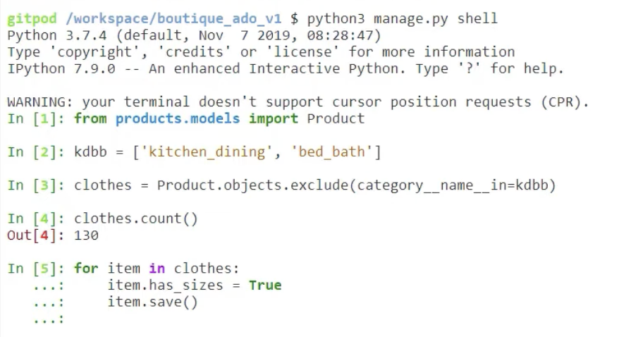
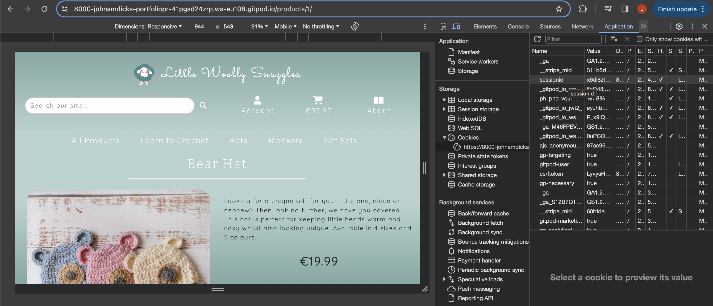
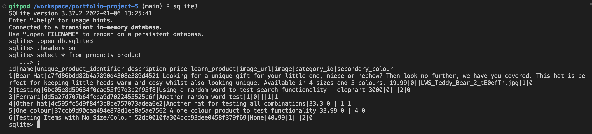
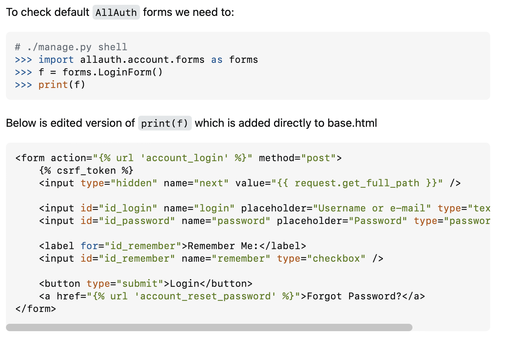

## PROJECT SET UP -
Use `pip3 install 'django<4'` for Django installation if following structure of this project.

## ALL AUTH
* Reminder to add `import os` to settings
* Use `pip3 install django-allauth==0.41.0`
* Change the domain name and display name in the Django admin panel.
* When copying the all auth templates use the following line in the terminal to copy recursively:
`cp -r ../.pip-modules/lib/python3.9/site-packages/allauth/templates/* ./templates/allauth`
* To check the python version, hit tab as typing python into the directory string which will return the correct 
version of python used in the IDE.

## HOME/BASE
* Add this to base.html head to allow for backwards compatability:
    `<meta http-equiv="X-UA-Compatible" content="ie=edge">`
* `mkdir -p` with directory structure e.g. home/templates/home to create structure in main project directory.

## CREATING ENV.PY

In your project workspace, create a file called env.py. It’s a good idea to check that this file is included in the .gitignore file too. If you are using the Code Institute provided GitHub template, then the env.py file is already in the .gitignore file.

a gitignore file with a line reading env.py

In your env.py file add the following line of code.

`import os`

Next we need to set some environment variables. First, add a blank line, then set a DATABASE_URL variable, with the value you just copied from ElephantSQL as follows

    
 `os.environ["DATABASE_URL"]="<copiedURL>"`
Replace `<copiedURL>` with the relevant string from ElephantSQL.

As this is a Django application it has a SECRET_KEY, which it uses to encrypt session cookies. The secret key can be whatever you like.

We need to include this string in the env.py file. So, just like before, add the variable by pasting in the string as follows

 `os.environ["SECRET_KEY"]="my_super^secret@key"`

We don't want to share our secrets either, so this documentation shows you a made up key. Just replace `my_super^secret@key` with your key.

## CREATING DATABASE AND LINKING UP

Now you have created an env.py file, you need to make your Django project aware of it. Open up your settings.py file and add the following code below your Path import

 `import os` 
 `import dj_database_url` 
 `if os.path.isfile('env.py'):` 
    &nbsp;&nbsp;&nbsp;&nbsp;`import env`

The if statement here acts as a little protection for the application in case you try to run it without an env.py file present. You will use the other import in a moment.

A little further down, remove the insecure secret key provided by Django. Instead, we will reference the variable in the env.py file, so change your SECRET_KEY variable to the following

` SECRET_KEY = os.environ.get('SECRET_KEY')`

Now that is taken care of, we need to hook up your database. We are going to use the dj_database_url import for this, so scroll down in your settings file to the database section.

Comment out the original DATABASES variable and add the code below, as shown

 `# DATABASES = {` 
 `#     'default': {`
 `#         'ENGINE': 'django.db.backends.sqlite3',` 
 `#         'NAME': BASE_DIR / 'db.sqlite3',` 
 `#     }` 
 `# }` 
    
 `DATABASES = { ` 
     `'default': dj_database_url.parse(os.environ.get` `("DATABASE_URL"))` 
 `}`
 
The code that has been commented out connects your Django application to the created db.sqlite3 database within your repo. However, as we know, that database is not suitable for production. This line of code separates the database URL stored by your env.py file into the relevant name and password etc.

With those changes in place, make sure to save your file. Your application will now connect to your remote database hosted on ElephantSQL. Not convinced? Let’s prove it.

Run the migration command in your terminal to migrate your database structure to the newly-connected ElephantSQL database

 `python manage.py migrate`

Once the migrations have completed, head back over to your ElephantSQL dashboard, select your database instance and then select the “Browser” tab on the left.

Click “Table queries” to reveal a dropdown list, you can see your database structure here. You may not recognise all of the tables in the list, many are generated by the authorisation apps used, the important thing is that this list has been populated from your Django migrations.

Next we want to install gunicorn  `pip3 install gunicorn` and following successful installation freeze into requirements.txt file. The next step is to create a Procfile (important to capitalise) and add in the following code: `web: gunicorn YOUR_PROJECT_NAME.wsgi:application`

We then want to add Heroku to allowed hosts in settings. On Heroku disable collect static set to 1. Generate a secret key for Django and add to environ variables in local IDE and also in Heroku config vars.

To automatically select the correct DB depending on using development or production environments, add the following code to settings: 
`if 'DATABASE_URL' in os.environ:` 
    `DATABASES = {` 
        `'default': dj_database_url.parse(os.environ.get('DATABASE_URL'))` 
    `}` 
`else:` 
    `DATABASES = {` 
        `'default': {` 
            `'ENGINE': 'django.db.backends.sqlite3',` 
            `'NAME': os.path.join(BASE_DIR, 'db.sqlite3'),` 
        `}` 
    `}` 

In order to automatically apply the correct debug settings, change the following in settings file:  
`DEBUG = 'DEVELOPMENT' in os.environ` which will automatically apply the correct debug depending on environment. Note, when deployed it may be necessary to go back to True if there are any non-obvious errors.

## Django Tips and Tricks
- get_ITEM_display to render the human readable aspect of choices tuple in template, where ITEM is the name of the model property. See ProductSizes and Colours rendering in product detail template.
- `manage.py shell` command to enable db changes from the terminal.  To exit shell use the `exit()` function.
- When using context processors, data is stored in a sessionid variable. When making changes during development, there may come a time that this will need to be deleted to correct errors or reset processor quickly without having to manually delete everything one at a time. This can be completed in the inspector in the Applications tab.

- `startapp` followed by app name to create a new app in the project.
- To view the db from the shell, follow steps in image below. Note some commands require `;` to signify end of input.

- A handy trick to access Django objects otherwise not shown in the IDE is to access the shell using command `python3 manage.py shell`. I used this to access the login form HTML for rendering in the offcanvas menu. The solution I found on [Stack Overflow](https://stackoverflow.com/questions/39197723/how-to-move-singup-signin-templates-into-dropdown-menu)

## Amazon WS S3
- Open S3 and create a new bucket for storing files.
- Choose a name for the bucket, preferably matching your Heroku app name for clarity.
- Select the region closest to you for better performance.
- Uncheck "Block all public access" and acknowledge that the bucket will be public.
- The Object Ownership setting needs to be set the ACLs enabled option and Bucket Owner Preferred also checked.
- Create the bucket.
- Set up static website hosting on the properties tab to get a new endpoint for internet access.
- Fill in default values for index and error documents.
- Save the settings.
- On the permissions tab, paste a CORS configuration for required access between the Heroku app and S3 bucket.
- Go to the bucket policy tab, select "Policy Generator," and create a security policy.
- Set the policy type to "S3 Bucket Policy," allow all principals using a star, and set the action to "Get Object."
- Copy the ARN from the other tab and paste it into the ARN box.
- Add a statement, generate the policy, and copy it into the bucket policy editor.
- Modify the resource key to allow access to all resources in the bucket.
- Save the policy.
- Set the "List objects" permission for everyone under the Public Access section in the access control list tab.
- Finish configuring the bucket, which is now ready to serve files.
- - With the S3 bucket ready, the next step is to create a user to access it via IAM (Identity and Access Management).
- Go back to the services menu and open IAM.
- Start by creating a group for the user to reside in.
- Click on "User Groups," then "Create New Group," and name it appropriately.
- Proceed to create the group on the same page.
- Next, create a policy for accessing the S3 bucket by clicking on "Policies" and then "Create Policy."
- Import a managed policy for full S3 access, then modify it to restrict access to the specific bucket.
- Click the button to proceed to the next page to add optional tags, and then review and create the policy.
- Attach the policy to the group by selecting the group, clicking on "Permissions," and opening the "Add permissions" dropdown.
- Select "Attach policies," choose the created policy, and click "Add permissions" at the bottom.
- Create a user to put in the group by clicking "Add User" on the user's page.
- Provide a username and select "Programmatic Access" for access type.
- Proceed to the next step, put the user in the group with the attached policy, and create the user.
- Retrieve the user's access keys by going to IAM, selecting "Users," and choosing the user.
- Select the "Security Credentials" tab and scroll to "Access Keys."
- Click "Create access key," choose "Application running outside AWS," and proceed.
- Leave the "Description tag value" blank and click "Create Access Key."
- Click the "Download .csv file" button to get the CSV file containing the access keys.
- Save the CSV file as it contains critical authentication information that cannot be retrieved later.
- In summary, the process involves creating a group, attaching an access policy allowing S3 access to the bucket, and creating a user with specific access keys.
- In the next step, configure Django to connect to S3 using these keys and upload static files to S3.
